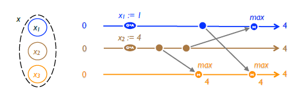
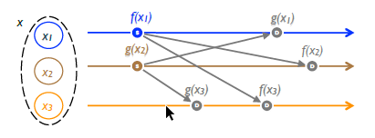

# Ausprägungen

Grundsätzlich lassen sich zwei unterschiedliche Arten von Conflict-free Replicated Data Types (CRDTs) identifizieren. [4, 5]

## State-based Convergent Replicated Data Type (CvRDT)

Bei den State-based Convergent Replicated Data Type (CvRDT) tauschen die Knoten Nachrichten über den aktuellen Zustand des geänderten Objektes aus. Eine Änderung an einem CvRDT erfolgt zunächst lokal, um anschließend den neuen Zustand des Objektes an alle anderen Replikate zu übermitteln. Über eine Merge-Operation können die Replikate dann den gespeicherten Zustand mit dem empfangenen neuen Zustand des Objektes zusammenführen. Die mathematische Grundlage dieser Methode sind Halbverbände. Die Merge-Operation muss kommutativ, transitiv und idempotent sein.

Damit die Daten der Replikate konvergieren, müssen folgende Bedingungen erfüllt sein:

1. Die Aktualisierungsfunktion ist monoton steigend.
2. Die möglichen Zustände des Objektes bilden eine partielle Ordnung.

Ein einfaches Beispiel, welches diese Bedingungen erfüllt, wäre eine Ganzzahl, wobei immer der höchste Wert gespeichert werden soll. In diesem Fall wird die partielle Ordnung durch die Größer-Relation (>) definiert. Die Merge-Operation ist das Maximum aus der aktuellen und der neuen Zahl.

*State-based Convergent Replicated Data Type (CvRDT) aus [4]*

Im Beispiel wird auf Knoten x1 der Wert auf 1 geändert, während gleichzeitig auf Knoten x2 der Wert auf 4 geändert wird. Unabhängig von der Reihenfolge in der die Änderungsmitteilungen eingehen, aktualisiert sich der Wert aufgrund der Maximum-Operation auf allen drei Knoten auf 4.

## Op-based Commutative Replicated Data Type (CmRDT)

Bei den Op-based Commutative Replicated Data Type (CmRDT) werden Änderungen zunächst lokal durchgeführt, um die ausgeführte Operation anschließend als Nachricht an die anderen Knoten zu übermitteln. Die Knoten führen die enthaltene Operation dann ebenfalls lokal aus. Bei CmRDTs müssen bestimmte Vorbedingungen erfüllt sein, um die spätere Konsistenz der Daten zu gewährleisten.

1. Jede Änderungsmitteilung wird genau einmal übertragen. Die Nachrichten dürfen also weder mehrfach ankommen, noch verloren gehen.
2. Die Änderungsmitteilungen kommen in der Reihenfolge an, in der sie versendet wurden.

Durch die erste Bedingungen wird sichergestellt, dass Änderungsmitteilungen zuverlässig an alle Knoten zugestellt werden. Damit die Daten auf den Replikaten übereinstimmen, müssen sie auch über jede Änderung informiert werden. Wenn nicht auf allen Knoten die gleichen Änderungen durchgeführt werden, wird das System inkonsistent. Änderungsmitteilungen dürfen somit nicht verloren gehen oder mehrfach ankommen. Dieser Forderung kann durch die Wahl eines geeigneten Übertragsprotokoll Rechnung getragen werden.

*Op-based Commutative Replicated Data Type (CmRDT) aus [4]*

Sämtliche parallel ausführbaren Operationen müssen kommutativ sein. Kommutative Operationen können in beliebiger Reihenfolge ausgeführt werden. Ein einfaches Beispiel ist die Addition. Das Term 1 + 2 + 3 liefert dasselbe Ergebnis, wie der Term 1 + 3 + 2. Im Beispiel ist es also egal, ob ein Knoten nun zunächst die Änderung +2 oder die Änderung +3 verarbeitet. Beim Startzustand von 1 aktualisiert sich der Wert von allen Replikaten auf 6, unabhängig von der Reihenfolge in der die Änderungsmitteilungen eingehen. Sofern diese Eigenschaft nicht gegeben ist, spielt die Reihenfolge der Änderungsmitteilung eine  Rolle. In diesem Fall muss das Übertragsprotokoll sicherstellen, dass die zweite Vorbedingung gegeben ist.

## Vergleich CvRDT und CmRDT

Op-based Commutative Replicated Data Type (CmRDT) und State-based Convergent Replicated Data Type (CvRDT) sind gegeneinander austauschbar. Jede Anforderung, die mithilfe eines operations-basierten CmRDT umgesetzt wird, kann auch als zustandsbasierten CvRDT umgesetzt werden. Diese beiden Typen unterscheiden sich in der Praxis jedoch erheblich. Während bei den zustandsbasierten CvRDT der Ressourcenbedarf aufgrund der permanenten Übertragung des gesamten Zustands höher ist, haben die operations-basierten CmRDT höhere Anforderungen an das Übertragsprotokoll. Es hängt demnach sehr vom Anwendungsfall ab, welcher Typ in einem konkreten Fall vorzuziehen ist. Umso vorteilhafter erscheint dabei die Tatsache, dass prinzipiell beide Vorgehensweisen zum Ziel führen.

[Nächstes Kapitel](04_Beispiele.md)  
