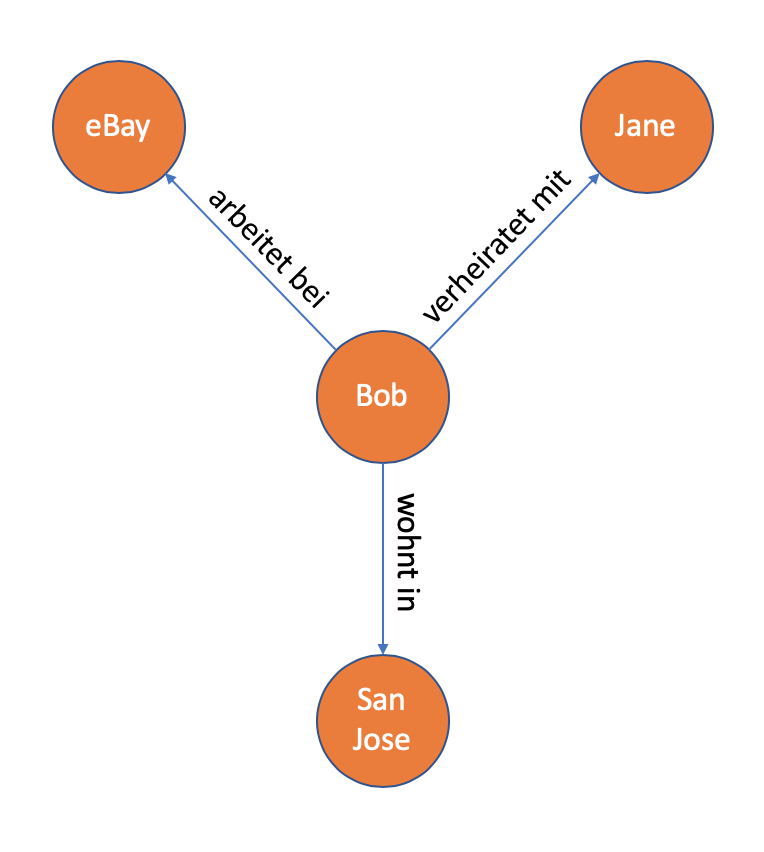

# 5.1 Graph-Datenbanken

Graph-Datenbanken basieren auf der mathematischen Graphentheorie und speichern die Daten in einem Modell, welches überwiegend aus Knoten und Kanten besteht. Ein Knoten repräsentiert dabei eine Entität, welche durch Kanten mit anderen Entitäten verbunden sein können, also in Relation zueinander stehen. Es lassen sich somit also stark vernetzte Informationen speichern, wie zum Beispiel Daten aus sozialen Netzwerken oder Daten über Kunden.

Die folgende Darstellung zeigt einen Graphen mit Beziehungen zu anderen Entitäten :

***Darstellung 5.1.1:** Eigene Darstellung eines Graphen mit Beziehungen zu anderen Entitäten*

Für das Durchsuchen eines Graphen sind sepzialisierte Graphalgorithmen möglich, es wird dabei zwischen der Tiefen- und der Breitensuche unterschieden.

Während bei der Tiefensuche zunächst der tiefere Knoten besucht wird, werden bei der Breitensuche im ersten Schritt alle Nachbarknoten auf einer Ebene durchsucht und erst dann wird auf die nächst tiefere Ebeneb gewechselt.

Nachfolgend werden die Vor- und Nachteile von Graph-Datenbanken gelistet [[5.1.1](https://www.bigdata-insider.de/was-ist-eine-graphdatenbank-a-788834/), [5.1.2](https://www.ionos.de/digitalguide/hosting/hosting-technik/graphdatenbank/)] :

Vorteile | Nachteile |
| :----: | :----: |
| die Strukturen sind flexibel und agil | es gibt keine einheitliche Abfragesprache |
| die Darstellung der Beziehungen sind anschaulich und übersichtlich | schlechte Skalierung, da alle Daten auf einem Server gespeichert werden müssen |
| die Abfragegeschwindigkeit ist von der Anzahl der konkreten Beziehungen abhängig und nicht von der Gesamtmenge der Daten | |
| trotz komplexer Suchanfragen und stark vernetzter Beziehungen bleibt die Abfragegeschwindigkeit hoch | |

***Darstellung 5.1.2:** Tabelle mit Vor- und Nachteilen von Graph-Datenbanken*

Im Gegensatz zu relationalen Datenbanken, gehören Graphdatenbanken zur Familie der NoSQL-Datenbanken. [[5.1.1](https://www.bigdata-insider.de/was-ist-eine-graphdatenbank-a-788834/), [5.1.3](https://www.bigdata-insider.de/graph-datenbanken-a-887332/)]

NoSQL steht dabei für *Not only SQL*. Mehr über NoSQL kann unter <https://aws.amazon.com/de/nosql/> nachgelesen werden.

| [&lt;&lt;&lt; Inhaltsverzeichnis](../README.md) | [&lt;&lt; 5 Datenbanken](./Datenbanken.md) | Graph-Datenbanken | [5.1.1 Neo4j &gt;&gt;](./Neo4J.md) |
|------------------------------------------------|---------------------------------------------------------------------------------|-------------|-----------------------------------------------------------------|
