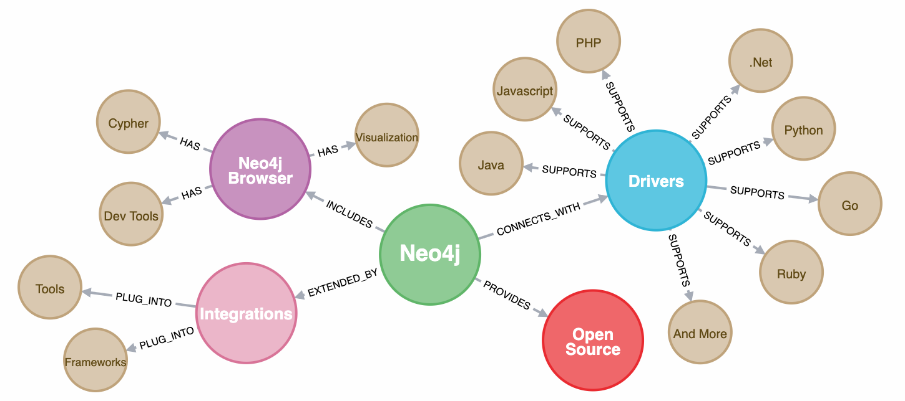

# 5.1.1 Neo4j

In dem YouTube-Video wird Neo4j vorgestellt .

***Video 5.1.1:** Was ist Neo4j? [[5.1.4](https://www.youtube.com/watch?v=GM9bB4ytGao)]*

Neo4j ist eine in Java entwickelte NoSQL-Graph-Datenbank, die nicht nur Daten speichert, sondern auch die Beziehungen zwischen den Daten.

Die folgende Darstellung visualisiert einen solchen Graphen mit  entsprechenden sogenannten *Nodes* (Knoten) und *Relationships* (Kanten/Beziehungen) :

***Darstellung 5.1.3:** Screenshot eines Graphen mit entsprechenden Nodes und Relationships [[5.1.5](https://neo4j.com/developer/get-started/)]*

Obwohl Neo4j zu den NoSQL-Datenbanken zählt, wird dennoch die Datenbankabfragesprache SQL (Structured Query Language) unterstützend vorangetreiben, da diese insbesonders bei Unternehmensanalytikern Anwednung findet.

Neo4j steht außerdem kurz vor dem Ziel, eine standardisierte Abfragesprache für alle [Graph-Datenbanken](./Graphdatabase.md), die sich [Cypher](https://neo4j.com/docs/cypher-manual/current/) nennt, zu etablieren.

Wer jedoch in der Cloud arbeiten möchte, hat die Möglichkeit, dies mit Neo4j, unter dem Namen "Aura", zu tun. [[5.3](https://www.bigdata-insider.de/graph-datenbanken-a-887332/)]

Namenhafte Kunden, wie eBay, Adobe, Microsoft und einige mehr, nutzen Neo4j. [[5.1.6](https://neo4j.com/customers/?ref=home)]

Um Neo4j selbst auszuprobieren, kann mit Hilfe der [Get Started Dokumentation](https://neo4j.com/developer/get-started/) begonnen werden.

Die Autoren haben sich dabei für den Neo4j Browser entschieden, da hier zunächst lediglich eine Registrierung von Nöten war. Im [folgenden Kapitel](./Neo4j-Example.md) wurde dafür ein Praxisbeispiel gewählt und dokumentiert.

| [&lt;&lt;&lt; Inhaltsverzeichnis](../README.md) | [&lt;&lt; 5.1 Graph-Datenbanken](./Graphdatabase.md) | Neo4j | [5.1.2  Praxisbeispiel mit Neo4j Desktop  &gt;&gt;](./Neo4j-Example.md) |
|------------------------------------------------|---------------------------------------------------------------------------------|-------------|-----------------------------------------------------------------|
