# 5.1.2 Praxisbeispiel mit Neo4j Desktop

Für das Praxisbeispiel wurde die entsprechende Dokumentation von Neo4j Browser herangezogen, die unter <https://neo4j.com/developer/neo4j-browser/> erreichbar ist.

Als Voraussetzung wird hier der Download von Neo4j Desktop genannt. Nach diesem, erwartet den Nutzer die folgende Startoberfläche:

***Darstellung 5.1.4:** Screenshot von Neo4j Desktop*

Entsprechend der [Anleitung](https://neo4j.com/download-thanks-desktop/?edition=desktop&flavour=osx&release=1.2.4&offline=true) wurde ein neues Projekt angelegt und ein Graph erstellt.

Nach erfolgreichem Setup, ist die Datenbank unter <http://localhost:7474> erreichbar. Der einzige Unterschied zu Neo4j Desktop ist der Cloud Service, welcher in der folgenden Darstellung rot gekennzeichnet ist. Für das Praxisbeispiel wird an dieser Stelle nun jedoch Neo4j Desktop, anstatt Neo4j Browser, genutzt. 

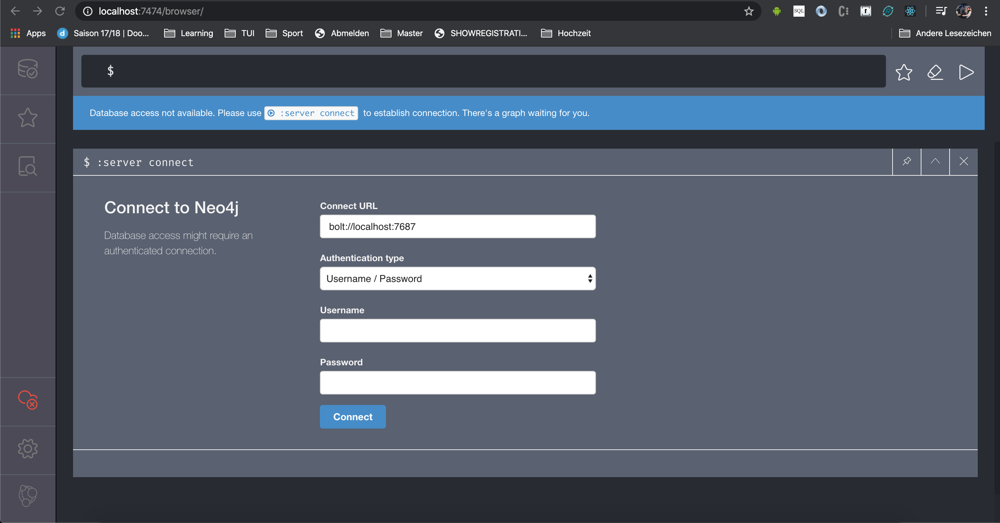

***Darstellung 5.1.5**: Screenshot Neo4j im Browser*

Zunächst soll an dieser Stelle ein ausgedachtes Modell vorgestellt werden, welches im Anschluss in die Datenbank überführt wird.
Die Voraussetzungen für einen Graphen sind dabei Knoten, Beziehungen und Eigenschaften. 

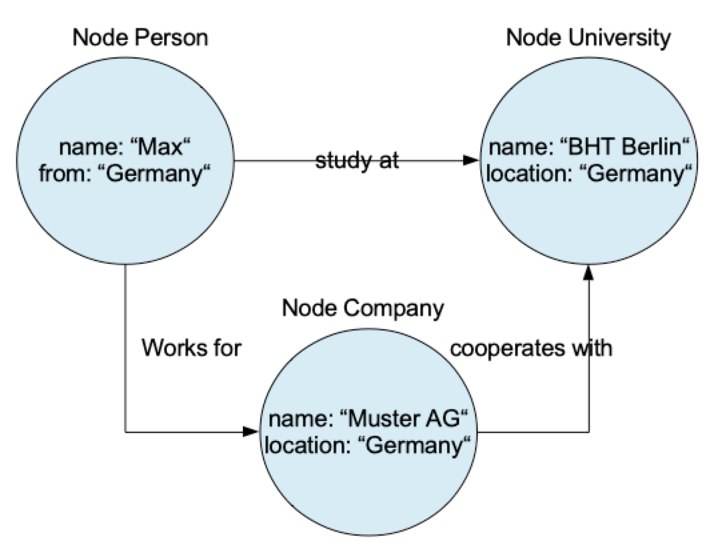

***Darstellung 5.1.6:** Eigene Darstellung eines Graphmodells*

Um nun einen Datensatz anlegen zu können, wird die Datenbank gestartet und im Browser geöffnet. Es befindet sich in dem Fenster eine Art Eingabespalt, in der die [Cypher](https://neo4j.com/docs/cypher-manual/current/)-Abfragen eingegeben werden können. In der Darstellung ist zu sehen, wie ein erster Datensatz mit der Sprache [Cypher](https://neo4j.com/docs/cypher-manual/current/) erzeugt wurde. 

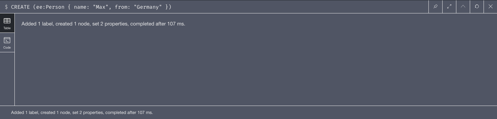

***Darstellung 5.1.7:** Screenshot eines in [Cypher](https://neo4j.com/docs/cypher-manual/current/) geschriebenen Datensatzes*

Im Menü, welches ein- und ausgeblendet werden kann, sind Datenbankinformationen gelistet. Unter anderem ist hier auch der zuvor erstellte Node zu sehen. 

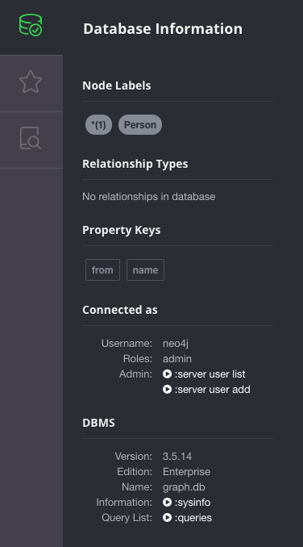

***Darstellung 5.1.8:** Screenshot des Neo4j Desktop Menüs*

Nach selektieren des Nodes "Person" wird in der Hauptansicht der Datensatz angezeigt. Dieser kann als grafischer Knoten, als Tabelle, als Text oder als Code dargestellt werden. 

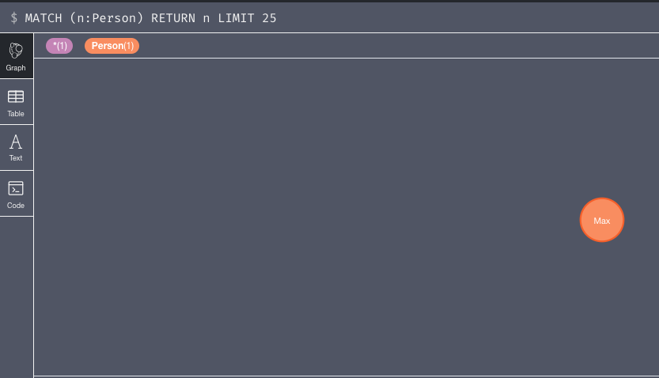

***Darstellung 5.1.9:** Screenshot eines grafisch erstellten Nodes in der Graphansicht*

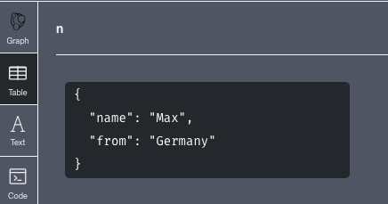

***Darstellung 5.1.10:** Screenshot eines erstellten Nodes in Tabellenform*

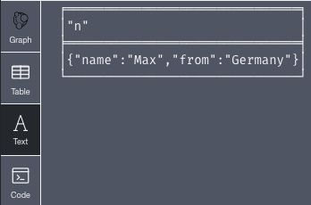

***Darstellung 5.1.11:** Screenshot eines erstellten Nodes in Textform*

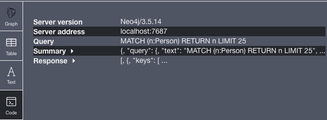

***Darstellung 5.1.12:** Screenshot eines erstellten Nodes in Codeform*

Analog erfolgt die Erstellung der Nodes *University* und *Company*. Über das Menü lassen sich auch alle drei Nodes (hier noch Beziehung zueinander) anzeigen. 

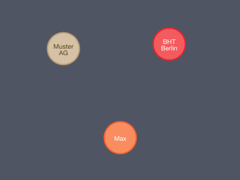

***Darstellung 5.1.13:** Screenshot dreier grafisch erstellter Nodes*

Die Farben der Nodes können individuell verändert werden. Dazu ist lediglich ein Label zu selektieren und eine Farbe aus dem Menü, welches sich unter dem Fenster öffnet, zu wählen. 

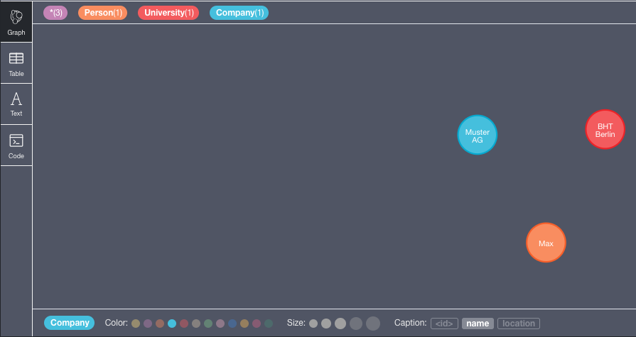

***Darstellung 5.1.14:** Screenshot der Oberfläche zur Erstellung eines Graphen mit Farbpalette*

Nun fehlen nur noch die Beziehungen. Diese können über die entsprechenden [Cypher](https://neo4j.com/docs/cypher-manual/current/)-Abfragen hinzugefügt werden.

    MATCH (p:Person), (un:University) CREATE (p)-[r:STUDIES_AT]->(un)

    MATCH (co:Company), (un:University) CREATE (co)-[r:COOPERATES_WITH]->(un) RETURN(r)

    MATCH (p:Person), (co:Company) CREATE (p)-[r:WORKS_FOR]->(co)

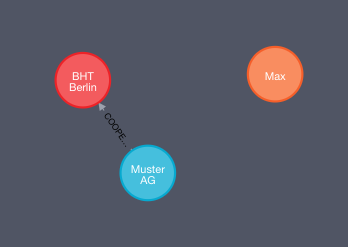

***Darstellung 5.1.15:** Screenshot dreier Nodes und einer Beziehung*

Es ergibt sich nun folgender Graph:

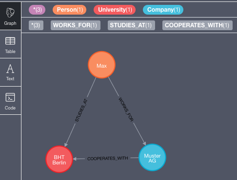

***Darstellung 5.1.16:** Screenshot eines grafisch fertig erstellten Graphens*

Die Nodes lassen sich außerdem auch verschieben, indem der entsprechende Knoten selektiert und dann verschoben wird.

Es ist erkennbar, dass hier unendlich viele Knoten, Eigenschaften und Beziehungen erstellt werden können und Graph-Datenabnken ein Gewinn für das Zeitalter der Digitalisierung sind.

| [&lt;&lt;&lt; Inhaltsverzeichnis](../README.md) | [&lt;&lt; 5.1.1 Neo4j](./Neo4J.md) | Praxisbeispiel mit Neo4j Desktop | [5.2.1  Apache Spark - Entstehung  &gt;&gt;](../Spark/5_2_1_Entstehung.md) |
|------------------------------------------------|---------------------------------------------------------------------------------|-------------|-----------------------------------------------------------------|
