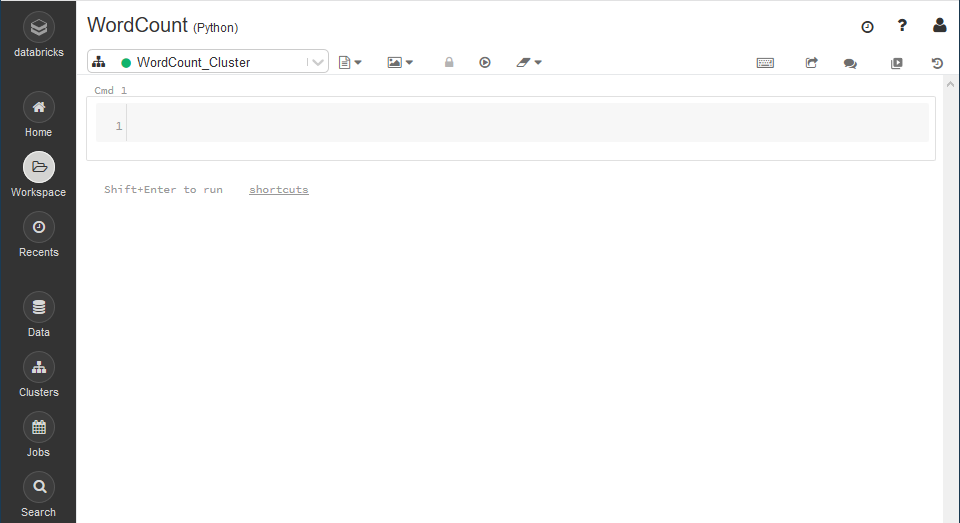
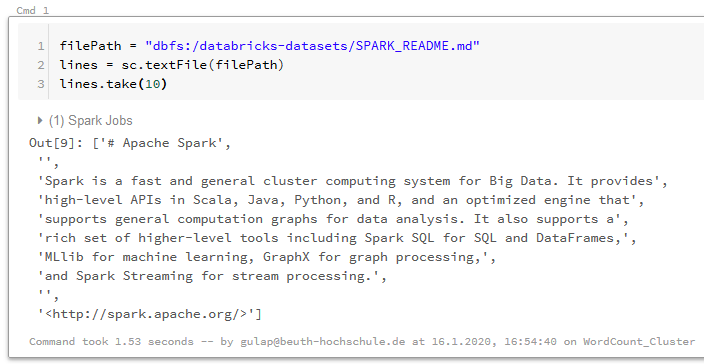
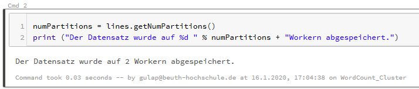
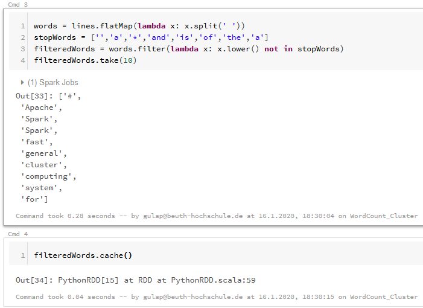
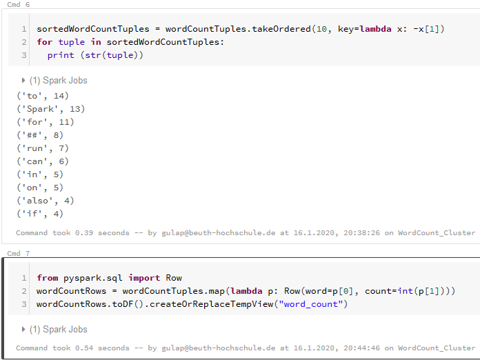
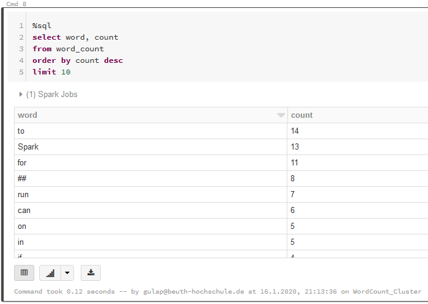
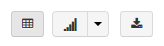
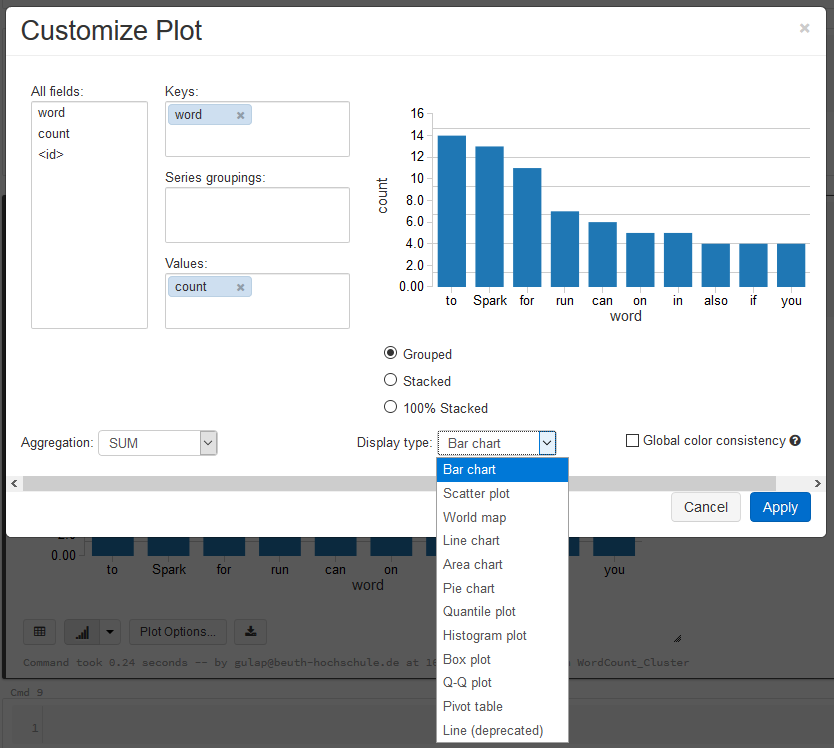

# 5.2.5 Praxis: Databricks statt lokale Installation

Nach der theoretischen Betrachtung soll nun an einigen kleinen praktischen Beispielen Spark demonstriert werden. Hierzu bietet sich zum Einen eine lokale Installation an. Bei einer solchen Installation stehen zwar keine Worker zur Verfügung – dadurch geht ein großer Vorteil von Spark verloren, es können nämlich keine großen Datensätze in sinnvoller Zeit verarbeitet werden. Um Spark zu erlernen und an kleinen Datensätzen Grundlegendes zu erarbeiten oder einfach nur um etwas auszuprobieren, kann eine lokale Installation aber durchaus hilfreich sein. Die andere Möglichkeit besteht darin, auf eine webbasierte Lösung zurückzugreifen. Neben der Installation in der Cloud bietet sich das gemanagte Angebot von Databricks an. Das vom Apache-Erfinder gegründete Unternehmen ging aus einem Projekt des AMPLab an der University of California in Berkeley, USA hervor und ist unter anderem Veranstalter der größten Spark-Konferenz, dem Spark Summit [XXX Link zum Spark Summit].

In Databricks entfaltet sich nicht nicht nur der volle Funktionsumfang von Spark (Nutzung mehrerer Worker, Zugriff auf unterschiedliche Datenquellen, ...), sondern der Nutzer erhält auch nützliche Zusatzfunktionen, wie im folgenden Beispiel gezeigt wird. Gearbeitet wird auf einer Jupyter-Notebook ähnlichen Arbeitsoberfläche.

Zur Auswahl stehen eine „Community Edition“ für Studenten und Bildungseinrichtungen mit eingeschränktem Funktionsumfang oder die kostenpflichtige „Databricks Platform“. Obwohl die Community Edition auf nur einen Worker beschränkt ist – sodass der Nutzer wieder nicht in den Genuss der verteilten Verarbeitung kommt – fiel die Entscheidung für die Demonstration der folgenden Beispiele hierauf, um die Plattform auch länger nutzen zu können. Vom Angebot, die Plattform für 14 Tage mit vollem Funktionsumfang zu testen, wurde daher nicht Gebrauch gemacht.

Aus Platzgründen wird auf eine ausführliche Erklärung des Arbeitsumfeldes verzichtet. Vom Menü werden lediglich die verwendeten Optionen erwähnt.

## 5.2.5.1 Praxisbeispiel: Wörter zählen

Als „Hello World“ für verteilte Rechnersysteme gelten Anwendungen, die in einem vorgegebenen Text Wörter zählen und nach Häufigkeit ordnen. Es folgt ein Beispiel hierfür in Spark an.

 
*Abbildung 5.7: Databricks 1*

Bereits der erste Blick erinnert, wie oben erwähnt, an Jupyter Notebooks. Neben dem selbst bestimmten Titel „WordCount“ steht in Klammern als primäre Programmiersprache „Python“ eingestellt, darunter ein Dropdown mit grünem Punkt (symbolisiert „aktiv“) und dem Titel des Clusters, an den dieser „Workspace“ angebunden ist ("Databricks 1").

Beim Laden des Textes kommt zum ersten Mal der Spark Core mit dem Befehl „sc.“ (Codezeile 2) zum Einsatz. Bei Ausführen des Codes wird zusätzlich zur Ausgabe auch die benötigte Zeit, sowie der zum Einsatz gekommene Cluster, angezeigt ("Databricks 2"). „take“ ist die Aktion, die eine Anzeige erzeugt.

 
*Abbildung 5.8: Databricks 2*

Als nächstes soll angezeigt werden, wieviele Worker („partitions“) zum Einsatz gekommen sind (ABB XXX).

 
*Abbildung 5.9: Databricks 3*

Mit den nächsten Aktionen wird der vorliegende Text in eine Liste mit einzelnen Wörtern umgewandelt und Stopwords werden herausgefiltert. Die übrig gebliebenen Wörter werden gecached – unsere erste Transformation, die als Ergebnis keine Ausgabe liefert sondern ein neues RDD.("Databricks 4").

*Abbildung 5.10: Databricks 4*

Jetzt können die Wörter absteigend nach Häufigkeit sortiert und in SQL-Tabellenform überführt werden ("Databricks 5").

 
*Abbildung 5.11: Databricks 5*

Abschließend werden per SQL-Befehl die 10 häufigsten Wörter aufgelistet. Die SQL-Codesequenz wird mit dem „%sql“ initialisiert ("Databricks 6*").

 
*Abbildung 5.12: Databricks 6*

Unter dem Ausgabefenster fallen drei neue Icons ("Databricks 7") auf, über die die Daten als Tabelle beziehungsweise als Diagramm dargestellt oder (3) als CSV heruntergeladen werden können. "Databricks 8" zeigt ein einfaches Balkendiagramm sowie einen Teil der Anpassungsmöglichkeiten für Diagramme.

 
*Abbildung 5.13: Databricks 7*

 
*Abbildung 5.14: Databricks 8*

[Zurück zu XXX](./XXX.md) || [Weiter zu XXX](./XXX.md)
