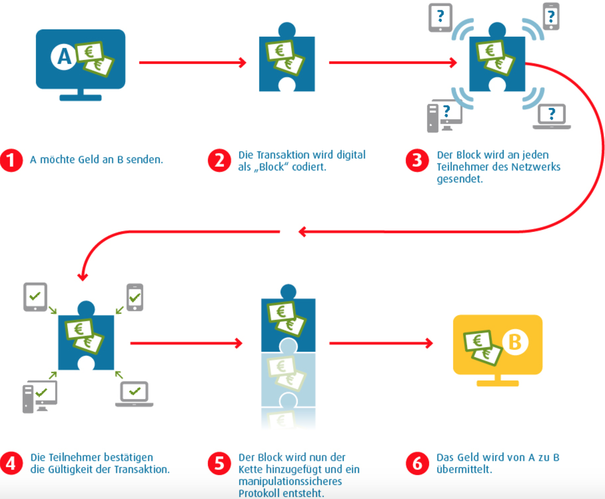

# 4.4 Blockchain

Mit Hilfe der Bockchain-Technolgie (auch *Distributed Ledger Technolgies* genannt) ist es möglich, digitale Informationen in einer dezentralen Datenbank zu speichern, zu verarbeiten, zu teilen und zu verwalten.

Ursprünglich wurde die Blockchain-Technologie für die Kryptowährung Bitcoin und deren Transaktionen entwickelt, jeodch etablieren sich nun auch weitere Anwendungsgebiete und Geschäftsmodelle, wie zum Beispiel *Smart Contracts*.

Unter *Smart Contracts* ist eine Art neuer Verträge zu verstehen, die automatisch ausgeführt werden. Manipulationen oder Menschen als Fehlerquelle können dabei ausgeschlossen werden. [[4.15](https://blockchainwelt.de/blockchain-was-ist-das/), [4.16](https://www.startupvalley.news/de/blockchain-das-gewaltige-potenzial-des-digitalen-datenregisters/)]

Während klassische Datenbanken sich an der Client-Server-Architektur mit zentraler Eingriffsmöglichkeit orientieren, bestehen Blockchain-Netzwerke aus gleichberechtigten Server-Nodes. Diese pflegen die gemeinsame Datenbasis kontinuierlich und unabhängig voneinander. [[4.17](https://t3n.de/news/blockchain-statt-datenbank-diese-1063641/2/)] 

Die Eigenschaften

| Eigenschaft | Beschreibung |
| :----: | :----: |
| Dezentralität | Mit Hilfe der dezentralen Datenbank werden alle Daten auf Tausenden internationalen verschiedenen Computern gespeichert |
| Vertrauen | Das Manipulieren der verschiedenen Blöcke innerhalb der Blockchain ist nicht einfach möglich und somit wird das Vertrauen in das System bestärkt. |
| Anonymität | Es findet kein Austausch von persönlichen Daten während einer Transaktion statt, weshalb die Anonymität der Partner sichergestellt ist. |
| Transparenz | Der Grad der Denzentralisierung in wie weit Informationen bis zum Ursprung zurückverfolgt werden können, hängt von allen öffentlich sichtbaren Transaktionen ab. |
| Manipulationssicherheit | Es ist fast unmöglich Transaktionen, die einmal Bestandteil der Blockchain waren, im Anschlss noch zu bearbeiten oder zu entfernen. Jeder Block erhält neben den eigentlichen Daten auch Vorgängerinformationen zur Verifikation. Somit müssen bei einer Manipulation eines Blocks auch alle nachfolgenden Blöcke erneut erzeugt werden.|

zeichenn die Blockchain als einzigartige Datenbank aus. [[4.18](https://www.econsor.de/digitalisierung/digitalisierung-news/was-ist-eine-blockchain/), [4.19](https://www.digitale-technologien.de/DT/Redaktion/DE/Downloads/Publikation/2017-02-09_smartdata_steckbrief_blockchain.pdf?__blob=publicationFile&v=5)]

***Darstellung 4.10:** Tabelle mit Eigenschaften und jeweiliger Beschreibung der Blockchain*

In der folgenden Darstellung ist eine Transaktion mit Hilfe des Blockchain-Verfahrens zu sehen :

***Darstellung 4.11:** Screenshot einer Transaktion mit Hilfe des Blockchain-Verfahrens [[4.20](https://www.bwi.de/news-blog/blog/blockchain-interview/)]*

| [&lt;&lt;&lt; Inhaltsverzeichnis](../README.md) | [&lt;&lt; 4.3 Cloud Computing](./Cloud.md) | Blockchain | [5 Datenbanken &gt;&gt;](../Datenbanktechnologien/Datenbanken.md) |
|------------------------------------------------|---------------------------------------------------------------------------------|-------------|-----------------------------------------------------------------|
