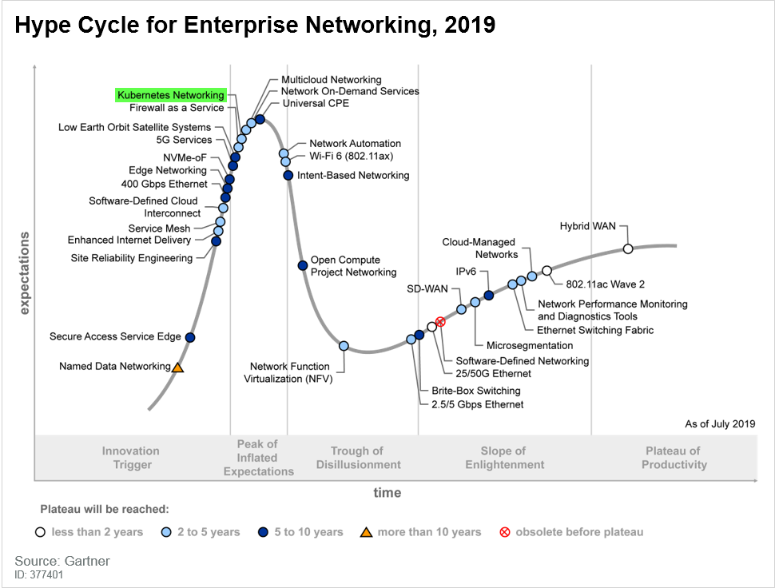

# Thema und Motivation

Im Sommer 2016 erfolgte der Start des Spieles „Pokémon Go“ der Firma Niantic Inc. Die Entwickler rechneten damals mit einem moderaten Interesse der Nutzer. Es hatte sich aber gezeigt, dass dieses Spiel einen regelrechten Hype auslöste. Als Resultat dieses überwältigenden Erfolges erfuhr die dahinterliegende Systemstruktur einen auf das 50-fache erhöhten Daten-Traffic. Die zugrundeliegende Infrastruktur basierte auf Google Cloud, welche mit Kubernetes gesteuert wurde. Hierdurch war es möglich die Spieleplattform schnell hoch zu skalieren und den neuen Anforderungen gerecht zu werden. [1]

Kubernetes ist eine Open-Source-Software die von Google entwickelt wurde. 2015 wurde das Projekt von Google an die Cloud Native Computing Foundation übergeben. Kubernetes hat sich bis heute zu einem Industriestandard im Bereich der Cloud-Dienste entwickelt. [2]

Die Google-Software wird bei wirklich großen Umgebungen eingesetzt. Beispielsweise bei einer sehr großen Webseite, auf die weltweit zugegriffen werden soll, die auf sehr vielen Servern in mehreren Clouds läuft und hohe Lastspitzen abfangen muss. [2]

Das Marktforschungsinstitut Gartner Inc. ordnet Kubernetes Networking in seinem Hype- Cycle-Diagramm, welches in Abbildung 1 dargestellt ist, als eine Technologie ein, welche erst in geschätzten zwei bis fünf Jahren das Plateau der Produktivität erreicht haben wird. Im Moment befindet sich diese Technik noch in einer Phase der überzogenen Erwartungen, da Kubernetes derzeit sehr viel öffentliche Aufmerksamkeit erfährt.

**_Hype Cycle 2019_ [5]**

Kubernetes ist ein Container-Management-System welches zur Verwaltung von containerisierten Arbeitslasten und Services benutzt wird. Kubernetes besitzt ein schnell wachsendes Ökosystem [3].

Mittlerweile haben Softwareanbieter ihre Entwicklungsarbeiten an eigenen Cloud-Plattformen zugunsten von Kubernetes aufgegeben. Beispielsweise hat der Linux-Anbieter SUSE zugunsten von Kubernetes die Entwicklung seiner OpenStack Cloud eingestellt. Neben Suse haben aber auch Cloud Provider wie beispielsweise AWS oder Microsoft Azure ihre Unterstützung für Kubernetes erweitert. Banken und Versicherungen gehören laut Umfragen dabei zu der größten Nutzergruppe von Kubernetes [4].

Alternativen zu Kubernetes sind beispielsweise Docker Swarm, Apache Mesos und Azure Container Service. Auf diese wird in dieser Ausarbeitung aber nicht weiter eingegangen.

| #   | Literatur                                                                                                                                                                                                            |
| --- | -------------------------------------------------------------------------------------------------------------------------------------------------------------------------------------------------------------------- |
| [1] | _Drei gute Gründe sprechen für Kubernetes, Container Days in Hamburg_, https://line-of.biz/it-infrastruktur-und-rechenzentren/drei-gute-gruende-sprechen-fuer-kubernetes/, aufgerufen 25.11.2019                     |
| [2] | **Jan Mahn, Merlin Schumacher**: _Container à la K_, c’t 2019, Heft 18, Heise Medien, Seite 156 ff                                                                                                                   |
| [3] | _Was ist Kubernetes?_, https://kubernetes.io/de/docs/concepts/overview/, aufgerufen 5.12.2019                                                                                                                        |
| [4] | **Harald Weiß**: _Wie Kubernetes die Anwendungsentwicklung revolutioniert_, https://www.computerweekly.com/de/feature/Wie-Kubernetes-die-Anwendungsentwicklung-revolutioniert?vgnextfmt=print, aufgerufen 15.11.2019 |
| [5] | **David Ramel**: _Research Firm's Hype Cycle Report: 'SDN Has Become Obsolete_, https://virtualizationreview.com/articles/2019/10/14/enterprise-networking-report.aspx, aufgerufen 1.11.2019                         |

---

| [Inhaltsverzeichnis](0_inhalt.md) |  [Docker >>](2_docker.md) |
| --------------------------------- | ------------------------- |

