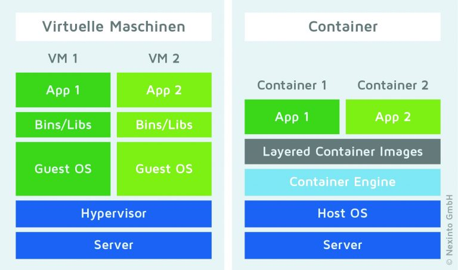

# Docker

Um eine so dynamisch skalierbare Infrastruktur zu schaffen, muss es möglich sein, Software schnell und ohne Benutzereingaben auf anderen Knoten zu installieren und zu starten. Für genau diese Aufgabe existiert schon länger das Konzept der Anwendungs-Container. Hierbei werden sogenannte Images erstellt, die alle benötigte Software bündeln, um sie auf jedem beliebigen Host zu installieren, starten und verwenden zu können.
Der Durchbruch der Containerisierung gelang im Jahr 2013 mit der Veröffentlichung von Docker. Mit der Hilfe von Docker wurde es einfacher Images selbst zu erstellen, zu verwalten und dann als Container zu nutzen. [1]

![Docker-Engine [2]](./images/engine-components-flow.png)

**_Docker-Engine_ [6]**

Die Docker-Engine besteht aus drei wesentlichen Bestandteilen:

- dem Docker-Daemon, der die Docker-Objekte (Container, Images, Netzwerke, etc…) verwaltet und API-Anfragen entgegennimmt und verarbeitet,
- der REST API, die die Schnittstelle zwischen Applikationen und dem Docker-Daemon beschreibt und
- dem Kommandozeilen-Interface, das über die REST API mit dem Docker-Daemon kommuniziert und so eine Anwendung zur Verwaltung zur Verfügung stellt.

## Container-Technologie

Ein Container beschreibt zum einen das Image und zum anderen den Container zur Laufzeit der Anwendung. Die Images bilden dabei die Grundlage auf denen die Container zur Laufzeit erstellt werden. Dies hat den Vorteil, dass mehrere Container aus dem gleichen Image erstellt werden können. Dabei ist es egal, ob es auf dem gleichen Host oder auf unterschiedlichen Hosts passiert. Die gestartete Software läuft immer im gleichen Umfeld und hat immer die gleichen Funktionen (und auch Bugs). [4]

### Images

Wie zuvor bereits beschrieben, enthält ein Image alle zur Ausführung der Software benötigten Ressourcen. Bei den Ressourcen handelt es sich um

- die benötigte Fremd-Software (Bibliotheken oder eigenständige Software die zur Ausführung gebraucht wird)
- die Definition der Netzwerk-Schnittstellen, die zum Host aufgebaut werden müssen und
- die Definition von Netzlaufwerken (Volumes) zum Host oder zu Fremd-Hosts

Ein fertiges Image stellt eine in der Regel plattformunabhängige Einheit dar. Dies hat den Vorteil, dass nicht explizit darauf geachtet werden muss, dass auf dem Host die richtige Umgebung für die Software eingerichtet sein muss. Dadurch werden die Bereitstellung und das Debugging der Software auf unterschiedlichen Systemen deutlich vereinfacht. Zur Ausführung der Software wird lediglich ein installiertes Betriebssystem inkl. einer Software zum Lesen und Ausführen der Images benötigt.
Abschließend noch ein weiteres wichtiges Detail, welches die Images mit sich bringen: Ein Image ist nach der Erstellung nicht mehr änderbar. Das bedeutet, dass eine Software, die Daten dynamisch, z.B. in einer Datenbank, speichern will, dieses auch ohne Probleme durchführen kann. Bei einem Neustart des Containers vom Image sind diese Daten jedoch verloren. [5]

### Container

Als Container bezeichnet man eine gestartete Instanz eines Images. Dieser erhält eine eindeutige Container-ID und einen eindeutigen Container Namen, der vom Image-Namen abweichen kann. Mit dem Start des Images im Container werden auch die benötigten Ressourcen, wie Volumes und Netzwerke, vom Hostsystem bereitgestellt.
Ein Container besitzt ein Image als Basis und benötigt dieses nach dem Startvorgang nicht mehr. Somit können mehrere Instanzen vom gleichen Image gestartet werden. Dieses Vorgehen bringt folgende Vorteile mit sich:

- Die Anwendungen sind dadurch sehr gut skalierbar.
- Die Anwendungen sind von der Umgebung isoliert.
- Alle Instanzen arbeiten mit den gleichen Bedingungen.

Diese Art und Weise der Nutzung hat aber auch Nachteile. So ist die Abschottung der Anwendungen untereinander geringer als bei virtuellen Maschinen (gleiches gilt aber auch bei der Virtualisierung gegenüber den Hardwareservern). Weiterhin ist es Problematisch innerhalb der Container mit dynamischen Daten zu arbeiten bzw. diese Daten anderen Containern des gleichen Images zur Verfügung zu stellen. Dynamisch generierte Daten werden von Haus aus nicht persistent gespeichert. Beim Neustart eines Containers bzw. beim Start einer zweiten Instanz eines Images stehen die Daten nicht zur Verfügung. [4]

### Image-Build

Um ein Image zu erzeugen muss zunächst ein Ordner erstellt werden, in dem alle benötigten Dateien und Ordner zur Verfügung gestellt werden. Die wichtigste Datei, die in diesem Ordner bereitgestellt wird ist das Dockerfile (`dockerfile` ist gleichzeitig auch der Dateiname). In dieser Datei werden alle Anweisungen hinterlegt, die zu dem gewünschten Image führen.

**Aufbau des dockerfiles**
Jedes Dockerfile beginnt neben Kommentaren und Parser-Direktiven mit der Anweisung `FROM`. Mit dieser Anweisung wird angegeben, welches Image die Basis für dieses Image darstellen soll. Die „Basis“-Images können entweder Images aus einem Repository (das wohl bekannteste ist der Docker-Hub) oder auch selbst erstellte Images sein.
Im Anschluss folgen dann Anweisungen, die das Basis-Image so verändern, wie es benötigt wird. Folgende Anweisungen werden am häufigsten benötigt:

- `RUN` Führt diverse Befehle innerhalb des Images aus. Die Befehle die ausgeführt werden können hängen davon ab, welche Basis für das Image ausgewählt wurde, z.B. welche Shell im Basis-Image zur Verfügung steht.
- `LABEL` Fügt Metadaten dem Image hinzu. Häufig werden hier Angaben über die Version, den Ersteller oder eine Beschreibung hinzugefügt.
- `EXPOSE` Beschreibt Schnittstellen, auf die im Container gelauscht wird. So kann zum Beispiel angegeben werden, dass ein Webserver, der im Container gehostet wird, auf dem Port 80 lauscht.
- `COPY` Mit dieser Anweisung können Daten aus dem angelegten Verzeichnis in das Image kopiert werden. Hostet man im Container z.B. einen Webserver, so können mit dieser Anweisung die benötigten HTML-Dateien zum Image hinzugefügt werden.
- `VOLUME` Diese Anweisung fügt dem Image einen Mount-Point hinzu. Dies ist wichtig, wenn Daten über ein Verzeichnis-Share mit anderen Containern oder dem Hostsystem ausgetauscht werden müssen. Beim Starten des Images müssen die Shares allerdings dem Hostsystem noch bekannt gegeben werden.

Ist das Dockerfile fertiggestellt, kann es mit dem Befehl `docker build -t *image_name*` in ein Docker-Image konvertiert werden. [6]

Dockerfiles können mehrere Verarbeitungsschritte (Stages) enthalten. In dem nachfolgenden Beispiel wird zunächst mit Hilfe eines Maven-Images die Abhängigkeiten einer Java-Applikation installiert und zu einer ausführbaren WAR-Datei (Web Application Archive) gebündelt. Im zweiten Schritt wird diese gebündelte Applikation dann in einem Image, hier aufbauend auf einen Wildfly-Server, in das Verzeichnis kopiert und beim Start eines Containers von diesem Image ausgeführt.

```Dockerfile
# Stage 1 - Build Java Application and Install Dependencies
FROM maven:3.6.2-jdk-8 as build
WORKDIR /app
COPY . .
RUN mvn clean install

# -----------------------------------------------------

# Stage 2 - Build Wildfly-Server Image
FROM jboss/wildfly:14.0.1.Final

# Copy Wildfly-Deployment files
RUN cd /opt/jboss/ && mkdir copytmp
COPY deployment/wildfly/ copytmp
RUN yes | cp -rf copytmp/* wildfly
RUN rm -r copytmp

# Add bundled Java-Application from Stage 1
COPY --from=build /app/target/*.war wildfly/standalone/deployments/ROOT.war

# Set Command to automaticall run Java Application on Container Creation
CMD ["/opt/jboss/wildfly/bin/standalone.sh", "-b", "0.0.0.0", "-bmanagement", "0.0.0.0"]
```

Die Einsatzmöglichkeiten wie in dem Beispiel sind nicht nur auf das Ausführen von Applikationen beschränkt, sondern im gesamten DevOps-Kontext für automatisierte Pipelines und das Bauen von Applikationen sehr einfach zu verwenden.

## Container vs VMs

Der Vergleich Container vs. virtueller Maschinen ist nicht ganz einfach zu gestalten. Beide Technologien überschneiden sich nur in kleinen Teilen und die eine ist sogar von der anderen abhängig. Nachfolgend werden beide Technologien am Beispiel des Anwendungsbetriebs verglichen. Dabei wird davon ausgegangen, dass auf beiden Technologien die gleiche Anwendung betrieben werden soll.

| Bereich           | VM                                                                                                                                                                                       | Container                                                                                                                                                                           |
| ----------------- | ---------------------------------------------------------------------------------------------------------------------------------------------------------------------------------------- | ----------------------------------------------------------------------------------------------------------------------------------------------------------------------------------- |
| Persistenz        | voll gegeben                                                                                                                                                                             | nicht vorhanden, nach einem Neustart sind die Daten, die nicht zum Image gehören, verloren gegangen                                                                                 |
| Hochverfügbarkeit | gegeben durch den Hyppervisor                                                                                                                                                            | gegeben durch Orchestratoren, die die Container auf verschiedenen Hosts verwalten                                                                                                   |
| Voraussetzung     | Betriebssystem muss installiert sein (idealerweise in der gleichen Version und mit den gleichen Bibliotheken um Probleme beim Betrieb der Anwendung zu vermeiden)                        | Ist der Host mit einer Containersoftware ausgestattet, so kann die Anwendung reibungslos in Betrieb genommen werden, unabhängig vom Betriebssystem und der Bibliotheken             |
| Skalierbarkeit    | VMs zu skalieren ist nicht unmöglich, allerdings mit sehr viel Aufwand verbunden. Schließlich müssen die benötigten Bibliotheken und das Betriebssystem jedes Mal mit installiert werden | Images können einfach auf andere Hosts kopiert und ausgeführt werden. Auch das mehrfache Starten des gleichen Images auf einem Host ist möglich, um eine Lastverteilung zu erzielen |

Anhand der Tabelle kann man sehr gut erkennen, dass die reine Container-Technologie in Sachen Persistenz und Hochverfügbarkeit nicht mit virtuellen Maschinen mithalten kann. Müssen Daten dauerhaft gespeichert und verändert werden können, so ist momentan die VM der reinen Verwendung von Containern einiges voraus. [7]

Bei Betrachtung der Voraussetzungen zum Betrieb stellte man fest, dass Container wesentlich schlanker betrieben werden können, da nicht jede Applikation ein eigenständiges und vollständiges Betriebssystem braucht (s. Abbildung). Bei Docker teilen sich die Container über die Container Engine (meist Docker) die Systemressourcen. Das ist auch einer der wesentlichen Faktoren, wieso Container so schnell in Betrieb genommen, ausgetauscht und gestoppt werden können.



**_Vergleich VM <-> Container_ [6]**

Bettet man die Technologie der Containerisierung in einen größeren übergeordneten Kontext ein, z.B. einem Orchestrator wie Kubernetes, können die Schwächen der reinen Verwendung von Containern ausgeglichen werden. Orchestartoren wie Kubernetes erweitern die Containertechnologie und können außerdem hohe Anforderungen an Hochverfügbarkeit und eine Persistenz der Daten gewährleisten. Auch die Möglichkeiten hinsichtlich Skalierbarkeit und Anpassbarkeit steigen rasant in dem Moment wo Orchestratoren eingesetzt werden. Somit ist die Vervielfältigung, z.B. zur Lastverteilung, per Knopfdruck oder auch automatisiert möglich. Mehr zum Orchestrator Kubernetes im nächsten Kapitel.

| #   | Literatur                                                                                                                                                                                                           |
| --- | ------------------------------------------------------------------------------------------------------------------------------------------------------------------------------------------------------------------- |
| [1] | **Peter Wurbs**: _Docker versus VM: Wie Container die heutige IT verändern_, [https://jaxenter.de/docker-vs-vm-54816](https://jaxenter.de/docker-vs-vm-54816), aufgerufen am 04.01.2020                             |
| [2] | _Docker overview_, [https://docs.docker.com/engine/docker-overview/](https://docs.docker.com/engine/docker-overview/), aufgerufen am 31.12.2019                                                                     |
| [3] | **Stephan Augsten**: _Was ist Docker?_, [https://www.dev-insider.de/was-ist-docker-a-733683/](https://www.dev-insider.de/was-ist-docker-a-733683/), aufgerufen am 25.12.2019                                        |
| [4] | **Stephan Augsten**: _Was sind Docker-Container?_, [https://www.dev-insider.de/was-sind-docker-container-a-597762/](https://www.dev-insider.de/was-sind-docker-container-a-597762/), aufgerufen am 25.12.2019       |
| [5] | **Stephan Augsten**: _Was ist ein Container Image?_, [https://www.dev-insider.de/was-ist-ein-container-image-a-756912/](https://www.dev-insider.de/was-ist-ein-container-image-a-756912/), aufgerufen am 25.12.2019 |
| [6] | _Dockerfile reference_, [https://docs.docker.com/engine/reference/builder/](https://docs.docker.com/engine/reference/builder/), aufgerufen am 04.01.2020                                                            |
| [7] | **Peter Wurbs**: _Docker versus VM: Wie Container die heutige IT verändern_, [https://jaxenter.de/docker-vs-vm-54816](https://jaxenter.de/docker-vs-vm-54816), aufgerufen am 04.01.2020                             |

---

| [<< Thema und Motviation](1_intro.md) | [Inhaltsverzeichnis](0_inhalt.md) | [K8s >>](3_k8s.md) |
| ------------------------------------- | --------------------------------- | ------------------ |

