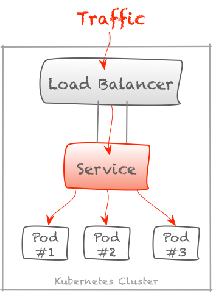
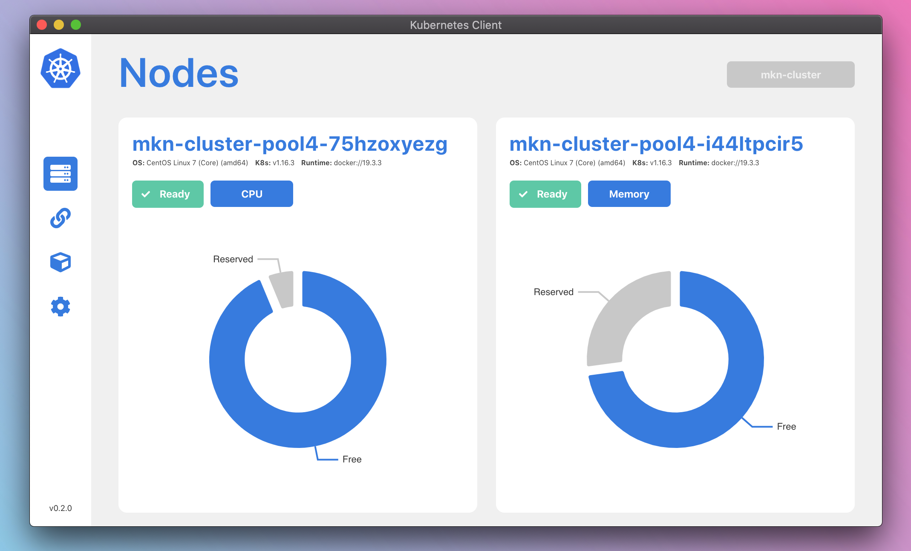

# Kubernetes

Kubernetes ist ein Orchestrator für Container-Anwendungen und kümmert sich neben der Hochverfügbarkeit dieser Container u.a. um das Routing innerhalb des Netze, Skalierung und Provisionierung von Cloud-Speicher.
Der automatisierte Neustart eines Pods ist dabei zentrales Instrument zur Skalierung.

Die Idee von Kubernetes ist die Entkopplung von der eigentlichen Anwendung und seinen Konsumenten über Services. Ein Service ist ein im Kubernetes-Netz eingesetzes DNS als Teil des _Service Discovery_ und kann mit einer Vielzahl von Containern eines Types verknüpft werden. Konsumenten sprechen nicht direkt mit einzelnen Containern, sondern über deren verknüpften Service.

**_Zugriff auf Container-Anwednungen über einen Kubernetes-Service_ [1]**

Kubernetes kann so auf dem Cluster verteilte Container unter einem Namen finden und eine Lastverteilung vornehmen. Elementarer Vorteil dieser Entkopplung ist die Gewährleistung der Verfügbarkeit, ein Container kann bei einer Redundanz abstürzen, der Konsument kann über den Service trotzdem mit den restlichen verfügbaren Containern des Services im Cluster kommunizieren. Jeder Service ist somit durch die Anzahl der verknüpften Container horizontal skalierbar. Was bei VMs nur durch die Anzahl der VMs selbst erreicht werden kann, ist bei Kubernetes und der meist eigesetzen Docker-Architektur durch die Container-Technologie schlank und kostensparend umzusetzen.

Kubernetes ist also als Erweiterung für Container Engines wie Docker geschaffen worden, um die Hochverfügbarkeit und Skalierbarkeit zu vereinfachen und Netzfunktionalität bereitzustellen. Kubernetes wird meist dann eingesetzt, wenn eine Vielzahl von Applikationen über einen längeren Zeitraum in produktiven Umgebungen betrieben werden müssen.

> _"Wo Docker aufwendig wird, z.B. beim Container- Monitoring und der (Re)start-Automatisierung, fängt Kubernetes an. Es kümmert sich neben der Hochverfügbarkeit (0-Downtime bzw. 24/7-Verfügbarkeit eines Netzwerkservice) von Services um den Lebenszyklus von Containern (run, start, stop, remove). Das betrifft alle Dinge rund um die Konfiguration und den Betrieb von Containern auf unterschiedlichen Docker-Hosts. Das oberste Ziel ist einfache Konfigurierbarkeit und maximale Automatisierung hochverfügbarer Netzwerkservices."_ [1]

## Infrastruktur

Kubernetes kann als ein in Schichten aufgebautes System dargestellt werden, wobei jede höhere Schicht die Komplexität der niedrigeren Ebenen abstrahiert. Kubernetes fasst einzelne physische oder virtuelle Maschinen, meist Docker-Hosts (s. Abschnitt 2), zu einem Cluster zusammen und verwendet ein gemeinsames Netzwerk für die Kommunikation zwischen den einzelnen Maschinen. Dieses Cluster ist die physische Plattform, auf der alle Kubernetes-Komponenten, -Funktionen und -Arbeitsauslastungen konfiguriert werden. Kubernetes verwaltet als Orchestrator alle Ressourcen der Maschine, in Kubernetes Node genannt, global.

> _"Das Verteilen von Ressourcen auf einem Computer ist größtenteils dem Betriebssystem vorbehalten. In einem Kubernetes-Cluster übernimmt Kubernetes eine ähnliche Funktion. Kubernetes verwaltet Ressourcen wie Memory, CPU und Storage und verteilt Anwendungen und Services in Containern auf den Nodes im Cluster. [...]"_
>
> _"Aus einem globalen Ressourcenmanagement resultieren verschiedene Vorteile. Dazu gehören eine effizientere Auslastung von Ressourcen, nahtlose Skalierung von Anwendungen und Services, hohe Verfügbarkeit und weniger Aufwand im Betrieb."_ [2]

**_Kubernetes als Abstraktion eines Docker-Hosts_ [3]**

Anwendungen und Dienste selbst werden auf dem Cluster in Containern ausgeführt. Die zugrunde liegenden Komponenten stellen sicher, dass der gewünschte Status der Anwendungen mit dem tatsächlichen Status des Clusters übereinstimmt. Benutzer interagieren mit dem Cluster, indem sie entweder direkt oder mit Clients und Bibliotheken mit dem Haupt-API-Server kommunizieren. Um eine Anwendung oder einen Dienst zu starten, wird in der Formatsprache JSON oder YML ein deklaratives _Skript_ erstellt und per API an Kubernetes übermittelt, das definiert, was als Ressource erstellt und wie es verwaltet werden soll. Der Kubernetes-Master erstellt und verändert dann anhand des Skriptes die dort beschriebenen Ressourcen wie u.a. Pods, Services und Controller.‚ Diese Gruppe von benutzerdefinierten Anwendungen, die nach einem festgelegten Skript ausgeführt werden, bilden die letzte Schicht von Kubernetes.

## Komponenten

Das System Kubernetes besteht aus vielen Bestandteilen und Prozessen. In diesem Abschnitt werden nur die Komponenten beschrieben, die für das Thema "Datenbanken in Kubernetes" relevant sind.

### Kubernetes-Master

Die Maschinen im Cluster erhalten jeweils eine Rolle innerhalb des Kubernetes-Ökosystems. Ein Node fungiert dabei als Kubernetes-Master. Dieser Node fungiert als Gateway und Gehirn für das Cluster, indem er eine API für Benutzer und Clients bereitstellt, den Zustand anderer Nodes überprüft, festlegt, wie die Arbeit am besten aufgeteilt und zugewiesen werden soll und die Kommunikation zwischen anderen Komponenten koordiniert. Der Master-Node fungiert als primärer Ansprechpartner für das Cluster und ist für den Großteil der zentralisierten Logik verantwortlich, die Kubernetes bereitstellt. Der Kubernetes-Master dient als Ansprechpartner für Administratoren und Benutzer.
Er besteht aus drei Prozessen, die auf einem einzelnen Node im Cluster ausgeführt werden, der als Master-Node bezeichnet wird. Diese Prozesse sind: _kube-apiserver, kube-controller-manager und kube-scheduler._

#### _kube-apiserver_

Einer der wichtigsten Services des Kubernetes-Master ist ein API-Server. Dies ist der Hauptverwaltungspunkt des gesamten Clusters, da über diese API ein Benutzer die Workloads und Organisationseinheiten von Kubernetes konfigurieren kann. Er ist auch dafür verantwortlich, dass die Servicedetails der bereitgestellten Container übereinstimmen und fungiert als Verbindungsstück zwischen verschiedenen Komponenten, um den Clusterzustand aufrechtzuerhalten und Informationen und Befehle zu verbreiten.

Der API-Server implementiert eine _RESTful_-Schnittstelle, sodass viele verschiedene Tools und Bibliotheken problemlos mit ihm kommunizieren können. Ein Client namens `kubectl` ist als Standardmethode für die Interaktion mit dem Kubernetes-Cluster von einem lokalen Computer aus verfügbar. [6]

#### _kube-controller-manager_

Der Controller-Manager ist ein allgemeiner Dienst, der viele Aufgaben hat. Primär werden verschiedene Controller verwaltet, die den Status des Clusters steuern, die Workload-Lebenszyklen verwalten und Routineaufgaben ausführen. Ein Replication Controller stellt beispielsweise sicher, dass die Anzahl der Replikate, die für ein Deployment definiert sind, mit der Anzahl übereinstimmt, die aktuell im Cluster bereitgestellt werden. Wenn eine Änderung festgestellt wird, liest die Steuerung die neuen Informationen und implementiert die Prozedur, die den gewünschten Zustand erfüllt. Dies kann das Vergrößern oder Verkleinern einer Anwendung oder das Anpassen von Endpunkten usw. beinhalten. So werden die Anzahl von Pods innerhalb des Clusters skaliert. [6]

#### _kube-scheduler_

Der Prozess, der Workloads tatsächlich bestimmten Knoten im Cluster zuweist, ist der Scheduler. Dieser Service liest die Betriebsanforderungen eines Workloads ein, analysiert die aktuelle Infrastrukturumgebung und platziert die Arbeit auf einem akzeptablen Node. Der Scheduler ist dafür verantwortlich, die verfügbare Kapazität auf jedem Host zu verfolgen, um sicherzustellen, dass die Workloads nicht über die verfügbaren Ressourcen hinaus geplant werden. Der Scheduler muss die Gesamtkapazität sowie die Ressourcen kennen, die bereits den einzelnen Servern mittels der vorhandenen Workloads zugewiesen sind. Wenn der Schedular eine Überlastung eines Nodes feststellt, so plant er dort laufende Anwendung auf anderen Nodes ein. Diese Anwendungen werden dann auf den anderen Nodes gestartet und anschließend auf dem ausgelasteten Node gestoppt, um insgesamt ein gleichmäßig ausgelastetes Cluster zu gewährleisten. Ziel ist nämlich immer ein stabiles Cluster. Überlastete Nodes können ihre Aufgaben nicht mehr nachgehen, dort laufende Anwendungen stützen ab. [6]

Ein Beispiel für eine Visualisierung der freien und belegten Node-Ressourcen zweier Nodes, die vom _kube-scheduler_ gesammelt und per _kube-apiserver_ ausgelesen werden, zeigt die nachfolgende Abbildung des Projekts [kubernetes-client](https://github.com/TinkeringAround/kubernetes-client).

**Beispiel für die Visualisierung der belegten und freien Node-Ressourcen**

### Nodes

Die anderen Maschinen im Cluster, als ausführende Infrastruktur für Kubernetes selbst und alle Anwendungen, werden als _Nodes_ bezeichnet: Nodes, die für die Annahme und Ausführung von Workloads unter Verwendung lokaler und externer Ressourcen verantwortlich sind. Um die Isolation, Verwaltung und Flexibilität zu verbessern, führt Kubernetes Anwendungen und Dienste in Containern aus. Daher muss jeder Node mit einer Container-Laufzeitumgebung (wie Docker oder rkt) ausgestattet sein. Der Knoten empfängt Arbeitsanweisungen vom Kubernetes-Master und erstellt oder zerstört Container entsprechend und passt die Netzwerkregeln an, um den Datenverkehr entsprechend weiterzuleiten. [6]

### Pods

Ein Pod ist eine Kubernetes-Abstraktion, die eine Gruppe von einem oder mehreren Anwendungs-Containern und einigen gemeinsam genutzten Ressourcen für diese Container darstellt.
Pods werden von Kubernetes überwacht, um sie bei Bedarf neu zu starten oder ihnen Zeit zur Selbstheilung zu geben, falls der Pod ausgelastet ist. Der Neustart wird durch die Liveness-Probe ausgelöst und die Selbstheilung durch die Readiness-Probe. Beide Probes können entweder HTTP-Endpunkte oder Container-Kommandos sein. Sie werden nach der ersten initialisierten Zeit von Kubernetes in einem vorher definierbaren Takt abgefragt.

Im wiederholten Fehlerfall passiert folgendes:

- Liveness-Fehlerfall: Kubernetes started den Pod neu.
- Readiness-Fehlerfall: Kubernetes routet keinen weiteren Traffic zu diesem Pod.

### Skripte

Ressourcen wie z.B. Anwendungen, Datenbanken usw. können über Skripte in Kubernetes gestartet, gestoppt und in ihren Spezifikationen verändert werden. Wie bereits beschrieben sind diese Skripte im wesentlichen JSON- oder YML-Textdateien, die von Entwicklern und Systemadministratoren erstellt und gewartet werden. Über einen deklarativen Ansatz wird beschrieben wie die Ressourcen, in Kubernetes als Objekte behandelt, erstellt werden soll.

> _"Jedes Kubernetes-Objekt besitzt einen Typ und gibt an, welcher Version dieses Typs es entspricht. Neben dem Typ besteht ein Objekt aus zwei Hauptbestandteilen: der Spezifikation und dem Status. Zusätzlich kann es noch Metadaten, wie den Namen oder Labels, geben."_ [4]

Die Anzahl der Ressourcen-Typen ist nicht begrenzt, es können beliebige eigene Ressourcen erstellt werden, sognenannte _Custom Ressource Definitions_, die z.B. als Konfiguration für den Betrieb von Anwendungen dienen können. So funktionieren eine Vielzahl von Operator-Anwendungen zum Betrieb von Datenbanken (s. Kapitel 4).

> _"Die Menge der Typen wird von Kubernetes nicht beschränkt. Es ist somit möglich, Kubernetes um eigene Typen zu erweitern. Kubernetes bringt jedoch bereits eine definierte Menge von Standardtypen mit, zu denen auch unser Pod gehört."_ [4]

Über die Kubernetes-API können diese Skripte dem _kube-apiserver_ übermittelt werden, der dann diese Veränderung über den _kube-scheduler_ einplant. Schon durch den Einsatz von Containern können Applikationen in Produktions- und Entwicklungsumgebungen identisch gestartet und getestet werden. Durch die Beschreibung von Ressourcen in Skripten können komplexe Anwendungen mit Anzahl an zu startenden Pods, Netztwerkrouting, Services u.v.m. in vielen Clustern durch Anwenden des Skriptes einfach identisch aufgebaut werden.

## Vorteile von Kubernetes

Kubernetes eignet sich bestens, um skalierbare, hochverfügbare Container-Workloads auf einer stark abstrahierten Plattform ausführen zu können. Die Leistungsfähigkeit, Flexibilität, Erweiterbarkeit, Individualisierbarkeit und Robustheit von Kubernetes ist in der Open-Source-Welt beispiellos.

Einige wesentliche Vorteile von Kubernetes für IT-Abteiltungen hat Herrmann zusammengefasst. [5]

> _"Mit Kubernetes können IT-Abteilungen_
>
> - _Container über mehrere Hosts hinweg orchestrieren,_
> - _Hardware-Ressourcen, die für die Ausführung von Unternehmensanwendungen benötigt werden, effizienter nutzen,_
> - _die Bereitstellung und Aktualisierung von Applikationen steuern und automatisieren,_
> - _Storage mounten und Speicherkapazitäten hinzufügen, um zustandsbehaftete Applikationen auszuführen,_
> - _Applikations-Container und deren Ressourcen skalieren."_

| #   | Literatur                                                                                                                                                                                |
| --- | ---------------------------------------------------------------------------------------------------------------------------------------------------------------------------------------- |
| [1] | **Jan Winter (14.12.2018)**: _KUBERNETES – WER NICHT SKALIERT, VERLIERT_, https://blogs.itemis.com/de/kubernetes-wer-nicht-skaliert-verliert, aufgerufen 12.01.2019                      |
| [2] | **Timo Derstappen (3.1.2018)**: _Kubernetes Grundkurs: So baut man (Container-)Anwendungen heute_, https://jaxenter.de/der-steuermann-fuers-containerschiff-65844, aufgerufen 12.01.2019 |
| [3] | _Kubernetes erklärt_, https://www.redhat.com/de/topics/containers/what-is-kubernetes/, aufgerufen 27.12.2019                                                                             |
| [4] | **Michael Vitz (23.05.2019)**: _Ein praxisorientierter Einstieg in Kubernetes_, https://www.innoq.com/de/articles/2019/05/kubernetes-einstieg/#kubernetes-objekte, aufgerufen 14.01.2019 |
| [5] | **Lars Herrmann (14.12.2017)**: _Kubernetes: Vorteile, Grundlagen und Status Quo_, https://jaxenter.de/kubernetes-vorteile-grundlagen-status-quo-65441, aufgerufen 14.01.2019            |
| [6] | **Justin Ellingwood (02.05.2018)**: _An Introduction to Kubernetes_, https://www.digitalocean.com/community/tutorials/an-introduction-to-kubernetes, aufgerufen 14.01.2019               |

---

| [<< Docker](2_docker.md) |  [Inhaltsverzeichnis](0_inhalt.md) |  [Run Databases in Kubernetes >>](4_dbInK8s.md) |
| ------------------------ | ---------------------------------- | ----------------------------------------------- |

