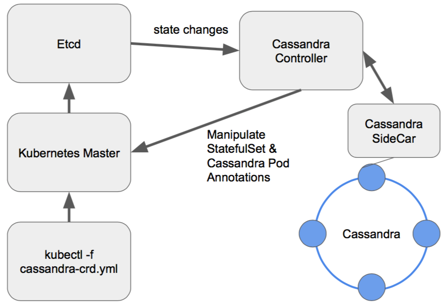

# Run Databases in Kubernetes

> Hinweis: Die in diesem Abschnitt dargestellten Skripte sind gekürzt und enthalten nur für den Kontext relevante Inhalte. Für einen reibungslosen Betrieb sind jeweils weitere Attribute in den Skripten zu ergänzen.

Erst mit der Einführung von Docker hat sich die Containerisierung durchgesetzt. Durch Docker als am weitesten verbreiteten Standard von Containertechnologien ist es nämlich leicht Container zu erstellen, auszuliefern und in geringer Anzahl zu betreiben. [1] Aber gerade durch die Vorzüge von Docker hat sich die Anzahl von produktiven Applikationen auf Dockerbasis schnell erhöht und ein manueller Betrieb ist nicht mehr effizient. Aus diesem Grund wurde der Einsatz von Orchestratoren vorangetrieben. Sie automatisieren eine Vielzahl von Containern in unterschiedlichen Umgebungen, organisieren, starten und stoppen Container. Sie können über Netzwerke hinweg zusammenarbeiten. [1] Kubernetes ist so ein Orchestrator welcher Container unterschiedlichster Art betreiben kann.

Grundsätzlich eignet sich das Dateisystem eines Containers nicht für die dauerhafte Speicherung von Daten, Container sind i.A. zustandslos und werden im RAM der ausführenden Maschine ausgeführt. Eine erstellte Datei in einem Container ist also flüchtig und geht beim Stoppen des Containers verloren.

Besonders beim Einsatz eines Orchestrators wie Kubernetes ist die Berücksichtigung der Persistenz beim Betreiben von Datenbanken in Container besonders wichtig.
Kubernetes kann nämlich beliebig Container je nach Auslastung der ausführenden Maschinen verschieben, starten und stoppen oder muss es sogar beim Ausfall einer ausführenden Maschine.

> _"Im Allgemeinen eignet sich das Root-Dateisystem eines Containers nicht zum Speichern von nichtflüchtigen Daten. Die Container [...] sind normalerweise entfernbare Entitäten. Der Clustermanager kann jeden Container löschen, bereinigen oder neu planen, der aufgrund von Knotenfehlern oder anderen Ursachen nicht mehr verfügbar ist. Wenn Knoten fehlschlagen, gehen alle Daten verloren, die im Root-Dateisystem eines Containers gespeichert sind."_ [2]

## Stateful und Stateless Applications

Man spricht beim Betrieb von Datenbanken in Containern, die aufgrund ihrer Natur Daten persistent ablegen müssen, von Stateful Applications. _Stateless Applications_ sind das Gegenstück und weitaus einfacher für Kubernetes zu händeln. Eine _Stateless Application_ ist z.B. ein NGINX-Server, der eine schon fertig gebündelte Webseite bei Aufruf über seine URL im Browser ausliefern soll. Alles Relevante im NGINX-Container ist statisch und ändert sich nicht. Es werden keine neuen wichtigen Dokumente im Container erstellt, die persistiert werden müssen. Ein [Dockerfile](https://github.com/TinkeringAround/nginx-docker-k8s/blob/master/Dockerfile) für so ein Image ist entsprechend einfach und benötigt keine Anbindung zu externen Volumes oder Verzeichnisquellen für eine Persistierung.

```Dockerfile
# Small NGINX Base Image
FROM nginx:alpine

# Deliver always index.html Page on Incoming Request on Default Port 80
COPY /src/index.html /usr/share/nginx/html/index.html
```

Sollen aber in einem Container zur Laufzeit erstellte Daten persistiert werden, so müssen diese auf externe Speicherorte außerhalb des Containers abgelegt werden. [2]

In einer gängigen Cloud-Umgebung wie z.B. Google Cloud oder Amazon Web Services hat man für die Persistierung von Daten i.d.R. zwei Möglichkeiten:

1. HDD/SSD der ausführenden Maschine (Node)
2. Cloud-Speicher als Volume-Ressource in Kubernetes

## Storage und Persistenz

Wie im Abschnitt [Docker](2_docker.md) beschrieben kann ein Container mit dem Dateiverzeichnis der darunterliegenden ausführenden Maschine verknüpft werden und eigentlich im RAM/im Container erstellte Dateien stattdessen in diesem Dateiverzeichnis auf der HDD/SSD der ausführenden Maschine ablegen. Diese Persistierung mag für den einfachen Betrieb von Containern in einer Virtuellen Maschine ausreichen, ist für den Einsatz im Rahmen von Kubernetes aber keine Option.

Kubernetes führt eine Lastverteilung der laufenden Applikationen auf den zur Verfügung stehenden Virtuellen Maschinen bzw. Nodes aus. Steigt die Last auf einem Node an, so können Applikationen auf andere im Cluster zur Verfügung stehende Nodes verschoben werden. Dafür startet Kubernetes zunächst einen neuen Container auf einem weniger belasteten Node und wartet bis diese stabil laufen. Anschließend stoppt er die Container auf dem höher belasteten Node. Nodeabhängige Datenbestände von Container werden nicht mit verschoben, da Kubernetes i.A. nicht weiß welche Applikationen welche Daten ablegen und wie wichtig diese sind. Für den Entwickler und Betreiber von Applikationen soll es bei Verwendung von Kubernetes außerdem auch irrelevant sein auf welchem Node die Anwendung ausgeführt wird. Wichtig ist nur, dass Anwendung vom Entwickler auch so ausgelegt werden, dass sie möglichst einfach und schnell gestoppt und gestartet werden können und dann reibungslos weiter funktionieren. Das stellt neue Anforderungen an die Art der Entwicklung von Software.

Die zweite Variante ist die Verwendung von externen Cloud-Speichern, die wie eine externe Festplatte für verschiedene Anwendungen per _"Plug and Play"_ verwendbar gemacht werden kann. Mit Kubernetes 1.3 wurde die automatische Speicherplatzzuordnung (Provisioning von Storage) für Container bereitgestellt. Der Storage wird als _Persistent Volumes_ (oder einfach _Volume_) von Kubernetes bereitgestellt und kann mit Pods bzw. darin laufende Container verknüpft werden. Cloud-Speicher sind wie Cloud-Infrastruktur selbst betreiberabhängig und richten sich nach deren Angebot. So variieren nicht nur verschiedene Arten von einsetzbaren VMs für das Kubernetes Cluster mit unterschiedlichen Spezifikationen, sondern auch die Cloud-Speicher unterscheiden sich nach Art (HDD/SSD) und provisionierbarer Größe. Beim Starten von Applikationen und dem Verknüpfen mit Volumes kann die Art des Speichers mit der betreiberspezifischen _Storage Class_ angegeben werden. Läuft Kubernetes z.B. in der Google Cloud, kann es die GCEPersistentDisk, bei Amazon der ElasticBlockStore und auf Azure das AzureFile oder die AzureDisk sein. Bestimmte Anbieter bieten Storage Classes an, die sogar direkt eine Replikation von Daten ermöglichen und damit höhere Anforderungen an die Ausfallsicherheit gewährleisten. Es existieren Projekte wie beispielsweise “Rook", die ein verteiltes Dateisystem betreiben, dies aber direkt auf dem Kubernetes-Cluster aufsetzen und somit weiteres Management überflüssig machen.

Volumes sind externe Cloud-Speicherressourcen und damit im Gegensatz zu der ersten Variante unabhängig von jeglicher Infrastruktur des Kubernetes Clusters. Stürzt z.B. eine laufende Mongo Datenbank ab, so sind bei richtiger Verknüpfung von Container und Volume, die Daten auf dem Volume sicher. Der Container wird einfach neu gestartet, auch auf einem anderen Node als zuvor, und wieder mit dem Volume verlinkt. Die Datenbank kann dann direkt weiterarbeiten. Das gleiche gilt auch beim Absturz eines Hardware-Nodes, wie eine das Cluster bildende und Kubernetes ausführende VM. Aus diesem Grund ist der generelle Ansatz von Volumes im Kontext von Kubernetes für die Persistierung von Daten mit Abstand die bessere Variante.

> _"Ein PV ist eine Darstellung des Speicher-Volumes im Cluster, das von einem Administrator manuell oder von Kubernetes dynamisch zur Verarbeitung einer Anfrage bereitgestellt wird, die in einem PVC gestellt wurde. Ein PVC ist eine vom Nutzer gesendete Anfrage zur Speicherung einer bestimmten Speicherklasse, die von einem PV verarbeitet werden kann. PVs und PVCs sind von Pod-Lebenszyklen unabhängig und behalten Daten auch dann bei, wenn Pods neu gestartet, neu geplant oder sogar gelöscht werden."_ [2]

Einige Vorteile und Möglichkeiten von Volumes in Kubernetes zusammengefasst:

- Komplexe verteilte Datensysteme
- Replikationsmechanismen
- Gezielte Backup-Routinen
- Automatische Speichervergrößerung
- Dynamische Provisionierung on Demand
- Betreiber von Cloud-Speicher ist verantwortlich für Betrieb (keine Administration)

Die Ablage von Daten auf den Nodes selber ist meistens sehr aufwendig, da ein Kubernetes Cluster i.d.R. nicht selbst auf eigens partitionierten VMs oder Bare Metal Maschinen eingerichtet ist, sondern die Hosted Kubernetes Dienste von den oben genannten Cloud-Plattformen verwendet werden. Dadurch hat man meist nur einen eingeschränkten Zugriff auf die Nodes selbst und es ist schwer die oben genannten Vorteile von Volumes umzusetzen.

### Persistent Volume Claim

Container bzw. Anwendungen können in Kubernetes entweder per CLI (Kommandozeilen-Interface), im Kubernetes Cluster deploytem Dashboard oder per Skript gestartet werden. Die letzte Variante ist die bevorzugte, da Skripte (YML- oder JSON-Datei) versioniert und für die Automatisierung leicht integrierbar sind.

Wenn man eine Datenbank als Container in einem Pod starten möchte ist der reproduzierbarste Weg die Erstellung eines entsprechenden Skriptes, wo der Pod samt auszuführenden Container spezifiziert wird. Ein minimales Skript für das Ausführen einer MongoDB ist nachfolgend dargestellt.

```yaml
apiVersion: v1
kind: Pod
metadata:
  # Pod Name
  name: mongodb
spec:
  # 1. Container in Pod
  containers:
    - name: mongodb
      # Docker Image with Version-Tag
      image: mongo:4
      # Opened and named Container Ports
      ports:
        - containerPort: 27017
          name: http
      # Volume Mapping from Container to Kubernetes Volume via PVC
      volumes:
        # Custom Volume Name
        - name: mongo-persistent-volume
          # PVC
          persistentVolumeClaim:
            # PVC Name
            claimName: mongo-persistent-volume-claim
```

Neben dem Namen und den geöffneten Container-Ports wird analog wie zu Docker das interne Dateiverzeichnis der Mongo Datenbank mit einem Kubernetes Volume gemappt/verknüpft. Dieses Volume `mongo-persistent-volume` ist wiederum über ein _Persistent Volume Claim_ (PVC) mit einem, auf Anfrage von Kubernetes, vom Cloud-Betreiber provisionierten Speicher verknüpft (link).

```yaml
apiVersion: v1
kind: PersistentVolumeClaim
metadata:
  # PVC Name
  name: mongo-persistent-volume-claim
spec:
  accessModes:
    - ReadWriteOnce
  resources:
    requests:
      # Requested Storage Size = 10GB
      storage: 10Gi
      # Selected Storage Class from Provider Ionos
  storageClassName: ionos-enterprise-hdd
```

Wie bereits beschrieben sind provisionierte Volumes einer Storage Class unabhängig von jeglichem Workload im Kubernetes Cluster. Ein Container kann also kein Volume direkt _besitzen_, sondern lediglich ein Volume anfordern (claim). Kubernetes sorgt dann dafür, dass der Container beim Schreiben auf dieses externe Verzeichnis zugreifen kann und stellt dafür die notwendige Verbindung her. Wenn ein PVC erstellt wird und kein zugehöriges Volume existiert, wird dieses dynamisch provisioniert.

Pro partitioniertem Volume gibt es nur ein zugehöriges PVC. Dieses PVC kann aber von beliebig vielen Containern für einen lesenden und schreibenden Zugriff verwendet werden.

## Running Workload in Kubernetes

In diesem Abschnitt werden nun drei Arten/Typen (kind) beschrieben, wie eine Anwendung (Workload), hier mit Fokus auf Datenbanken, in einem Kubernetes Cluster gestartet und betrieben werden kann.

- Pod
- Deployment
- StatefulSet

Dabei wird hier nur der bevorzugte Fall, die Verwendung von Cloud-Speichern/Volumes, berücksichtigt. Kubernetes bietet noch weitere Varianten wie Anwendungen betrieben werden können, diese sollen hier allerdings nicht weiter behandelt werden.

### Pods

Ein `pod` ist die einfachste Art ein oder mehrere Container in einem Kubernetes Cluster zu starten. Ein Beispiel für das Deployment von einem Pod ist im Abschnitt PVC dargestellt. Ein Pod hat keinen Controller, der dafür sorgt, dass der Pod bei Absturz der Anwendung auch wieder neu gestartet wird. Eine Datenbank, die also auf diese Weise gestartet und via PVC mit einem Volume verknüpft wird, verliert beim Absturz aufgrund des Volumes zwar keine Daten, wird aber auch nicht neu gestartet. Auch kann über diese Art immer nur ein Pod laufen. Sind mehrere Replicas des gleichen Typs notwendig, so ist auch hier z.B. ein Replication Controller und damit ein `deployment` notwendig.

### Deployments

Der Typ `deployment` ist generell für komplexere Stateless oder einfache Stateful Applications gedacht. Ein Replication Controller sorgt dafür, dass eine bestimmte Anzahl von identischen Pods, ein _Replica Set_, laufen. Die Pods werden analog zu dem `pod` Deployment spezifiziert.

> _"You describe a desired state in a Deployment, and the Deployment Controller
> changes the actual state to the desired state at a controlled rate."_ [3]

Für kleine Anwendungen, z.B. eine Webseite (klassischer WordPress-Stack), bestehenden aus PHP-Server in einem Pod und einer Datenbank in einem anderen Pod, kann dieser Typ `deployment` sehr gut verwendet werden. Es werden keine sehr hohen Ansprüche an eine 100%-Verfügbarkeit noch an die Partitionstoleranz gemäß CAP-Theorem gestellt, da das Cluster an sich meist sowieso nicht hochverfügbar gestaltet ist und nur aus wenigen Nodes besteht. Die Konsistenz ist allerdings gewährleistet, es gibt nur eine schreibende bzw. lesende Instanz und ein Pod mit dem PHP-Server. Nachfolgend ist ein Beispiel für ein MySQL-Deplyoment für eine WordPress-Anwendung dargestellt. [4]

```yaml
apiVersion: apps/v1
kind: Deployment
metadata:
  name: wordpress-mysql
spec:
  replicas: 1
  template:
    spec:
      # 1. Container in Pod
      containers:
        - image: mysql:5.6
          name: mysql
          ports:
            - containerPort: 3306
              name: mysql
          # Volume Mapping from Container to Kubernetes Volume via PVC
          volumeMounts:
            - name: mysql-persistent-storage
              mountPath: /var/lib/mysql
      # Kubernetes Volume Spec via PVC
      volumes:
        - name: mysql-persistent-storage
          persistentVolumeClaim:
            claimName: mysql-pv-claim
```

Stürzt einmal der Pod mit der Datenbank ab, so wird diese in kurzer Zeit neu gestartet. Dafür sorgt der Replication Controller als Teil des im `deployment` spezifizierten Replica Set. In diesem Fall gibt es eine Downtime. Die Daten sind allerdings über das externe Volume sicher. Die Downtime hängt von der Art des Containers ab und wie schnell dieser sich wieder starten lässt. Ein gut gebauter Container kann so binnen wenigen Sekunden wieder einsatzfähig sein.

Mit einem `deployment` kann man aufgrund des Replication Controllers auch mehrere Pods gleichen Typs über `replicas: n` im Skript spezifizieren. Das bedeutet allerdings nicht gleich, dass n Duplikate von Datenbanken in n Pods auch miteinander kommunizieren. Kubernetes würde lediglich beim Einsatz einer Service-Ressource vereinfacht ausgedrückt als interner DNS und LoadBalancer für alle Datenbanken-Pods fungieren und eingehenden Traffic auf die n-Pods verteilen. Dieser Fall ist i.A. nicht für den Betrieb von Datenbanken zu empfehlen, denn gemäß CAP-Theorem steigt dadurch zwar die Verfügbarkeit bei steigendem Traffic, die Konsistenz wird bei einer Vielzahl von Schreibvorgängen aber nicht mehr gewährleistet sein. Stateless Applications können, im Gegensatz zu Datenbanken als Stateful Applications, so optimal betrieben und von Kubernetes automatisch lastverteilt und beliebig skaliert werden.

Je nach Art der zu betreibenden Anwendung ergeben sich evtl. auch Einsatzmöglichkeiten für Datenbanken. Ein Beispiel wäre ein Datenbestand in einem Volume, der nur von einer Admin-Seite über ein separates Datenbank-Deployment schreibend verändert werden kann und über ein parallel dazu laufendes `deployment` aus mehreren Datenbanken nur gelesen werden darf. So eine Trennung der Verantwortlichkeiten durch zwei Separate Deployments führt zwar auch zu einer verminderten Konsistenz, aber auch zu einer hohen Verfügbarkeit, im Gegenteil zu dem eben genannten Negativ-Beispiel einer Stateful Application. Aus administrativer Sicht ist dieser Fall natürlich auch mit mehr manuellem Aufwand verbunden. Um einen generellen Einsatz von Stateful Applikationen in Kubernetes zu vereinfachen, wurden die StatefulSets eingeführt.

### StatefulSets

> _"Conventional wisdom says you can’t run a database in a container. “Containers are stateless!” they say, and “databases are pointless without state!”_
>
> _"Of course, this is not true at all. At Google, everything runs in a container, including databases. You just need the right tools. Kubernetes 1.5 includes the new StatefulSet API object [...] With StatefulSets, Kubernetes makes it much easier to run stateful workloads such as databases."_ [5]

StatefulSets sind überwiegend für den Einsatz von komplexen und ausfallsicheren Stateful Applications gedacht. Selbst Google verwendet Kubernetes für ihre gigantischen Mengen an Datenbanken und Anwendungen.

In einem StatefulSet wird ein anderer Controller verwendet, dieser startet die Pods nacheinander und gibt diesen im Gegensatz zu einem Replication Controller eindeutige Namen und behält diese auch bei Neustart eines Pods bei.

> _"Like a Deployment, a StatefulSet manages Pods that are based on an identical container spec. Unlike a Deployment, a StatefulSet maintains a sticky identity for each of their Pods. These pods are created from the same spec, but are not interchangeable: each has a persistent identifier that it maintains across any rescheduling."_ [6]

#### 1. Beispiel: Mongo DB

Am folgenden Beispiel einer Mongo Datenbank wird ein [Sidecar-Container](https://github.com/thesandlord/mongo-k8s-sidecar) neben dem MongoDB-Container in einem Pod verwendet, der beim Start des Pods die Datenbank mit den anderen im StatefulSet zu einem gemeinsamen Cluster verknüpft. [5]


**_Replikation innerhalb eines MongoDB-Clusters bestehend aus drei Nodes_ [7]**

Im Falle vom MongoDB erfolgt da auch die gegenseitige Zuweisung als _Primary_ und _Secondary Nodes_ der MongoDB-Container in den Pods. [7] Diese Synchronisation beim Start wird durch den im Skript dargestellten `command` bei Containererstellung initiiert. MongoDB besitzt diesen Mechanismus von sich aus, andere Datenbankentypen sind schwieriger als Cluster aufzusetzen und erfordern meist ein manuelles Eingreifen durch einen Administrator.

```yaml
apiVersion: apps/v1beta1
kind: StatefulSet
metadata:
  name: mongo
spec:
  replicas: 3
  template:
    spec:
      containers:
        - name: mongo
          image: mongo
          # Start Command on Container Creation
          command:
            - mongod
            - "--replSet"
            - rs0
            - "--smallfiles"
            - "--noprealloc"
          ports:
            - containerPort: 27017
          # Volume Mapping from Container to Kubernetes Volume via PVC
          volumeMounts:
            - name: mongo-persistent-storage
              mountPath: /data/db
          # Sidecar Container for Initial Synchronisation and Integration in MongoDB-Cluster
        - name: mongo-sidecar
          image: cvallance/mongo-k8s-sidecar
  # Volume Claim Template for every Pod of StatefulSet
  volumeClaimTemplates:
    - metadata:
        name: mongo-persistent-storage
      spec:
        accessModes: ["ReadWriteOnce"]
        resources:
          requests:
            storage: 10Gi
```

Nachdem das StatefulSet alle MongoDB-Nodes erfolgreich gestartet und die Synchronisierung abgeschlossen wurde, ist das nun entstandene Cluster erreichbar. Jeder MongoDB-Node hat sein eigenes Volume und ist beim Ausfall eines anderen Nodes des Cluster nicht auf die anderen angewiesen. Das Volume wird im Gegensatz zu Replica Set als Teil des `deployment` via `volumeClaimTemplates` spezifiziert. Wie im Abschnitt _Persistent Volume Claim_ beschrieben kann ein Volume via PVC von mehreren Containern in Pods verwendet werden, das ist hier allerdings nicht das Ziel. Hier soll gerade eine Redundanz erzeugt werden, d.h. jede Datenbank in einem Pod soll ihr eigenes Volume erhalten. Ein `volumeClaimTemplates` unterscheidet sich darin, dass Kubernetes für jeden Pod ein neues PVC nach diesem Template anlegt, damit jeder Pod nach Partitionierung sein eigenes Volume bekommt.

> _"Kubernetes creates one PersistentVolume for each VolumeClaimTemplate."_ [6]

Das StatefulSet sorgt bei Ausfall eines MongoDB-Nodes dafür, dass der betroffene Node bzw. Pod neu gestartet wird und die gleiche Identifikation, u.a. Namen, wie der zuvor ausgefallene Pod erhält. Die Schreib- und Leseanfragen werden genauso beantwortet wie es ein manuell auf mehreren VMs aufgesetztes MongoDB-Cluster tun würde.

Skalieren kann man ein StatefulSet analog zu einem Replica Set, indem die Replicas hoch oder runterskaliert werden. Kubernetes bzw. der StatefulSet Controller erstellt oder stoppt dann nacheinander MongoDB-Nodes bis die gewünschte Anzahl läuft. Beim Hochskalieren werden neue MongoDB-Nodes analog wie beschrieben gestartet und gliedern sich durch den Sidecar-Container in jedem Pod automatisch in das Cluster ein.

Neben dem Einsatz eines Sidecars als zusätzlicher Container in jedem Pod gibt es am Beispiel der Mongo-Datenbank auch einen weiteren Mechanismus, um ein MongoDB-Cluster aufzubauen. Dieser Mechanismus ist die Verwendung eines weiteren Pods mit einem MongoDB-Operator. Dieser ist dann die Schnittstelle und übernimmt u.a. die Aufgaben des Sidecars.

#### 2. Beispiel: Cassandra DB

Ein weiteres Beispiel für das Deployment eines CassandraDB-Rings bestehend aus drei Nodes ist nachfolgend dargestellt und den offiziellen Kubernetes Dokumentation entnommen. Es wurde auf die wesentlichen Attribute gekürzt. [8] Neben vielen weiteren Einstellungen wird ein in den Cassandra-Container integrierter Seed-Mechanismus genutzt, um den Ring zu bilden.

> _"[...A] custom Cassandra SeedProvider enables Cassandra to discover new Cassandra nodes as they join the cluster."_ [8]

```yml
apiVersion: apps/v1
kind: StatefulSet
metadata:
  name: cassandra
spec:
  # 3 Node Ring
  replicas: 3
  template:
    spec:
      # 1. Container per Pod
      containers:
        - name: cassandra
          # Cassandra DB Image with Java SeedProvider integrated
          image: gcr.io/google-samples/cassandra:v13
          # Ports for intern and extern communication
          ports:
            - containerPort: 7000
              name: intra-node
            - containerPort: 7001
              name: tls-intra-node
            - containerPort: 7199
              name: jmx
            - containerPort: 9042
              name: cql
          securityContext:
            capabilities:
              add:
                - IPC_LOCK
          lifecycle:
            # Before Stopping the Container, Gracefully Remove from Ring
            preStop:
              exec:
                command:
                  - /bin/sh
                  - -c
                  - nodetool drain
          # Volume Mapping
          volumeMounts:
            - name: cassandra-data
              mountPath: /cassandra_data
  # Volume Claim Template for every Pod of StatefulSet
  volumeClaimTemplates:
    - metadata:
        name: cassandra-data
      spec:
        accessModes: ["ReadWriteOnce"]
        resources:
          requests:
            storage: 1Gi
```

Neben der Möglichkeit des SeedProviders gibt es auch Open-Source Projekte wie u.a. [CassKop](https://github.com/Orange-OpenSource/casskop), ein Operator zum Managen eines Cassandra Ringes in einem Kubernetes Cluster. [9] Ähnlich wie der MongoDB Operator ist auch der Cassandra Operator eine Kombination aus _Custom Ressource Definition_ (CRD, s. Abbildung unten links), und einem speziellen Controller.

> _"The Cassandra operator's controller listens to state changes on the Cassandra CRD and will create its own StatefulSets to match those requirements. It will also manage those operations and can ensure repairs, backups, and safe scaling as specified via the CRD."_ [9]

Das CRD ist dabei eine YML-Datei mit Informationen für den Controller wie u.a. die Anzahl der zu betreibenden Cassandra Nodes im Ring.



**_Zusammenspiel aus Cassandra Operator und Kubernetes Architektur_ [9]**

Vorteil von einem Operator ist das einfache Deployment des gesamten Stacks, bestehend aus Operator, CRD und den automatisch erstellten Cassandra Nodes samt Zusammenschluss zum Ring als Teil eines StatefulSets. Änderungen sind vom Entwickler bequem über die YML-Datei zu tätigen. Das CRD kann versioniert und automatisiert auf die Cluster angewendet werden. Auch sind so identische Datenbankumgebungen in verschiedenen Clustern mit nur einem Skript reproduzierbar.

#### StatefulSets für Stateful Applications

Mit Hilfe eines StatefulSets lassen sich Datenbanken als Stateful Applications sehr gut in Kubernetes betreiben, da eine Eindeutigkeit der Pods gewährleistet wird. Die Failover-Mechanismen von Kubernetes helfen dabei abgestürzte Nodes zu reparieren und automatisch wieder in ein Cluster (s. Beispiel MongoDB) bzw. Ring (s. Beispiel Cassandra) einzugliedern. Der initiale Aufwand beim Einrichten ist erfahrungsgemäß geringer als beim manuellen Setup auf VMs. Wichtig ist nur, dass die Volumes, egal ob per `pod`, `deployment` oder `StatefulSet` betrieben, entsprechend beim produktiven Einsatz gesichert und wiederherstellbar sind.

Außerdem gibt es logischerweise keine allgemeine Lösung für verschiedene Datenbanken, jede Datenbank funktioniert anders und ist vom Konzept mehr oder weniger für den Einsatz im Cloud- bzw. Kubernetes-Umfeld geeignet. Jeder Typ von Datenbank hat bei Unterstützung von Clusterbetrieb außerdem einen anderen Mechanismus zum Erstellen und Betreiben eines Clusters. MongoDB bildet ein Cluster mit Primary und Secondary Node, CassandraDB hingegen bildet einen Ring. Dies heißt es gesondert zu berücksichtigen.

| #   | Literatur                                                                                                                                                                                                                                                |
| --- | -------------------------------------------------------------------------------------------------------------------------------------------------------------------------------------------------------------------------------------------------------- |
| [1] | **Thomas Fricke (16.01.2018)**: _Kubernetes: Architektur und Einsatz – Eine Einführung mit Beispielen_, https://www.informatik-aktuell.de/entwicklung/methoden/kubernetes-architektur-und-einsatz-einfuehrung-mit-beispielen.html, aufgerufen 02.12.2019 |
| [2] | _Nichtflüchtige Speicher mit WordPress und MySQL verwenden_, https://cloud.google.com/kubernetes-engine/docs/tutorials/persistent-disk?hl=de, aufgerufen 01.11.2019                                                                                      |
| [3] | _Deployments_, https://kubernetes.io/docs/concepts/workloads/controllers/deployment/, aufgerufen 12.01.2020                                                                                                                                              |
| [4] | _Example: Deploying WordPress and MySQL with Persistent Volumes_, https://kubernetes.io/docs/tutorials/stateful-application/mysql-wordpress-persistent-volume/, aufgerufen 12.01.2020                                                                    |
| [5] | **Sandeep Dinesh**: _Running MongoDB on Kubernetes with StatefulSets_, https://kubernetes.io/blog/2017/01/running-mongodb-on-kubernetes-with-statefulsets/, aufgerufen 12.01.2020                                                                        |
| [6] | _StatefulSets_, https://kubernetes.io/docs/concepts/workloads/controllers/statefulset/, aufgerufen 12.01.2020                                                                                                                                            |
| [7] | _Replication_, https://docs.mongodb.com/manual/replication, aufgerufen 12.01.2020                                                                                                                                                                        |
| [8] | _Example: Deploying Cassandra with StatefulSets_, https://kubernetes.io/docs/tutorials/stateful-application/cassandra/, aufgerufen 12.01.2020                                                                                                            |
| [9] | **Ben Bromhead (11.09.2018)**: _Running Apache Cassandra on Kubernetes_, https://opensource.com/article/18/9/cassandra-operator-kubernetes, aufgerufen 13.01.2020                                                                                        |

---

| [<< Kubernetes](3_k8s.md) |  [Inhaltsverzeichnis](0_inhalt.md) |  [When to Run Databases in Kubernetes >>](5_fazit.md) |
| ------------------------- | ---------------------------------- | ----------------------------------------------------- |

