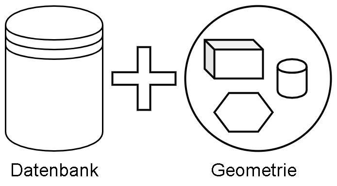
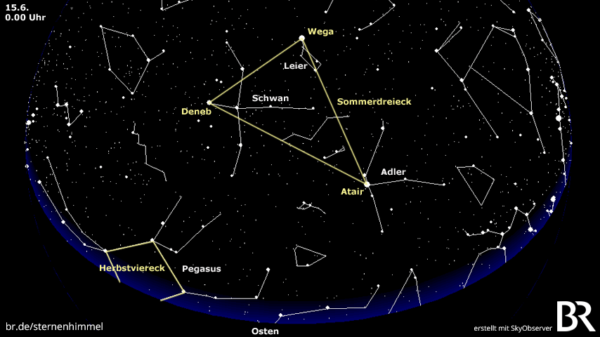
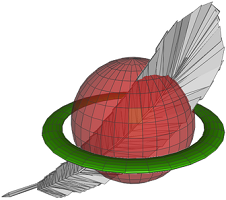
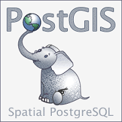

# Einleitung
## Was sind Geodatenbanken

In einer einfachen Definition sind Geodatenbanken Datenbanken, die mit räumlichen oder geometrischen Daten und Funktionen kombiniert werden. Neben der Speicherung stellen diese Datenbanken Funktionen zur Erfassung, Bearbeitung, Organisation, Analyse und Präsentation räumlicher Daten[1]. Die Geodatenbanken sind meißt in einem sogenannten Geoinformationsystem eingebetet. Dieses beinhaltet neben den Datenbanken zusätzliche Hardware.

In diesem Zusammenhang besteht die der geometrisch Anteil aus

- Geometrischen Formen
- Geometrischen Operationen
- Einem Refferenzkoordinatensystem
- Räumlichen Indezis

## Geschichte

#### Höhlenmalerei

Der Wunsch nach Karten und Navigationsmöglichkeiten zeige sich bereits in der frühen Menschengeschichte. So zeichneten bereits vor ca. 15.000 Jahren die Cro-Magnon-Jäger Karten an die Wände ihrer Höhlen. Die im heutigen Frankreich befindlichen Höhle von Lascau wurde im Jahre 1979 zum UNESCO Kulturerbe ernannt und zeigt neben Tierbildern auch Pfad- und Strichzeichnungen, die als vermeintliche Wegbeschreibung zu ihren Beutetieren verstanden werden kann. Eines dieser Zeichnungen wurde später als das sogenannten Sommerdreieck
, bestehenden aus den Sternen Wega, Atair und Deneb, identfiziert [Quelle](http://news.bbc.co.uk/2/hi/science/nature/871930.stm).
Diese Sternenkonstellation wurde vor allem in der nördlichen Hemisphäre zum navigieren verwendet. Damit stellen diese Malerein das vermutliche erste GIS-System, nämlich die Verknüpfung von geologischen und anderen Attributen dar.

[Quelle](https://www.br.de/sternenhimmel/sterne-sternbilder-sternenhimmel-100.html)

### Eratosthenes 

### John Snow Cholera-Karte

Bereits im Jahr 1854 konnte der der britische Mediziner John Snow die Ursache einer Choleraepidemie in London durch die Awnedung eines einfachen Geoinformationssystem erkennen und deren Ausbreitung dadurch einschränken. Durch die Kombination von bereits bekannten Karten der Londoner Innenstadt und dem Auftreten der bekannten Cholerafälle konnte schnell eine Ursache für die Infektion ermitteln werden. Dazu wurden die Cholerafälle ortsbezogenen gruppiert, d.h. die Daten wurden geclustert. Nahezu alle der Cholerafälle bezogen ihr Wasser aus der gleichen Wasserpumpe.

[Quelle](https://www.r-bloggers.com/john-snows-cholera-data-in-more-formats/)

Die roten Punkte stellen die gruppierten Fälle von Cholera dar. Je größer der Punkt ist, desto mehr Fälle sind an diesem Ort aufgetreten. 
Unter Clustering versteht man in diesem Zusammenhang die logische Zusammenfassung von Objekten und Informationen mit ähnlichen Eigenschaften.

### Das Open Geospatial Consortium

Einen weiteren Meilenstein in der Geschichte der Geodaten stellte 1994 die Gründung des Open Geospatial Consortium dar. Im Jahr der Gründung noch als Open GIS Consortium gegründete und als gemeinnützige Organisation angedachte, entwicklte sich das *OGC* in den letzten Jahren zur zentralen Analufstellung für die Standartisierung im Bereich der Geodaten. Das Ziel der Standartisierung ist die Interoperabilität zwischen verschienden System zu gewährleisten. Mittlerweise besteht das Consortium aus ca [523 aktiven Mitgliedern](https://www.opengeospatial.org/ogc/members), die sich unter anderem aus den Bereichen der Regierungsorganisationen, privater Industrie und Universitäten zusammensetzen. Ein Mitgliedschaft im OGC ist kostenpflichtig.

Die 2004 veröffentlichte Spezifikation [ISO 19125-2:2004](https://www.iso.org/standard/40115.html), dem sogenannten *Simple feature access*, die die grundlegenden geometrischen Datentypen und deren Speicherung festlegt, gilt als heutiger Industriestandard.

## Anwendungen

Geodaten können in den unterschiedlichsten Anwendungen eingesetzt werden. So  

## Aktuelle Geodatenbanken

Die meißten aktuellen Datenbanksystem bieten entweder eine integrierte oder über Erweiterungen eine Unterstüzung für das  Arbeiten mit Geodaten an. Einige davon sind

  [Oracle](https://www.oracle.com/database/technologies/spatialandgraph.html)

 [SpatiaLite](https://www.gaia-gis.it/fossil/libspatialite/index)

  [PostGIS](https://www.gaia-https://postgis.net/.it/fossil/libspatialite/index)

 [MS SQL Server](https://docs.microsoft.com/de-de/sql/relational-databases/spatial/spatial-data-sql-server?view=sql-server-ver15)

| [<< Inhaltsverzeichnis](readme.md) | Einleitung | [Geometrische Formen >>](02_datatypes.md) |
|------------------------------------|------------|-------------------------------------|
---

 1. https://de.wikipedia.org/wiki/Geoinformationssystem#Geodaten
 2. [An Introduction to Spatial Database Systems](http://dna.fernuni-hagen.de/papers/IntroSpatialDBMS.pdf)
 3. [An Introduction to Spatial Database Systems](http://dna.fernuni-hagen.de/papers/IntroSpatialDBMS.pdf)
 4. [Geospatial Data — A Datum Primer](https://towardsdatascience.com/geospatial-data-a-datum-primer-479b7ca8635c)
 5. https://docs.microsoft.com/de-de/sql/relational-databases/spatial/spatial-data-sql-server?view=sql-server-ver15
 6. https://www.datenbanken-verstehen.de/lexikon/geodatenbank/
 7. https://postgis.net/workshops/postgis-intro/introduction.html
 8. https://de.wikipedia.org/wiki/PostGIS
 9. https://de.wikipedia.org/wiki/Geodaten
10. https://data-science-blog.com/blog/2019/06/24/erstellen-und-benutzen-einer-geodatenbank/
11. http://www.bostongis.com/PrinterFriendly.aspx?content_name=spatialite_tut01