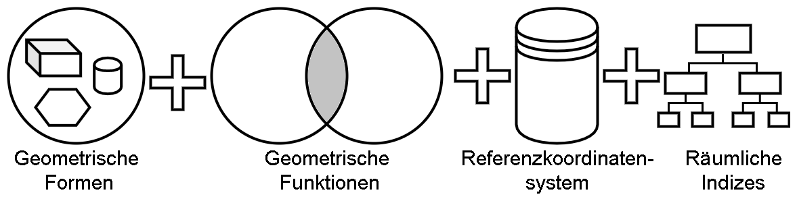
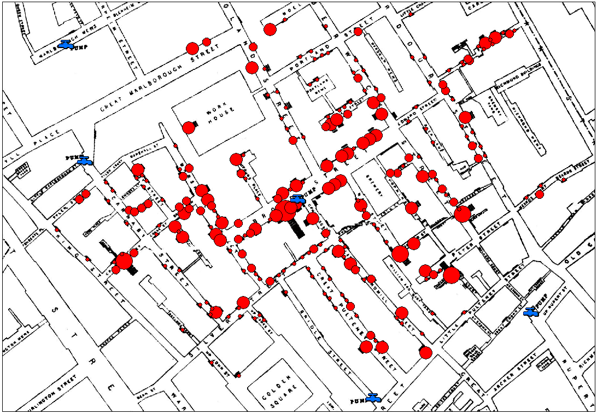

# Einleitung

## Was sind Geodatenbanken

In einer einfachen Definition sind Geodatenbanken Datenbanken, die die Integration räumlichen oder geometrischen Daten in das Datenabnkschema untesrtützen. Dabei werden spezielle Datentypen, Funktionen und Objekte zum Arbeiten mit räumlichen Daten angeboten. Neben der Speicherung stellen diese Datenbanken Funktionen zur Erfassung, Bearbeitung, Organisation, Analyse und Präsentation räumlicher Daten[1]. Die Geodatenbanken sind meißt in einem sogenannten Geoinformationsystem eingebetet. Dieses beinhaltet neben den Datenbanken meißt zusätzliche Hardware.

In diesem Zusammenhang bedeuten räumliche Daten und Objekte

- **Geometrischen Formen:** Es werden spezielle Datentypen zu Speicherung von räumlichen Daten bzw. Formen bereitgestellt.
- **Geometrischen Operationen:** Auf den geometrischen Formen können weitere Operationen ausgeführt werden. Daunter Zählnen zB. Schnitte, die das Arbeiten mit diesen Daten erleichtern.
- **Einem Referenzkoordinatensystem:** Das Referenzkoordinatensystem stellt den Bezug zwischen den Daten und dem umgegebenen System her.
- **Räumlichen Indezis:** Um einen performanten Zugriff auf die Datenstrukturen zu ermöglichen werden nehmen den normalen Indezis einer Datenbank eine sepzielle ARt von Indezies eingeführt, die räumlichen Indezis.

Diese vier Komponenten sollen in den nächsten Kapiteln beschrieben werden.

||
|:--:|
|*Abbildung 1-1: Grafische Darstellung der Komponennten einer Geodatenbank. Quelle: Selbsterstellt*|

## Geschichte

### Höhlenmalerei

Der Wunsch nach Karten und Navigationsmöglichkeiten zeigte sich bereits in der frühen Menschengeschichte. So zeichneten bereits vor ca. 15.000 Jahren die Cro-Magnon-Jäger Karten an die Wände ihrer Höhlen. Die im heutigen Frankreich befindlichen *Höhle von Lascau* wurde im Jahre 1979 zum UNESCO Kulturerbe ernannt und zeigt neben Tierbildern auch Pfad- und Strichzeichnungen, die als vermeintliche Wegbeschreibung zu den Beutetieren verstanden werden kann. Eine dieser Zeichnungen wurde später als das sogenannten Sommerdreieck, bestehend aus den Sternen *Wega*, *Atair* und *Deneb*, identifiziert[2].
Diese Sternenkonstellation wurde vor allem in der nördlichen Hemisphäre zum navigieren verwendet. Durch die Verknüpfung räumlicher Daten, der Wegbeschreibung, und weiteren Attributen, das Vorhandensein von Beutetieren, stellen diese Malerien wahrscheinlich die erste Geodatenbank dar.

### John Snow Cholera-Karte

Im Jahr 1854 konnte der der britische Mediziner John Snow die Ursache einer Choleraepidemie in London durch die Anwendung eines einfachen Geoinformationssystem erkennen und deren Ausbreitung dadurch einschränken. Durch die Kombination von bereits bekannten Karten der Londoner Innenstadt und dem Auftreten der bekannten Cholerafälle konnte schnell eine Ursache für die Infektion ermitteln werden. Dazu wurden die Cholerafälle ortsbezogen gruppiert, d.h. die Daten wurden geclustert. Nahezu alle der Cholerafälle bezogen ihr Wasser aus der gleichen Wasserpumpe[3].

||
|:--:|
|*Abbildung 1-2: Cholera-Map von John Snow. Quelle: [3]*|

Die roten Punkte stellen die gruppierten Fälle von Cholera dar. Je größer der Punkt ist, desto mehr Fälle sind an diesem Ort aufgetreten. Unter Clustering versteht man in diesem Zusammenhang die logische Zusammenfassung von Objekten und Informationen mit ähnlichen Eigenschaften.

### Das Open Geospatial Consortium

Einen weiteren Meilenstein in der Geschichte der Geodaten stellte 1994 die Gründung des Open Geospatial Consortium dar[4]. Im Jahr der Gründung noch als Open GIS Consortium gegründete und als gemeinnützige Organisation angedachte, entwicklte sich das *OGC* in den letzten Jahren zur zentralen Analufstellung für die Standartisierung im Bereich der Geodaten. Das Ziel der Standartisierung ist die Interoperabilität zwischen verschienden System zu gewährleisten. Mittlerweise besteht das Consortium aus ca. 523 aktiven Mitgliedern[5], die sich unter anderem aus den Bereichen der Regierungsorganisationen, privater Industrie und Universitäten zusammensetzen. Ein Mitgliedschaft im OGC ist kostenpflichtig.

Die 2004 veröffentlichte Spezifikation [ISO 19125-2:2004](https://www.iso.org/standard/40115.html)[6], dem sogenannten *Simple feature access*, die die grundlegenden geometrischen Datentypen und deren Speicherung festlegt, gilt als heutiger Industriestandard. Eine der wichtigsten Spezifikationen des Simple feature access sind die Formate *WKT - Well-known Text* und *WKB - Well-known Binary*, die die Repräsentation von Geometrien standartisieren und und somit die Interoperabilität erhöhen soll. Die Darstellungsarten werden im Kapitel *Geometrische Formen* näher erläutert.

**HINWEIS** Eine Kopie der *OGC-Simple feature access* Spezifikation in der Version *1.2.1* befindet sich im [Literaturverzeichnis](lit/06-103r4_Implementation_Specification_for_Geographic_Information_-_Simple_feature_access_-_Part_1_Common_Architecture_v1.2.1.pdf). Abgerufen am 08.01.2020 von [OGC](https://www.opengeospatial.org/standards/sfa)

## Anwendungen

In allen Bereichen, in denen eine Verknüpfung von Daten mit deren räumlichen Vorkommen einen Sinn macht, können Geodaten eingesetzt werden. Einige der Einsatzgebiete von Geodaten sind:

- **Notfallplanung und Katastrophenschutz::**  Ein wichtiger Einsatzbereich für Geodaten ist die Notfallplanung und der Katastrophenschutz. So kann anhand aufgezeichneter Daten zB. vorausberechnet werden, wie der Verlauf eines Hurrikanes aussehen könnte. Auch für aktuelle Situationen, wie den Buschbränden in Australien finden Geodaten einen weitläufigen Einsatz[7].
- **Navigation:** Einer der "klassischen" Anwendungsfälle von Geodaten. Dabei werden die zugrundeliegenden räumlichen Informationen zur Wegfindung verwendet. Kombiniert mit weiteren Daten, wie beispielsweise Wirtschaftlichkeit/Spritverbrauch, Dauer und Verkehrsaufkommen für eine gewisse Strecke, bilden diese Daten die Grundlagen für die heutige Navigation.
- **Vermessung:** Auch zur Grundstücksvermessung werden Geodaten verwendet. So bietet das Land Berlin einen direkten Zugriff auf die [Vermessungsdaten](https://www.stadtentwicklung.berlin.de/geoinformation/) der Stadt Berlin. Diese werden zur Stadtplanung und zur Planung weiteren Dienstleistungen verwendet[8].
- **Marktanalyse:** Auch zur Marktanalyse können Geodaten verwendet werden. So erstellte der Data Scientist Chrisopher Kipp auf seinen [Blog](https://data-science-blog.com/blog/2019/05/06/allgemeines-uber-geodaten/) ein Voronidiagrammen, dass Supermärkte und ihre umliegenden Einzugsgebiete verdeutlicht. Anhand dieser Auswertung, könnten Marktlücken gefunden und genutzt werden.[9]

## Aktuelle Geodatenbanken

Die meißten aktuellen Datenbanksystem bieten entweder bereits integrierte oder über Erweiterungen das Arbeiten mit Geodaten an. Einige davon sind:

- **Oracle Spatial:** Seit kurzem bietet das US-amerikanische Soft- und Hardwareunternehmen Oracle die Erweiterung zur Verarbeitungen und Analyse von Geodaten ohne weiteren Lizenzkosten an[10].
- **MS SQL Server:** Bereits seit der Version 2008 bietet der von Microsoft entwickelte Datenbankserver die Möglichkeit räumliche Datentypen zu nutzen[11].
- **SqLite und SpatiaLite:** Die seit dem Jahr 2000 verfügbare, gemeinfreie Programmierbibliothek ermöglicht den effizienten und kostengünstigen Einsatz relationaler Datenbanken. Mit der ebenfalls kostenlosen Erweiterung *SpatiaLite* kann eine Vielzahl geografischer Datenoperationen durchgeführt werden. Diese Kombination wird im späteren praktischen Teil eingesetz[12].
- **PostgreSQL und PostGIS:** Das objektrelationale Datenbankmodell wird seit dem Jahr 1996 vertrieben. Das Datenbanksystem wird unter der freien GNU Lizenz vertrieben. Die PostGis-Erweiterung erlaubt das bearbeiten, speichern und analysieren von geografischen Daten[13].

---

| [<< Inhaltsverzeichnis](readme.md) | Einleitung | [Geometrische Formen >>](02_datatypes.md) |
|------------------------------------|------------|-------------------------------------|

---

| #   | Literatur            |
| --- |--------------------------------------------------------------------------------------------------------------------------------------------------------------------------------------------------|
| [1] | **Wikipedia**: *Geoinformationssystem*, [https://de.wikipedia.org/wiki/Geoinformationssystem/](https://de.wikipedia.org/wiki/Geoinformationssystem), aufgerufen am 08.01.2020  |
| [2] | **BBC News**: *Ice Age star map discovered*,  [http://news.bbc.co.uk/2/hi/science/nature/871930.stm](http://news.bbc.co.uk/2/hi/science/nature/871930.stm), aufgerufen am 20.01.2020  |
| [3] | **Robin Wilson**: *John Snow’s Cholera data in more formats*,  [https://www.r-bloggers.com/john-snows-cholera-data-in-more-formats/](https://www.r-bloggers.com/john-snows-cholera-data-in-more-formats/), aufgerufen am 20.01.2020  |
| [4] | **OGC**: *20th Anniversary*,  [https://www.opengeospatial.org/about/20th-anniversary](https://www.opengeospatial.org/about/20th-anniversary), aufgerufen am 20.01.2020  |
| [5] | **OGC**: *OGC Members*,  [https://www.opengeospatial.org/ogc/members](https://www.opengeospatial.org/ogc/members), aufgerufen am 20.01.2020  |
| [6] | **ISO**: *ISO 19125-2:2004 Geographic information — Simple feature access — Part 2: SQL option*,  [ISO 19125-2:2004](https://www.iso.org/standard/40115.html), aufgerufen am 10.01.2020  |
| [7] | **Australian Government**: *Mapping Bushfires*,  [https://www.ga.gov.au/scientific-topics/earth-obs/case-studies/mapping-bushfires](https://www.ga.gov.au/scientific-topics/earth-obs/case-studies/mapping-bushfires), aufgerufen am 20.01.2020  |
| [8] | **Berlin.de**: *Geoportal Berlin*,  [https://www.stadtentwicklung.berlin.de/geoinformation/](https://www.stadtentwicklung.berlin.de/geoinformation/), aufgerufen am 07.01.2020  |
| [9] | **Christopher Kipp**: *Allgemeines über Geodaten*,  [https://data-science-blog.com/blog/2019/05/06/allgemeines-uber-geodaten/](https://data-science-blog.com/blog/2019/05/06/allgemeines-uber-geodaten/), aufgerufen am 07.01.2020  |
| [10] | **William Hardie**: *Machine Learning, Spatial and Graph - No License Required!*,  [https://blogs.oracle.com/database/machine-learning,-spatial-and-graph-no-license-required-v2](https://blogs.oracle.com/database/machine-learning,-spatial-and-graph-no-license-required-v2), aufgerufen am 07.01.2020  |
| [11] | **Davlid Lean**: *What Is SQL Server 2008?*,  [https://www.bostongis.com/PrinterFriendly.aspx?content_name=sql2008_tut01](https://www.bostongis.com/PrinterFriendly.aspx?content_name=sql2008_tut01), aufgerufen am 07.01.2020  |
| [12] | **SpatiaLite**: *SpatiaLite*,  [https://www.gaia-gis.it/fossil/libspatialite/index](https://www.gaia-gis.it/fossil/libspatialite/index), aufgerufen am 07.01.2020  |
| [13] | **PostGIS**: *About PostGIS*,  [https://postgis.net/](https://postgis.net/), aufgerufen am 10.01.2020  |