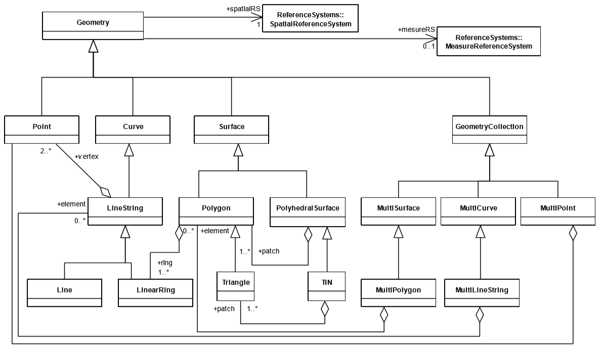
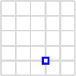
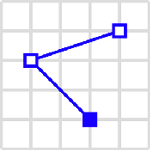
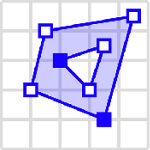
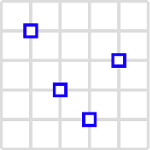
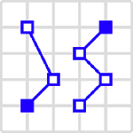
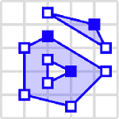

# Geometrische Formen

Neben den klassischen Datentypenen stellen Geodatenbanken spezielle Datentypen zum Speichern von Geoinformationen zur Verfügung. Dabei besitzen die Datentypen eine hierarische Vererbungsstruktur, ähnlich wie Objekte bei der Objektorientieren Programmierung. Diese Struktur erlaubt die Vererbung von Attributen und Verhalten von den Elternelementen an ihre Kindelemente. Im einfachsten Ansatz können diese Datentypen als Formen bezeichnet werden. Dabei gibt es verschiedene nicht instanziibare, sogenannten abstrakte, Typen, die zur Vereinfachung und Vererbung von geteilten Funktionen verwndet werden. Die folgende Abbildung enthält die Vererbungshierarchy der räumlichen Datentypen nach Vorgaben des OGC. Des weiteren werden die Datentypen in einfache Typen und Auflistungstypen unterteilt[1].

||
|:--:|
|*Abbildung 2-1: Geodatentypen Hierarchie. Quelle: [1]*|

| Datentyp | Beispiel
|------ | -----------
| **Geometry**  Abstrakter Datentypen, der als Elternklasse aller weiteren räumlichen Datentypen gilt. Stellt grundlegenden Funktionen und Eigenschaften zur Verfügung.
| **GeometryCollection**  Abstrakter Datentypen, der als Elternklasse aller Auflistungstypen dient. Erbt selbst alle Funktionen von der abstrakten Klasse `Geometry`. Eine GeometryCollection kann keine oder merhere Instanzen von `Geometry-Objekten enthalten.
|**Punkt/Point**  Der Punkt stellt einen einzelnen Ort im Referenzkoordinatensystem dar. Dieser setzt sich in der Regel aus einer X/Y-Koordinate zusammen. Es besteht aber die Möglichkeit, zusätzlich eine Z-Koordinate sowie eine M-Eigenschaft für die Maßeinheit anzugeben. In den meißsten Fällen werden die X/Y-Koordinaten auch als Längen- und Breitengrad (Longitude/Latitude oder geografische Länge und Breite) bezeichnet. Die Werte für die Länge und Breite werden in Grad gemessen und haben fest vorgegebene Bereiche.  Die Werte für den Breitengrad liegen immer im Bereich (-90, 90). Werte für den Längengrad liegen immer im Bereich (-180, 180). | 
|**LineString** Ein LineString ist ein eindimensionales Objekt, das eine Sequenz aus Punkten und die sie verbindenden Liniensegmente darstellt. Dabei bilden genau zwei Punkte ein Liniensegment. Die Reihenfolge der Punkte ist zu beachten. | 
|**Polygon**  Ein Polygon ist eine ebene Fläche, die durch 1 Außengrenze und 0 oder mehr Innengrenzen definiert ist. Jede innere Begrenzung definiert ein Loch im Polygon. Ein Dreieck ist ein Polygon mit 3 verschiedenen, nicht kollinearen Eckpunkten und ohne innere Begrenzung.| 
|**Multipunkt/MultiPoint**  Ein Multipunkt ist eine Sammlung von Punkten. Diese Punkt sind weder verbunden noch haben sie eine spezifische Reihenfolge.  | 
|**Multilinestring/MultiString**  Ein Multilinestring ist eine Sammlung von Linestrings  | 
|**Mulitpolygon/MultiPolygon**  Ein Multipolygon ist eine Collection von Polygonen. Dabei dürfen sich die Grenzen der enthaltenen Polygone zwar an einer endlichen Anzahl von Punkten berühren, aber niemals schneiden.    | 

## Repräsentation der Datentypen

Das OGC spezifiziert neben der topologischen Abbildung auch die Repräsentation, also die Darstellung, der räumlichen Objete. Dort wird hauptsächlich zwischen zwei Repräsentationsarten unterschieden[1].

**WKT - Well-known Text**
Die Well-known-Text-Repräsentation wird vor allem dazu verwendet, um die Geometrie alphanumerisch darstellen zu können. Dies ist von Vorteil, wenn der menschliche Anwender die Geometriespalten verstehen soll.

**WKB - Well-known Binary**
Die Well-known-Binary-Repräsentation ist eine übertragbare Repräsentation der Geometrien als eine kontinuierliche Byte-Datenkette. Als Datentypen verwendet WKB Integer ohne Vorzeichen aus einem bzw. vier Byte und Zahlen doppelter Genauigkeit aus acht Byte. Dabei hat jdes Byte eine spezielle Bedeutung[2].

- Das erste Byte bestimmt die Byte-Reiehnfolge. 00 steht dabei für *Big Endian* oder 01 für *Little Endian*
- Die nächsten 4 Bytes spezifizieren den Geomertry-Typen. Dabei ist ein Wert von 1 - 7 (Point, LineString, Polygon, MultiPoint, MultiLineString, MultiPolygon oder GeometryCollection) möglich
- Die 8-Byte representieren die Koordinaten.

Diese Darstellung eigenet sich speziell für die maschinengesteuerte Verarbeitung der Daten.

Beispiele für die Darstellugn WKT vs. WKB

| Geometrie | WKT | WKB
|------ | -------------------- | -------
| Punkt| `Point(10 10)` | `0101000000000000000000F03F000000000000F03F`
| LineString| `LineString (50 2, 50 10)` | `001\002\000\000\000\002\000\000\000\000\000\000\000\000\000I@\000\000\000\000\000\000\000@\000\000\000\000\000\000I@\000\000\000\000\000\000$@`

In den folgenden Kapiteln und in der praktischen Überung werden wir, wenn nicht anders angegeben, dass *WKT*-Format verwenden.

---

| [<< Einleitung](01_introduction.md) | Geometrische Formen | [Geometrische Operationen >>](03_operations.md) |
|------------------------------------|------------|-------------------------------------|

---

| #   | Literatur            |
| --- |--------------------------------------------------------------------------------------------------------------------------------------------------------------------------------------------------|
| [1] | **OGC**: *OGC -  Simple feature access*, [lit/06-103r4_Implementation_Specification_for_Geographic_Information_-_Simple_feature_access_-_Part_1_Common_Architecture_v1.2.1.pdf](lit/06-103r4_Implementation_Specification_for_Geographic_Information_-_Simple_feature_access_-_Part_1_Common_Architecture_v1.2.1.pdf), abgerufen am 08.01.2020  |
| [2] | **SkyLineSoft**: *APIReferenceGuide*,  [http://www.skylinesoft.com/SkylineGlobe/TerraExplorer/v6.5.0/APIReferenceGuide/Well_Known_Text_and_Well_Known_Binary_WKT_and_WKB.htm](http://www.skylinesoft.com/SkylineGlobe/TerraExplorer/v6.5.0/APIReferenceGuide/Well_Known_Text_and_Well_Known_Binary_WKT_and_WKB.htm), aufgerufen am 20.01.2020  |