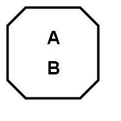
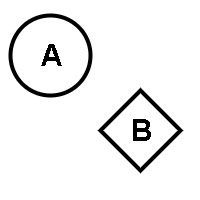
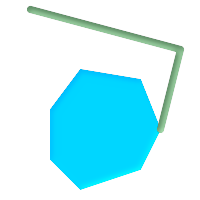
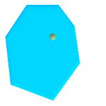
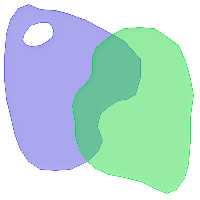
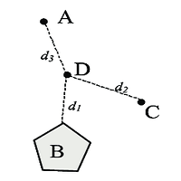

# Geometrische Operationen

Neben den im vorherigen Kapitel beschriebenen neu eingeführten geometrischen Datentypen verfügen Geodatenbank über spezielle geometrische Funktionen, die das Arbeiten mit den neuen Datentypen erleichtern sollen. Eine komplette Auflistung würde den Rahmen dieser Ausarbeitung weit überschreiten, deswegen soll hier auf die SQL Function List von [SpatiaLite](http://www.gaia-gis.it/gaia-sins/spatialite-sql-4.3.0.html) verwiesen werden. Primäre sollen die relationalen Operatoren erläutert werden. Diese Operatoren spezifizieren die topologische Beziehung zwischen verschiedenen Geometrien.

## Relationale Operatoren

Die relationalen Operatoren sind Operationen, die zwei oder mehr Geometrien auf eine spezifische, topologische Beziehung untersuchen. Sie arbeiten mit dem Rückgabewerten `Wahr` oder `Falsch`. Ist die topologische Beziehung vorhanden, wird `Wahr`zurückgegeben, anderseit `Falsch`.

Der grundlegende Ansatz zum Vergleichen von zwei geometrischen Objekten besteht darin, die Objekte auf ein horizontale 2D-Koordinatenreferenzsystem zu projizieren, das die Erdoberfläche darstellt. Anschliessend paarweise die Schnittpunkte zwischen den Innenräumen, Grenzen und Außenräumen der beiden Projektionen zu testen und zu klassifizieren[1].

| Operation | Beispiel
| ------ | -----------
| **Gleich/Equals**  Prüft, ob die beiden Geometrien identisch sind. Dafür werden alle Punkte der Geometrie miteinander verglichen. | 
| **Disjunkt/Disjoint**  Mit dieser Funktion lässt sich festestellen, ob die beiden Geometrien sich weder berühren, schneiden noch überlappen. | 
| **Berührt/Touches**  Geometrien berühren sich, wenn eine *endliche* Anzahl von Punkten aufeinander liegen, ohne das sie sich kreuzen. | 
| **Kreuzt/Crosses**  Eine Geometrie kreuzt eine andere Geometire, wenn sie interpolierte Punkte innerhalb oder auf einer anderen Geometrieform besitzt. Dabei können Start und Endpunkt sowohl innerhalb als auch ausserhalb der zweiten Geometrie liegen.  | 
| **Innerhalb/Within**  Eine Geometrie ist innerhalb einer anderen, sobald sich alle Punkte der ersten Geometrie innerhalb der zweiten Geometrieform befinden. | 
| **Überschneidet/Overlaps**  Wenn Teile einer Geometrieform Teilflächen der anderen Geometrieform überdecken, spricht man von überlappen. | 
| **Distanz/Distance**  Ermöglicht die Berechnung der Distanz zwischen Punkten. Im Gegensatz zu den relationalen Operatoren wird die Entfernung als Zahlenwert zurückgegeben, `nicht Wahr/Falsch` | 

---

| [<< Geometrische Formen](02_datatypes.md) | Geometrische Operationen | [Referenzkoordinatensystem >>](04_coordinate_system.md) |
|------------------------------------|------------|-------------------------------------|

---

| #   | Literatur            |
| --- |--------------------------------------------------------------------------------------------------------------------------------------------------------------------------------------------------|
| [1] | **OGC**: *OGC -  Simple feature access*, [lit/06-103r4_Implementation_Specification_for_Geographic_Information_-_Simple_feature_access_-_Part_1_Common_Architecture_v1.2.1.pdf](lit/06-103r4_Implementation_Specification_for_Geographic_Information_-_Simple_feature_access_-_Part_1_Common_Architecture_v1.2.1.pdf), abgerufen am 08.01.2020  |
