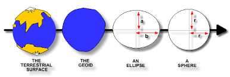
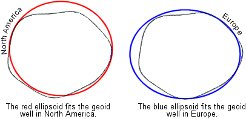
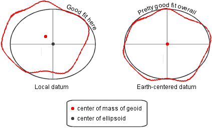

# Referenzkoordinatensystem

Ein wichtiger Apskekt sowohl für die Speicherung, als auch für die Anwendung von Geodaten ist das zugrundeliegende Referenzkoordinatensystem (*engl* Spatial reference system). Je nach Anwendung und Abstraktionslevel existieren verschiedene Annahmen über die geometrische Figur der Erde. Bei macnhen Anwendungen reichen einfache X/Y-Koordinaten, andere Anwendungen wie beispielsweise die Navigation brauchen zur korrekten Berechnung die Höhenangaben einer Koordinate. Dies ist die einfachste Form der Unterscheidung. Komplexer wird die Unterscheidung, wenn man bedenkt, dass die Erde weder eine Kugel, noch eine Ellipse mit abgeflachten Polen ist. Vielmehr ist die Erde ein Geoid. Dieser Geoid ist nach Definition *der von der tatsächlichen Erdgestalt abweichende theoretische Körper, dessen Oberfläche die Feldlinien der Schwerkraft überall im rechten Winkel schneidet* [1].

||
|:--:|
|*Abbildung 4-1: Grafische Darstellung verschiedener Annahmen von Erdformen. Quelle: [2]*|

Dies bedeutet, dass je nach Anwendungsfall und zugrundeliegenden Referenzkoordinatensystem die Darstellung der Geometrien unterschiedlich sein können.

## Geodätisches Datum

Aufgrund dessen wurde das geodätische Datum eingeführt. Dieses Datum beschreibt die Lage (Postiion und Orientierung) und den Maßstab eines mehrdimensionalen Koordinatensystems. Je nach Anwendung dienen unterschiedliche Erdofrmenen (Geoid, Kugel, Ellipse) als Bezugsfläche. Durch die Verknüpfung des geodätischen Datum und dem Koordinatensystem entsteht ein Referenkoordinatensystem.

Neben dem zugrundeliegenden Erdköper und der Anwendung spielt auch die Region der Anwendung eine wichtige Rolle. Um die Genauigkeit des geodätischen Datum zu erhöhen wird dieses je nach Region angepasst.

||
|:--:|
|*Abbildung 4-2: Gegenüberstellung verschiedener geodätischer Daten. Quelle: [4]*|

Diese Daten werden als **lokal** bezeichnet, da sie nur für eine bestimmte Region eine hohe Präzision liefern, für den Rest des Geoid jedoch nicht nutzbar sind. In der oben gezeigtn Grafik sind die beiden Daten für die Regionen *Nord Amerika* und *Europa* gewählt. Wählt man das rote Datum erhählkt man eine hohe Präzision für Amerika, verringert jedoch die Präzision für Europa und umgekehrt.

Um eine allgemeingültiges Datum zur Verfügung zu stellen wird das *Earth-centered datum* verwendet. Seit 2000 wird dazu das Datum *WGS84 - World Geodetic System 1984* verwendet. Dies soll in nahezu allen Regionen der Erde eine ausreichende Präzision ermöglichen.

||
|:--:|
|*Abbildung 4-3: Gegenüberstellung lokaler und weltweiter geodätischer Daten. Quelle: [4]*|

Die linke Abbildung zeigt das lokale Datum *NAD27 - North America Datum of 1927* für Nord Amerika, daneben das allgemeingültige *WGS84 - World Geometric System 1984*. Auch wenn es in einigen Regionen deutlich von der eigentlichen Geoid-Form abweicht, verfügt es für den Großteil des Geoid eine akzeptable Präzision.

Bei dem Referenzsystem dienen 6 Koordinaten zur exakten Positionsbestimmung relativ zur Erde. Dabei gelten 3 Koordinaten für den Ursprung und drei für die Orientierung.[3]

Die folgende Tabelle bietet eine Übersicht über aktuelle eingesetzte geodätischer Daten und deren Ursprung[4]

| Datum   | Ursprung | Ursprungs Koordinaten | Genutze Erdform | Anmerkung
| ---   | ----- | -----------| ----- | --------
| NAD27   | Meades Ranch, Kansas | 33° 13' 26.686" N   98° 32' 30.506'' W| Clarke 1866 |
| ED50   | Potsdam, Germany | 52° 22' 51.45" N  13° 03' 58.74" E | International 1924 | Veraltet. Nachfolger WGS84
| Tokyo   | Tokyo Observatory | 35° 39' 17.51" N  139° 44' 40.50" E | Bessel |
| Indian   | Kalianpur, India | 24° 07' 11.26" N  77° 39' 12.57" E | Everest |

## SRID

Jede räumliche Geometrie hat einen SRID (Spatial Reference Identifier), einen räumlichen Referenzbezeichner. Der SRID bezieht sich auf ein räumliches Referenzsystem. Eine räumliche Spalte kann Objekte mit unterschiedlichen SRIDs enthalten. Zum Arbeiten mit räumlichen Operationen, müssen alle Objekte die gleiche SRID besitzen. Das von zwei räumlichen Dateninstanzen abgeleitete Ergebnis einer beliebigen räumlichen Methode ist nur dann gültig, wenn diese Instanzen den gleichen SRID haben und die gleiche Maßeinheit, Bezugsebene und Projektion zur Bestimmung der Koordinaten der Instanzen verwendet wurde[5].

---

| [<< Geometrische Funktionen](03_operations.md) | Referenzkoordinatensystem | [Räumliche Indizes >>](05_spatial_indexes.md) |
|------------------------------------|------------|-------------------------------------|

---

| #   | Literatur            |
| --- |--------------------------------------------------------------------------------------------------------------------------------------------------------------------------------------------------|
| [1] | **Wikipedia**: *Geoid*, [https://de.wikipedia.org/wiki/Geoid/](https://de.wikipedia.org/wiki/Geoid), aufgerufen am 20.01.2020  |
| [2] | **Geoscience Australia**: *Map Projection Concepts*, [www.geosci.usyd.edu.au](https://www.google.com/url?sa=i&source=imgres&cd=&ved=2ahUKEwiwtYDv-KDnAhUSalAKHVbaBOcQjhx6BAgBEAI&url=ftp%3A%2F%2Fwww.geosci.usyd.edu.au%2Fpub%2Fmarias%2FGMT_SUCOGG_Lecture2_Maria.pdf&psig=AOvVaw2UZx4FbfL8n1_Ot89cHM74&ust=1580117053892582), aufgerufen am 20.01.2020  |
| [3] | **Wikipedia**: *Geodätisches Datum*, [https://de.wikipedia.org/wiki/Geod%C3%A4tisches_Datum](https://de.wikipedia.org/wiki/Geod%C3%A4tisches_Datum), aufgerufen am 20.01.2020  |
| [4] | **Jochen Albrecht**: *What is a datum*, [http://www.geo.hunter.cuny.edu/~jochen/GTECH201/Lectures/Lec6concepts/Datums/Components%20of%20a%20datum.htm](http://www.geo.hunter.cuny.edu/~jochen/GTECH201/Lectures/Lec6concepts/Datums/Components%20of%20a%20datum.htm), aufgerufen am 20.01.2020  |
| [5] | **Microsoft**: *SRIDs (Spatial Reference Identifiers)*, [https://docs.microsoft.com/de-de/sql/relational-databases/spatial/spatial-reference-identifiers-srids?view=sql-server-ver15](https://docs.microsoft.com/de-de/sql/relational-databases/spatial/spatial-reference-identifiers-srids?view=sql-server-ver15), aufgerufen am 20.01.2020  |
