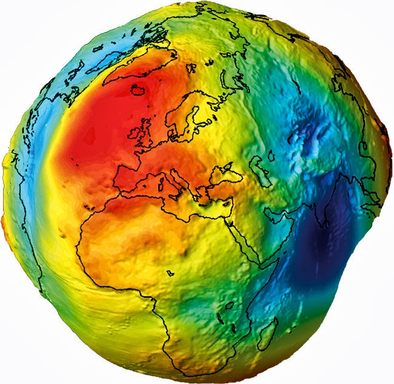
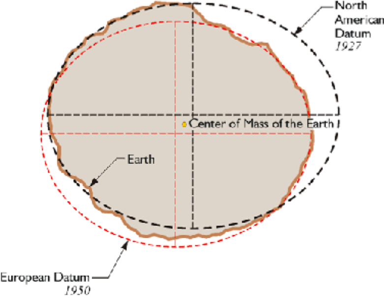

# Referenzkoordinatensystem

Ein wichtiger Apskekt sowohl für die Speicherung, als auch für die Anwendunge von Geodaten ist das zu grundeliegende Referenzkoordinatensystem (*engl* Spatial reference system). Nun stellt sich die Frage, was ist eine Referenzkoordinatensystem und wozu wird es verwendet. 

 [Quelle](http://deepearthscience.blogspot.com/2013/10/measuring-geoid-what-is-geoid.html)

Grundsätzlich sind alle Annahmen, bis auf die *Flat Earth*, richtig. Allerdings auf unterschiedlichen Abstraktionsebenen.
## Koordinatensystem

## Datum

| [<< Geometrische Funktionen](03_operations.md) | Referenzkoordinatensystem | [Praktische Anwendung >>](05_spatial_indexes.md) |
|------------------------------------|------------|-------------------------------------|
