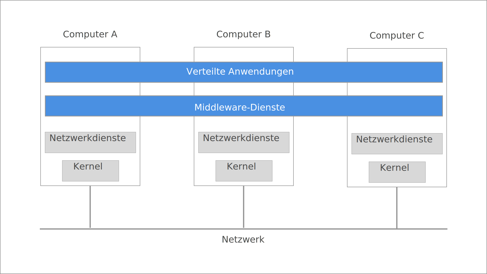

| [<< Einleitung](03_einleitung.md) | [Inhaltsverzeichnis](02_toc.md) | [Herausforderungen >>](05_herausforderungen.md) |
| --------------------------------- | ------------------------------- | ----------------------------------------------- |

---

# 2. Verteilte Systeme

Für das Konzept der verteilten Systeme gibt es in der Literatur, soweit ersichtlich, keine allgemein anerkannte und gültige Definition. Bei [van Steen, 2017] wird daher eine eher unspezifische Definition verwendet:

> A distributed system is a collection of autonomous computing elements that appears to its users as a single coherent system.

Nach dieser Definition besitzt ein verteiltes System zwei grundlegende Charakteristika:

- Es handelt sich um eine Ansammlung eigenständiger Recheneinheiten bzw. Knoten.
- Diese Ansammlung erscheint für die Nutzer wie ein einheitliches System.

Bei den Knoten kann es sich um viele verschiedene Arten von Computern handeln, wobei das Spektrum von Hochleistungsrechnern bis hin zu Einplatinenrechnern (und kleiner) reicht. Diese Knoten sind dabei grundsätzlich unabhängig voneinander, müssen aber auf verschiedenen Wegen miteinander kommunizieren. Die räumliche Verteilung der Recheneinheiten kann von demselben Mainboard über den gleichen Raum im Rechenzentrum bis hin zu unterschiedlichen Orten in der ganzen Welt reichen.

Die zweite Eigenschaft, das Erscheinen als ein einheitliches System, erfordert in der extremsten Deutung dieser Eigenschaft, dass sich das verteilte System gegenüber dem Nutzer so verhält, als sei es ein einziger Computer. Diese Forderung dürfte in den meisten Fällen jedoch zu weit gehen, sodass im Regelfall die Eigenschaft als erfüllt anzusehen ist, wenn sich das verteilte System den Erwartungen des Nutzers entsprechend verhält.

## 2.1 Hardware

Verteilte Systeme lassen sich zum einen aus Sicht der verwendeten Hardware betrachten. Im Unterschied zu zentralisierten, Ein-Kern-Rechnern setzen sich verteilte Systeme aus mehreren Recheneinheiten zusammen. Hierbei wird häufig zwischen Multiprozessorsystemen und Multicomputersystemen unterschieden.

**Multiprozessorsysteme** umfassen mehrere Prozessoren, die sich einen gemeinsamen Speicher teilen und meist an einen gemeinsamen Bus angeschlossen sind. Hierüber folgt ein direkter Zugriff aller beteiligten Prozessoren auf den Speicher sowie die Kommunikation zwischen den Prozessoren.

In **Multicomputersystemen** hingegen haben die einzelnen Prozessoren eigene, private Speicher, welchen sie nicht mit den anderen Prozessoren teilen. Die Kommunikation zwischen den Prozessoren erfolgt hier über ein Verbindungsnetzwerk. Multicomputersysteme lassen sich weiter in homogene und heterogene System unterteilen. **Homogene Systeme** setzen sich aus identischen Systemen zusammen, die alle die gleiche CPU, den gleichen Speicher usw. haben. **Heterogene Systeme** können aus verschiedensten Typen von Computern mit unterschiedlichsten Leistungsmerkmalen bestehen.

In den weiteren Teilen dieser Ausarbeitung wird von heterogenen Systemen ausgegangen, da diese in der Praxis am Häufigsten zu finden sind und für die die betrachteten Probleme die größte Relevanz besitzen. In Multiprozessorsysteme sind weitere Probleme zu finden, auf die hier nicht weiter eingegangen werden soll. Informationen hierzu finden sich u.a. bei [Tanenbaum, 2015].

## 2.2 Software

Der Software kommt in verteilten Systemen die vermutlich wichtigste Rolle zu, ist es doch bislang nur durch den geschickten Einsatz der Software möglich, die Ziele verteilter Systeme zu erreichen. Zu diesen Zielen zählen die gemeinsame Nutzung von Ressourcen, die Transparenz der Verteilung, Offenheit und Skalierbarkeit.

Das Ziel der **gemeinsame Nutzung von Ressourcen** umfasst vor allem den Ansatz, entfernte und / oder teure Ressourcen für mehrere Nutzer zugänglich zu machen. Der Begriff Ressource ist hierbei sehr weitläufig zu verstehen und umfasst sowohl Hardware-Ressourcen wie Drucker, Speicher oder Rechenleistung als auch Software-Ressourcen wie Datenbestände.

Die **Verteilungstransparenz** entspricht der o.g. Definition von verteilten Systemen und benennt die Eigenschaft, dass bei der Nutzung des verteilten Systems dessen Verteilung nicht unmittelbar sichtbar ist. Hierdurch wird insbesondere verborgen,

- wie der Zugriff auf die Ressource erfolgt (Zugriff)
- wo sich die Ressource befindet (Position)
- dass eine Ressource repliziert ist (Replikation)
- dass eine Ressource von mehreren, konkurrierenden Benutzern gleichzeitig genutz werden kann (Nebenläufigkeit)
- dass ein Teil des Systems ausgefallen ist und / oder wiederhergestellt wird (Fehler)
- ob eine Ressource sich im Speicher oder auf einer Festplatte befindet (Persistenz).

Mit **Offenheit** eines verteilten Systems ist gemeint, dass die Bestandteile des Systems leicht von anderen Systemen verwendet oder in diese integriert werden können und teilweise auch selber Komponenten aus anderen Systemen umfassen.

Die Fähigkeit eines verteilten Systems, auch bei stark wachsenden Nutzerzahlen und einer weitläufigen Verteilung der Nutzer die angebotenen Dienste angemessen und ohne Einschränkungen für die Nutzer zu erfüllen, wird als **Skalierbarkeit** bezeichnet. Hierzu ist es erforderlich, dass das System auch bei Hinzunahme (beliebig) vieler Knoten funktioniert. Neben der reinen Skalierbarkeit im Sinne von Größe, die sich insbesondere auf die Anzahl der Nutzer und Ressourcen / Zugriffe bezieht, ist auch die Skalierbarkeit in geographischer (regionale Verteilung der Nutzer ohne starke Latenzen) und administrativer Hinsicht notwendig.

## 2.3 Middleware

Da in verteilten Systemen überwiegend Multicomputersysteme zum Einsatz kommen, die zusätzlich auch noch heterogen sein können, ist die Kommunikation zwischen den Knoten nur über Netzwerkmechanismen möglich. Aus Sicht der Anwendungsentwicklung ist es sehr schwierig bis unmöglich und zudem unpraktikabel, auf die Besonderheiten der einzelnen Knoten angemessen einzugehen und diese separat zu adressieren. Aus diesem Grund wird durch Verwendung einer Abstraktionsschicht die Heterogenität der Einzelsysteme verborgen und in Form einer einheitlichen Schnittstelle zusammengeführt. Diese Abstraktionsschicht wird auch als **middleware** bezeichnet.

In der folgenden Abbildung ist zu sehen, wie die Middleware als Softwareschicht im verteilten System angeordnet ist.

Wie in der Grafik zu sehen ist, ist jeder Knoten mit einem eigenen Betriebssystem und eigenen Netzwerkdiensten ausgestattet. Die Verwaltung übernimmt das jeweilige Betriebssystem. Die Middleware bietet dann, basiered auf den Diensten und Ressourcen der jeweiligen Knoten, selber Dienste an, welche die Heterogenität der einzelnen Knoten verbergen.

Im Folgenden werden einige Dienste aufgelistet, die von der Middleware bereitgestellt werden:

- Application Programming Interface (API)
- Anwendungsserver
- Anwendungsintegration
- Datenintegration
- Transaction Processing
- Remote Procedure Call (RPC)
- Object Request Broker (ORB)

Eine Auswahl häufig verwendeter Middleware umfasst:

* Erlang/OTP

- MQSeries von IBM (plattformunabhängige Message orientierte Middleware-Software)

- der Websphere Application Server von IBM (Laufzeitumgebung für JavaEE-Anwendungen)

- die SAP Exchange Infrastructure von SAP

- FT-CORBA, COM+, .NET Remoting (Platformabhänige komplexe Objektbasierte RPC Kommunikation)

- RakNet (in Bereichen der Computerspiele Entwicklung).

  

---

[van Steen, 2017]: M. van Steen and A. S. Tanenbaum, Distributed systems, Third edition (Version 3.01 (2017)). London: Pearson Education, 2017.

[Tanenbaum, 2015]: A. S. Tanenbaum, Modern operating systems, Fourth edition. Boston: Pearson, 2015.

---

| [<< Einleitung](03_einleitung.md) | [Inhaltsverzeichnis](02_toc.md) | [Herausforderungen >>](05_herausforderungen.md) |
| --------------------------------- | ------------------------------- | ----------------------------------------------- |

