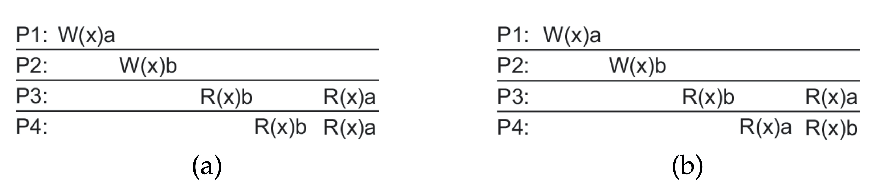
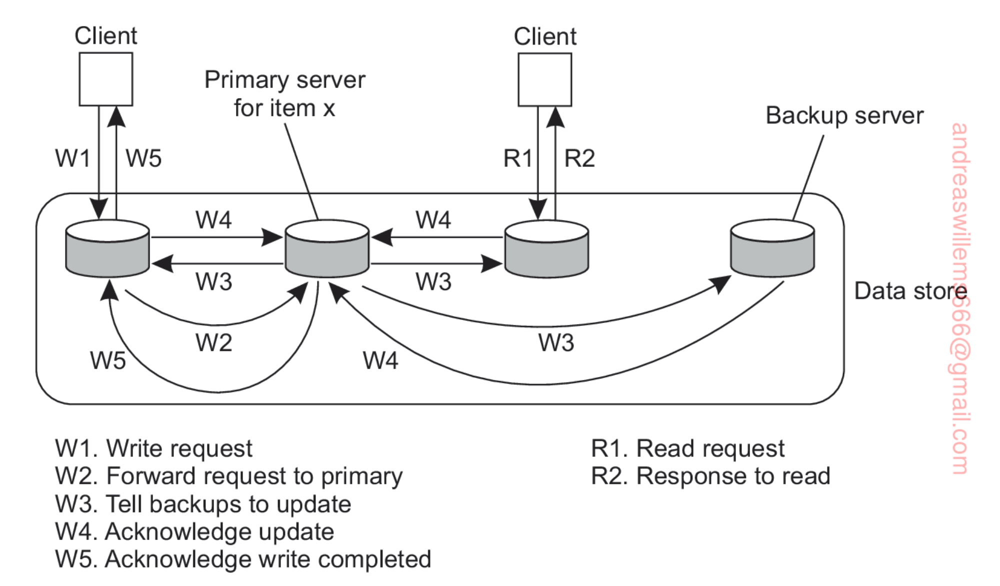
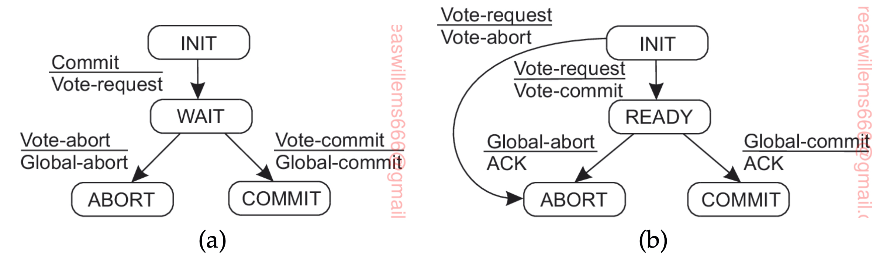

| [<< Verteilte Systeme](04_verteilte_systeme.md) | [Inhaltsverzeichnis](02_toc.md) | [Fallbeispiele >>](06_fallbeispiele.md) |
| - | - | - |
---

# 3. Herausforderungen

In diesem Kapitel sollen die Herausforderungen erläutert werden, denen man bei Entwicklung und Betrieb verteilter Systeme üblicherweise begegnet.


## 3.1 Architektur

In verteilten Systemen werden die beteiligten Komponenten per Definition häufig auf mehreren, unterschiedlichen Knoten ausgeführt. Mit wachsender Anzahl von Komponenten und Knoten steigt die Komplexität dieser Systeme massiv an.

Um diese Komplexität angemessen zu handhaben, wird bei den verteilten Systemen neben der rein physischen Verteilung der Komponenten,  genannt **Systemarchitektur**, auch deren logische Organisation betrachtet. Diese logische Organisation der Komponenten und deren Interaktionen untereinander werden auch als **Softwarearchitekturen** bezeichnet.

Ein wichtiges Ziel bei der Erstellung von Software-Architekturen in verteilten Systemen ist die Trennung der Applikationen von der zugrunde liegenden Plattform. Hierzu wird häufig eine Schicht eingeführt, die als **middleware** bezeichnet wird und welche der Erlangung von Transparenz dient (siehe dazu den Absatz "Ziele" in [Verteilte Systeme](04_verteilte_systeme.md)).

Verteilte Systeme folgen oft einem Architekturstil. Ein Stil reflektiert dabei die grundlegenden Prinzipien, anhand derer die Interaktion der verschiedenen Softwarekomponenten ausgestaltet ist. Wichtige und weit verbreitete Stile sind die Anordnung in Schichten sowie objektbasierte, ressourcenbasierte und ereignisbasierte Stile.

Ein verteiltes System kann auf verschiedenen Wegen zusammengesetzt werden. Eine der wichtigsten Klassen von verteilten Systemen ist die Aufteilung in Clients und Server. Ein Client sendet hierbei Anfragen an einen Server, welcher dann (idealerweise) eine Antwort errechnet und an den Client zurücksendet. Diese Aufteilung entspricht der üblichen Art und Weise, wie ein Modul Funktionen eines anderen Moduls aufruft. Durch die Anordnung verschiedener Komponenten auf verschiedenen Computern wird eine physikalische Verteilung der Funktionen über die beteiligten Computer / Maschinen erreicht.

Während Client-Server-Architekturen meist sehr zentralisiert und hierarchisch sind, gibt es auch denzentraliserte Architekturen, in denen die verschiedenen Prozesse der verschiedenen Computer eher gleichberechtigt angeordnet sind. Diese auch als peer-to-peer-Systeme bekannten verteilten Systeme organisieren ihre Prozesse meist in Form eines logischen Netzwerkes in welcher jeder Prozess eine lokale Liste von Prozessen pflegt, mit welchen Prozessen er kommunizieren kann.

Es gibt zudem hybride Architekturen, die Elemente der zentraliserten und dezentralisierten Formen kombinieren. So gibt es etwa eine zentrale Stelle, um initiale Anfragen von Clients entgegen zu enhmen. Im weiteren Verlauf wird die Verarbeitung dann von anderen Servern übernommen, welche Teil eines peer-to-peer-Systems sein können.

## 3.2 Prozesse

Prozesse sind, wie in Betriebssystemen, auch in verteilten Systemen ein wesentlicher Bestandteil und bilden die Basis für die Kommunikation zwischen verschiedenen Maschinen. Entscheidend ist hierbei die Klärung der Frage, wie die Prozesse organisiert sind und ob sie das Konzept von **Threads** unterstützen. Diese gegenüber Prozessen leichtgewichtigen Konzepte zur Implementierung von Nebenläufigkeit tragen je nach System unterschiedliche Namen: Jobs, Tasks, Fibre, Coroutine und viele mehr.

Threads sind in verteilten Systemen eine Möglichkeit, effiziente und performante Server zu entwickeln. Sie ermöglichen auch bei blockierenden I/O-Operationen die Nutzung der CPU durch mehrere Threads. Zur Erreichung dieser Nebenläufigkeit benötigen sie Konzepte zur **Synchronisierung** untereinander, analog zu Semaphoren und Mutex in Betriebssystem. Neben diesen existieren hier auch die Konzepte der Visitor und der Futures. Während Visitor Objekte ihren Zustand aufbauen und während ihrer Lebenszeit mehrere Systeme “besuchen”, verhalten sich Futures wie klassische Synchronisierungsobjekte mit Time-out, die ihr System nicht verlassen und das Ergebnis eines laufenden Vorganges repräsentieren.

Wichtig in verteilten Systemen ist auch das Konzept der **Virtualisierung**, welche durch das immer weiter verbreitete Cloud-Computing besondere Aufmerksamkeit erfährt. Populäre Technologien zur Virtualisierung (wie z.B. VirtualBox, Docker, Podman) und Orchestrierung (z.B. Kubernetes) erlauben es dem Nutzer, Anwendungen auf ihren favorisierten Betriebssystemen laufen zu lassen und komplette virtuelle verteilte Systeme "in der Cloud" zu erstellen. Dabei ist die Leistungsfähigkeit vergleichbar zu "traditionellen" Anwendungen. Durch diese Flexibilität in der Erstellung und dem Betrieb von virtuellen Systemen sind verschiedenste Cloud-Dienste entstanden, die Infrastruktur (IaaS), Plattformen (PaaS) und Anwendungen (SaaS) sowie weitere Dienste basierend auf virtuellen Umgebungen anbieten.

Die Organisation von verteilten Anwendungen in Clients und Server hat sich als nützlich erwiesen. Clients implementieren hierbei üblicherweise eine Benutzerschnittstelle, welche von einfachen Displays bis hin zu komplexen Anwendungen reicht. Durch das Verstecken von Details über die Kommunikation, Serverstandorte und Server Replikation wird in der Clientsoftware die angestrebte Verteilungstransparenz erreicht sowie Ausfälle und deren Behebung verdeckt.

Die Server sind in verteilten Systemen meist komplexer als die Clientsoftware. Für sie sind Fragen des Software Designs zu klären betreffend die Anzahl der angebotenen Dienste, der Zustandslosigkeit der Dienste und Ähnliches. Insbesondere bei der Anordnung der Dienste in einem **Cluster** aus Servern ist es sinnvoll, die Ausprägung des Systems als Cluster vor den Clients zu verbergen. Hierzu verwenden die Cluster meist einen einzelnen Zugangspunkt, welcher den Nachrichtenaustausch der Clients mit den Servern im Cluster verwaltet. Eine Herausforderung ist es, hierfür eine vollständig verteilte Lösung zu finden.

Eine weiterer wichtiger Aspekt in verteilten Systemen ist die Migration von Code zwischen verschiedenen Computern. Dies umfasst zum Beispiel die Möglichkeit, rechenintensive Anwendungen von den Servern hin zu den Clients zu verlagern, um so die Leistung und Flexibilität zu steigern. Insbesondere in Situationen, in denen die Kommunikation zwischen den Computern teuer und / oder langsam ist, bietet sich dieses Vorgehen an. Ein aktuelles Beispiel für dieses Vorgehen sind moderne Webanwendungen geschrieben in JavaScript, die komplexe Anwendungen (z.B. Single-Page-Applications) bei Aufruf der Website an die Clients ausliefern und dort im Browser ausführen.

## 3.3 Kommunikation

Der Kommunikation zwischen den beteiligten Komponenten sowie mit der Außenwelt kommt in verteilten Systemem besondere Bedeutung zu. Während in monolithischen Systemen die Kommunikation noch über Funktionsaufrufe und / oder lokale PubSub-Mechanismen u.ä. ausreicht, ist dies bei verteilten Multicomputersystemen nicht mehr gegeben.

```
TODO: Überarbeiten
Während in herkömmlichen verteilten Systemen die Netzwerkkommunikation noch über Mechanismen der Transportschicht wie einfaches Message Passing erfolgt, werden in middleware-basierten Systemen abstraktere Mechanismen angeboten, um die Kommunikation zu vereinfachen.
```

 Diese Mechanismen lassen sich grob in die drei Gruppen **Remote Procedure Calls**, **Message-Oriented Communication** und **Multicast Communication** unterteilen.

### 3.3.1 Remote Procedure Calls

### 3.3.2 Message-Oriented Communication

### 3.3.3 Multicast Communication


## 3.4 Namensgebung

Was in Einzelcomputersystemen noch relativ simpel ist, führt in verteilten Systemen zu Schwierigkeiten: die Lokalisierung und Referenzierung von Entitäten sowie dabei die Namensauflösung. In verteilten Systemen ist das System der Namensgebung meist auch verteilt implementiert und über mehrerer Computer verteilt.

Über einen Namen kann eine Entität referenziert werden. Im Grunde gibt es drei Arten von Namen:

* Adressen
* Identifier
* menschenfreundliche/-lesbare Namen

Eine **Adresse** ist der Name eines Zugriffspunktes, welcher mit einer Entität verbunden ist.

Ein **Identifier** ist eineindeutig, hat also eine eins-zu-eins-Beziehung zu einer Entität und wird nie einer anderen Entität zugewiesen.

**Menschenfreundliche Namen** bzw. von Menschen lesbare Namen sind auf die Nutzung durch Menschen ausgerichtet und werden durch Aneinanderreihung von Buchstaben repräsentiert.

Basierend auf diesen drei Arten von Namen können die folgenden Systeme der Namengebung unterschieden werden.

Beim **flat naming** wird hauptsächlich die Auflösung eines Identifiers zu einer Adresse der zugeordneten Entität vorgenommen. Diese Lokalisierung einer Entität kann auf verschiedenen Wegen erfolgen.

1. Broadcasting / Multicasting: der Identifier wird an alle Prozesse bekanntgegeben. Der Prozess, welcher eine Zugriffsmöglichkeit auf die Entität hat, antwortet mit der korrespondieren Adresse.
2. Weiterleitungen: sobald eine Entität den Ort wechselt, hinterlässt sie eine Weiterleitung, die den neuen Ort enthält. Die Lokaliserung der Entität erfolgt dann über die Traversierung / Nachverfolgung der Weiterleitungen.
3. Einer Entität kann ein sog. Zuhause zugewiesen sein. Jedes mal, wenn eine Entität den Ort wechselt, teilt sie ihren neuen Ort dem Zuhause mit. Die Lokalisierung erfolgt dann über die Abfrage des aktuellen Ortes beim Zuhause.
4. Alle Knoten im System können als peer-to-peer-Netzwerk strukturiert sein, wobei die Knoten systematisch den Entitäten anhand der Identifier zugewiesen werden. Über einen entsprechenden Routing-Algorithmus kann eine Anfrage dann an den verantwortlichen Knoten weitergeleitet werden.
5. Verwendung eines hierarchischen Suchbaumes: die einzelnen, disjunkten Netzwerke des verteilten Systems können in immer abstraktere Domänen gruppiert werden. Jeder Domäne ist Knoten mit einem Verzeichnis zugeordnet, in welchem Verweise auf die Entitäten gespeichert sind. Auf der untersten Ebene sind schließlich die Adressen der Entitäten gespeichert. Nach diesem Muster ist das **Domain-Name-System** aufgebaut.

Bei der **strukturierten Namensgebung** können die Namen in einem Namensraum organisiert sein. Dieser kann durch einen Graphen repräsentiert werden. Hierin stehen die Knoten für eine benannte Entität, während die benannte Kante für den Namen steht, unter welchem die Entität bekannt ist. Ein Knoten mit mehreren ausgehenden Kanten repräsentiert eine Sammlung von Entitäten und wird als Kontextknoten oder Verzeichnis bezeichnet.

Mithilfe solcher Graphen können bequem menschenfreundliche Namen in strukturierter Weise erstellt werden. Eine Entität kann dann über den Pfadnamen referenziert werden. Die Namensauflösung erfolgt über die Traversierung des Graphen.


## 3.5 Koordination

Eine weitere Herausforderung ist die Synchronisation von Prozessen, also dass alle Prozesse zur richtigen Zeit das richtige tun. Erschwert wird dieses Problem dadurch, dass es in verteilten Systemen kein globale Uhr gibt, die für alle beteiligten Computer gilt. Für jedem Computer und die daruaf befindlichen Prozesse gilt daher die jeweilig Systemzeit.

Um diesem Problem zu begegnen, gibt es verschiedene Wege, die Uhren der Computer zu synchronisieren. Diese Methoden basieren im Kern aber alle auf dem Austausch von Zeiten zwischen den Computern, wobei die Zeit zum Senden und Empfangen dieser Nachrichten entsprechend berücksichtigt wird.

In vielen Fällen ist die absolute, global bekannte Zeit jedoch auch nicht notwendig. Wichtiger ist es, dass zusammengehörige Ereignisse in der korrekten Reihenfolge geschehen. Durch das Konzept von logischen Uhren und Vektor-Uhren ist es möglich, dass eine gewisse Menge an beteiligten Prozessen eine globale Übereinkunft hinsichtlich der korrekten Reihenfolge der Ereignisse erreichen kann.

Eine wichtige Klasse von Algorithmen zur Synchronisation ist die des verteilten gegenseitigen Ausschlusses (engl. **distributed mutual exclusion**). Diese sorgen über die Grenzen eines Computers hinaus dafür, dass in einer Menge von Prozessen nur einer zu einem bestimmten Zeitpunkt Zugriff auf eine gemeinsame Ressource hat. Eine einfache Implementierung kann hier durch Verwendung von Koordinatoren erreicht werden, welche nachverfolgen, welcher Prozess zur Zeit für den Zugriff berechtigt ist. Demgegenüber gibt es auch vollständig verteilte Algorithmen, welche jedoch komplexer zu implementieren und anfälliger gegenüber Prozess- und Kommunikationsausfällen sind.

Die Synchronisation zwischen Prozessen benötigt häufig einen Koordinator. Sofern dieser nicht fest einer Instanz zugeordnet ist, ist es erforderlich, dass die beteiligten Prozesse in der Lage sind, sich auf einen gemeinsamen Koordinator zu einigen. Hierfür wurden Algorithmen zur Auswahl entwickelt, welche meistens dann zum Einsatz kommen, wenn der Koordinator selber ausfallen kann.

Eine besondere Herausforderung ist die Koordination hinsichtlich des verteilten Filterns von Benachrichtigungen (auch: **distributed event matching**), welches die Grundlage von Pub-Sub-Systemen ist. Während es noch relativ simpel ist, für alle Subscriptions schlichte eins-zu-eins-Vergleiche vornehmen zu lassen, ist eine Lastverteilung der Nachrichten schon wesentlich schwieriger zu implementieren. Ein Problem ist dabei, dass es schwer ist, von vornherein zu entscheiden, welcher Subscriber nun für welche Teile zuständig sein soll. Solange das System nicht zu groß wird, lassen sich diese Probleme durch den Einsatz von mehreren Brokern und entsprechenden Algorithmen (**flooding**, **routing**) sinnvoll handhaben.


## 3.6 Konsistenz und Replikation

In verteilten System werden Daten üblicherweise repliziert. Dies hat hauptsächlich zwei Gründe: zum einen soll hierdurch die Verfügbarkeit und Verlässlichkeit des verteilten Systems verbessert werden, zum anderen soll die dessen Leistung gesteigert werden.

Ein großes Problem hierbei ist es, die Replikate konsistent zu halten. Sobald ein Replikat geändert wird, unterscheidet es sich von den übrigen Beständen. Um die Konsistenz wieder herzustellen, müssen Änderungen in den übrigen Replikaten übernommen werden, idealerweise ohne, dass diese temporäre Inkonsistenz bemerkt wird. Dies kann je nach Größe und Aufbau des verteilten System zu massiven Leistungsproblemen führen.

Eine mögliche Lösung ist es, anstelle einer sofortigen, unmittelbaren Konsistenz, eine verzögerte Konsistenz in Kauf zu nehmen und diese kontinuierlich wiederherzustellen. Die Unterschiede zwischen dem beabsichtigten und dem tatsächlichen Zustand der Daten können als Abweichungen bezeichnet werden. Diese Abweichungen treten insbesondere in Form von drei Typen auf:

-  numerische Abweichungen: Abweichungen zwischen den Replikas bezogen auf Werte
- veraltete (engl. stale) Abweichungen: gemeint sind zeitliche Unterschiede, mit denen Updates auf die verschiedenen Replikas angewendet wurden
- Abweichungen in der Reihenfolge der Operationen: bezeichnet die Anzahl an ausstehenden Schreiboperationen je Server, welche noch nicht mit den anderen Replika-Servern synchronisiert wurden; hierbei kann es vorkommen, dass zeitlich jüngere Operation vor zeitlich älteren vorgenommen wurden

Um den verschiedenen Anforderungen an die Konsistenz gerecht zu werden, gibt es diverse Konsistenzmodelle und verschiedene Wege, diese zu implementieren. Im Folgenden sollen verschiedene Modell betrachtet werden.

### 3.6.1 Datenzentrierte Konsistenzmodelle

Traditionell wurde Konsistenz in Bezug auf Lese- und Schreiboperationen betrachtet, welche auf verteilten und gemeinsamen Datenbanken, Dateisystemen oder Speicher durchgeführt wurden. Für diese Datenhaltungsoptionen kann auch der allgemeinere Begriff **Data Store** verwendet werden.

Grundsätzlich wird in diesen Modellen davon ausgegangen, dass Prozesse, die Zugriff auf die Daten haben, eine lokale oder nahe Kopie des gesamten Data Store haben. Schreiboperationen werden dann zu den anderen Kopien verbreitet. Ein Konsistenzmodell ist aus dieser Sicht ein Vertrag zwischen den Prozessen und dem Data Store. Solange die Prozesse sich an bestimmte Regeln halten, verspricht der Data Store korrekt zu arbeiten und bei Lese-Operationen das Ergebnis der letzten Schreiboperationen zurückzugeben.

Viele Modelle aus dieser Kategorie beschäftigen sich mit der **korrekten Anordnung von Operationen** auf gemeinsam genutzten, verteilten Daten. Im Kern geht es bei diesen Modellen darum, dass die Replikate sich auf eine global gültige, konsistente Reihenfolge der Operationen einigen müssen.

#### Sequentielle Konsistenz

Ein wichtiges Modell der datenzentrierten Modelle ist das Modell der sequentiellen Konsistenz nach [Lamport, 1979]. Nach diesem Modell ist jede gültige Verschränkung von Lese- und Schreiboperationen für nebenläufige Prozesse auf unterschiedlichen Maschinen akzeptabel, solange alle Prozesse dieselbe Verschränkung sehen.

Als Beispiel für dieses Modell soll die nachfolgende Grafik aus [van Steen, 2017] dienen.



In der linken Abbildung (a) wird ein sequentiell konsistenter Zustand angezeigt. Prozess 1 schreibt zunächst den Wert a, zeitlich später schreibt Prozess 2 den Wert b. Prozess 3 und 4 lesen zunächst den Wert b, anschließend den Wert a. Nach dem Modell des sequentiellen Konsistenz gilt dieser Zustand als gültig, da die Prozesse 3 und 4 die gleiche Sicht auf die Daten haben.

Im Gegensatz dazu verdeutlicht die rechte Abbildung (b) einen inkonsistenten Zustand. Prozess 3 und Prozess 4 haben eine unterschiedliche Sicht auf die Daten und gehen von unterschiedlichen Werten aus.

#### Eventual Consistency

Eine weitere Form der datenzentrierten Konsistenz ist die der **letztendlichen Konsistenz** (engl. eventual consistency) nach [Vogels, 2009]. Hiermit ist gemeint, dass alle Replikate im Data Store letztendlich den zuletzt geänderten Wert zurückgeben, solange dieser nicht verändert wird. Im Kern bedeutet dies, dass eine Änderung eines Objektes garantiert irgendwann an alle Replikate propagiert wird, also dass alle Replikate letztendlich zu einem Zustand konvergieren.

Dieses Modell kann aus Client-Sicht Nachteile haben. Ein Client wird bei Benutzung des Systems mit einem Replikat verbunden sein und Änderungen veranlassen. Verbindet sich der Client dann über ein anderes Gerät oder an einem anderen Ort mit dem Systems, kann der Client mit einem anderen Replikat verbunden sein, auf dem die Änderungen noch nicht angelangt sind. Dies kann zu inkonsistentem Verhalten führen.

### 3.6.2 Clientzentrierte Konsistenzmodelle

Um die Nachteile der *eventual consistency* aufzuwiegen, wurden clientzentrierte Konsistenzmodelle entwickelt. Diese garantieren im Kern dafür, dass Zugriffe eines einzelnen Clients auf den Data Store konsistent sind. Diese Garantie gilt jedoch *nicht* für nebenläufige Zugriffe mehrerer Clients.

Die clientzentrierten Modelle wurden im Rahmen von Arbeiten an mobilen Datensystemen entwickelt, bei denen davon ausgegangen wurde, dass die Netzwerkverbindung unzuverlässig sei und Leistungsprobleme habe. Hierbei wurden insbesondere folgende vier verschiedene Konsistenzmodelle erstellt (deren Übersetzung aus dem Englischen der Übersichtlichkeit wegen nicht erfolgt ist) :

* **monotonic reads**: sobald ein Prozess den Wert eines Eintrags gelesen hat, werden alle nachfolgenden Lesezugriffe dieses Prozesses nur einen Wert zurückgeben, welcher genauso alt oder jünger ist wie der erste Wert
* **monotonic writes**: eine Schreiboperation eines Prozesses auf einem Eintrag wird garantiert abgeschlossen, bevor eine weitere Scheiboperation desselben Prozessen erfolgen kann
* **read-your-writes**: hat ein Prozess einen Eintrag mit einer bestimmten Version geschrieben, dann werden nachfolgende Lesezugriffe garantiert keine ältere als diese Version lesen
* **writes follow reads**: hat ein Prozess einen Wert für einen Eintrag gelesen, so werden nachfolgende Schreiboperationen garantiert auf dem gelesenen Wert oder einem jüngeren Wert ausgeführt

### 3.6.3 Replikatverwaltung

Ein grundlegendes Problem in verteilten Systemen ist die Andordnung und Platzierung der Replikate und welche Mechanismen zur Wahrung der Konsistenz eingesetzt werden müssen. Die hierbei auftretenden Probleme lassen sich in zwei Gruppen unterteilen: zum einen kann die Platzierung der Replika-Server betrachtet werden, zum anderen die der eigentlichen Daten.

Die Platzierung der Replika-Server ist heutzutage kein großes Problem mehr aufgrund der Vielzahl großer Datencenter weltweit und der stetig verbesserten Konnektivität.

Bei der Platzierung der Daten können drei Typen mit den jeweiligen Eigenschaften unterschieden werden:

* permanente Replikate:
  * initiale Menge der Daten im verteilten Data Store
  * geringe Anzahl
  * gespiegelt auf verschiedenen Servern
* durch Server erzeugte Replikate
  * Kopien der Daten in der Nähe von / auf Servern zur Steigerung der Leistung
  * können Nur-lesend konfiguriert werden, wenn permanente Replikate zum Schreiben verwendet werden
* durch Clients erzeugte Replikate
  * Cache beim Client
  * lokale Kopie der angefragten Daten
  * dienen der Leistungssteigerung.

Ein weiteres Thema der Replikatverwaltung ist die Art und Weise, in der Änderungen im Datenbestand zu den Replikaten propagiert werden. So muss geklärt werden, was eigentlich bei einer Änderung übermittelt wird, ob diese Änderungen aktiv oder passiv übermittelt werden und ob die Replikate individuell oder alle zusammen informiert werden.

Bei Änderungen im Datenbestand lassen sich drei mögliche Fälle der Propagierung unterscheiden. Im ersten Fall werden nur Benachrichtigungen über die Änderung verbreitet. Diese Benachrichtigungen enthalten die Information, dass die nachgelagerten / replizierten Datenbestände nicht mehr valide sind und gegebenenfalls, welcher Teil des Data Store geändert wurde. Wenn Nutzer dieses Datenbestandes über die Änderung benachrichtigt werden, obliegt es der nutzenden Stelle, sich eine aktuelle Version der Daten zu holen.

Die zweite Möglichkeit ist, die veränderten Daten zu den Replikaten zu übertragen. Dies ist selbst bei Aggregierung der Änderungen aufgrund der damit einhergehenden Netzwerklast aber nur sinnvoll, wenn nur selten Änderungen vorkommen und die Daten vielmehr gelesen werden.

Die dritte Möglichkeit ist schließlich, den Replikaten mitzuteilen, welche Operation sie zur Änderung der Daten mit den entsprechenden Parametern durchführen sollen (**active replication**). Dies erfordert, dass jedes Replikat in der Lage ist, aktiv seinen Datenbestand zu ändern. Ein Vorteil des Vorgehens ist, dass Änderungen mit nur geringen Auswirkungen auf die Netzwerklast verbreitet werden können, da die Operation mitsamt ihren Parametern meist nur kleine Einheiten sind. Nachteilig ist, dass die Replikate eine gewisse Rechenleistung aufweisen müssen, um die Änderungen zu verarbeiten.

Eine weitere Designentscheidung, die getroffen werden muss, ist, ob Änderungen zu den Replikaten geschoben (**push**) oder von diesen gezogen (**pull**) werden müssen. Bei push-basierten Lösungen werden die Replikate über Änderungen informiert, auch wenn sie die Daten nicht angefragt haben. Diese Möglichkeit wird u.a. dann genutzt, wenn starke Konsistenz gefordert ist, so z.B. zwischen permanenten Replikaten und durch Server erzeugte Replikate. Im Gegensatz dazu gibt es den pull-basierten Ansatz, bei dem Server und Clients bei den entsprechenden Stellen anfragen, welche Daten zur Zeit aktuell sind.

Die letzte Designentscheidung ist die zwischen der individuellen Benachrichtigung (**unicast**) und der Benachrichtigung mehrerer Teilnehmer (**multicast**). Bei unicast muss ein Server eine Änderung jeweils an alle anderen Server / Clients übermitteln. Dies ist dann sinnvoll, wenn nur ein Teilnehmer über die Änderung informiert werden soll. In den anderen Fällen ist die Verwendung von multicast effizienter, da hier der Server nur eine Nachricht erstellen muss, welche vom Netzwerk an alle (relevanten) Teilnehmer weitergeleitet wird.

### 3.6.4 Konsistenzprotokolle

Die Konsistenzprotokolle stellen die konkrete Implementierung der Konsistenzmodell dar. In Hinblick auf die sequentielle Konsistenz (und ihre Varianten) können die **primary-based** und **replicated-write** Protokolle unterschieden werden.

Bei den primary-based Protokollen werden alle Änderungen zu einer primären Kopie weitergeleitet, welche anschließend dafür sorgt, dass die Änderungen in der richtigen Reihenfolge vorgenommen werden und entsprechend propagiert werden.

In den replicated-write Protokollen wird eine Änderung an mehrere Replikate gleichzeitig weitergeleitet. In diesem Fall ist die Sicherstellung der korrekten Reihenfolge häufig schwieriger.

Im Folgenden sollen einige Konsistenzprotokolle weiter vorgestellt werden.

#### Primary-based Protokolle

Bei den primary-based Protokollen hat jeder Dateneintrag *x* im Data Store einen sog. **Primary**, also einen zugeordneten Prozess mit der primären Kopie der Daten, welcher für Koordination der Schreiboperationen auf *x* verantwortlich ist. Hierbei kann unterschieden werden zwischen **Primaries**, die fest einem Server zugordnet sind und einer wechselnden Variante, bei der jener Prozess der **Primary** wird, welcher die Schreiboperation initiiert.

In der einfachsten Variante ist der **Primary** einem Server fest zugeordnet. Alle Schreiboperationen, die auf dem Dateneintrag *x* ausgeführt werden sollen, werden zu diesem Server weitergeleitet. Dieser führt dann die Änderung auf seinem lokalem Datenbestand durch und leitet die Änderung anschließend an die übrigen Replikate weiter. Die Aktualisierung der nachgelagerten Replikate wird durch diese dem **Primary** gegenüber bestätigt. Dieser wiederum bestätigt die Änderung gegenüber dem initiierenden Prozess, sobald alle nachgelagerten Änderungen bestätigt wurden. Dieses Verfahren ist in der folgenden Abbildung aus [van Steen, 2017] dargestellt, welche ein primary-based Protokoll in Form eines primary-backup Protokolls wiedergibt.



Wie in der Grafik zu sehen ist, geht die angeforderte Schreiboperation bei einem Replika-Server ein (W1). Dieser leitet sie an den **Primary** weiter (W2). Der Primary aktualisiert seinen Datenbestand entsprechend der Operation und leitet sie an die Replikate / Backups weiter (W3). Dieser führen die Änderung ihrerseits durch und bestätigen die Änderung (W4). Sind alle Änderungen bestätigt, bestätigt der **Primary** seinerseits die Operation (W5). Im Gegenzug zu der Schreiboperation können die Leseoperationen lokal von den Replikaten verarbeitet werden.

Dieses Vorgehen kann unter Umständen sehr lange dauern, sodass der Client in einer blockierenden Implementierung einige Zeit auf die Bestätigung der Schreiboperation warten muss. Dafür kann sich der Client aber sicher sein, dass die Schreiboperationen an die jeweiligen Backups propagiert wurde. In einer nicht-blockierenden Implementierung kann der Client zwar sofort nach der Anfrage weitermachen, er kann aber nicht sicherstellen, dass die Schreiboperation entsprechend gesichert wurde.

Die primary-based Protokolle stellen eine relativ simple Implementierung der sequentiellen Konsistenz dar, weil der **Primary** alle eingehenden Operationen in die gewünschte Reihenfolge bringen kann.

In einer als **local-write** bezeichneten Variante der Protokolle sucht der anfragende Prozess auch zunächst den Primary und verlagert diesen anschließend in seine lokale Umgebung. Der Vorteil hierbei ist, dass diese und nachfolgende Schreiboperationen lokal ausgeführt werden können. Dies ist vor allem in Situationen sinnvoll, in denen der Computer vom Netzwerk getrennt ist. Alle Änderungen können lokal ausgeführt werden, solange der Computer offline ist, um dann später an die Replikate propagiert zu werden.

#### Replicated-write Protokolle

Bei den replicated-write Protokollen werden die Schreiboperationen von mehreren Replikaten ausgeführt anstatt nur von einem **Primary**. Bei diesen Protokollen kann unterschieden werden zwischen Protokollen mit **active replication** und **quorum-based** Protokollen.

Bei den Protokollen mit **active replication** ist jedes Replikat mit einem Prozess ausgestattet, welche der Änderungen durchführen kann. Jede Operation wird hierbei zu jedem Replikat gesendet. Problematisch ist hierbei, dass jede Operation auf jedem Replikat in der richtigen Reihenfolge ausgeführt werden muss. In der Praxis können hierfür sog. **Sequencer** eingesetzt werden. Diese sind zentrale Koordinatoren im System, welche zunächst alle Operationen erhalten, diese mit einer eindeutigen Sequenznummer versehen und anschließende an die Replikate propagieren. Dort werden die Operationen dann anhand ihrer Sequenznummer abgearbeitet.

In den **quorum-based** Protokollen wird das Konzept von Wahlen verwendet. Die grundlegende Idee dabei ist es, dass Clients gezwungen sind, die Berechtigung zum Lesen und Schreiben von replizierten Daten anzufragen und zu erhalten. Hierfür benötigen sie die Zustimmung einer Mehrheit von Replikaten.

Dies soll am Beispiel eines verteilten Dateiservers erläutert werden. Um eine Datei zu lesen, von der $N$ Replikate existieren, benötigt ein Client ein **read quorum**, also eine willkürliche Anzahl an $N_R$ Servern. Um eine Datei zu verändern benötigt ein Client entsprechend ein **write quorum** bestehend aus mindestens $N_W$ Servern. Für die Werte von $N_R$ und $N_W$ gelten folgende Einschränkungen:

1. $N_R + N_W > N$
2. $N_W > N / 2$

Nur wenn die benötigte Anzahl von Servern der Operation zugestimmt hat, kann die Datei gelesen oder verändert werden.

#### Clientzentrierte Konsistenzprotokolle

Neben der oben beschriebenen Implementierung der datenzentrierten Konsistenzmodell gibt es auch Implementierungen der clientzentrierten Konsistenzmodelle.

Grundlegend für diese Protokolle ist, dass jeder Schreiboperation eine global eindeutiger ID zugewiesen wird. Diese weist der Server zu, der die Schreibanfrage erhalten hat. Dieser Server ist dann der Ursprung der Operation. Dann werden für jeden Client zwei Mengen an Schreiboperationen vorgehalten. Die eine Menge besteht aus den Schreiboperationen, die für die lesenden Operationen relevant sind (**read set**), die andere besteht aus den Schreiboperationen, welche der Client durchgeführt hat (**write set**).

Auf dieser Basis können die vier oben genannten Konsistenzmodelle implementiert werden.

##### Monotonic Reads

Wenn ein Client eine Leseoperation auf einem Server durchführt, erhält der Server das **read set** des Clients um zu prüfen, ob alle Schreiboperationen in der Menge lokal ausgeführt wurden. Wenn nicht, wird zunächst der Datenbestand mithilfe der anderen Server aktualisiert. Hierzu kann die ID der Operation verwendet werden, die idealerweise eine Referenz auf den ausstellenden Server enthält.

##### Monotonic Writes

Die monotonic write-Konsistenz wird analog zu monotonic reads implementiert. Wenn ein Client eine Schreiboperation initiiert, wird dem angefragten Server das **write set** des Clients übergeben. Damit wird sichergestellt, dass die enthaltenen Schreiboperationen lokal ausgeführt wurden. Anschließend wird die neue Operation dem **write set** hinzugefügt.

##### Read-your-writes

Ähnlich zu den vorherigen Protokollen ist es hier notwendig, dass der Server, auf dem die Leseoperation ausgeführt wird, alle Schreiboperationen des **write sets** dieses Clients lokal ausgeführt hat. Die Schreiboperationen können hierbei ebenfalls von den anderen Servern geladen werden, bevor die Leseoperation ausgeführt wird.

##### Writes-follow-reads

Hierbei wird der angefragte Server zunächst anhand der Schreiboperationen im **read set** aktualisiert. Anschließend wird die Schreiboperation zusammen mit den Operationen aus dem **read set** in das **write set** eingefügt, da die Operationen aus dem **read set** nun ebenfalls relevant für die Schreiboperation sind.


## 3.7 Fehlerrobustheit

Eine kennzeichnende Eigenschaft von verteilten Systemen, die sie von Einzel-Computer-Systemen unterscheidet, ist das Konzept des teilweisen Ausfalls: ein Teil des Systemes kann ausfallen, während die übrigen Teile zumindest scheinbar korrekt weiterarbeiten.

Ein wichtiges Ziel beim Entwurf verteilter Systeme ist es, das System so zu entwerfen, dass es sich automatisch bei teilweisen Ausfällen erholen kann und dies ohne die Gesamtleistung des Systems zu beeinträchtigen. Dies bedeutet insbesondere, dass das System im Fehlerfall in angemessener Weise weiterarbeitet, während es repariert wird. Das verteilte System soll in dem Sinne tolerant gegenüber Fehlern, also robust sein.

Die Robustheit und Zuverlässigkeit eines verteilten Systems ergibt sich aus dem Zusammenspiel verschiedener, nützlicher Anforderungen, die an ein solches System zu stellen sind, nämlich

* Verfügbarkeit
* Verlässlichkeit
* Sicherheit
* Wartbarkeit.

Die **Verfügbarkeit** (engl. availability) eines Systems ist definiert durch die Eigenschaft, sofort verwendbar zu sein. Allgemein ist damit die Wahrscheinlichkeit gemeint, dass ein System zu einem bestimmten Zeitpunkt korrekt arbeitet und für die Nutzer funktioniert.

Mit der **Verlässlichkeit** (engl. reliability) ist die Eigenschaft eines Systems gemeint, kontinuierlich ohne Ausfälle zu arbeiten. Im Gegensatz zur Verfügbarkeit ist die Verlässlichkeit über einen Zeitraum und nicht für einen Zeitpunkt definiert.

Die **Sicherheit** (engl. safety) ist die Eigenschaft eines Systems, auch im Falle eines Fehlers bzw. Ausfalls keine katastrophalen Folgen zu bewirken. Die Wichtigkeit dieser Anforderung wird vor allem im Hinblick auf den Betrieb von Kernkraftwerken oder in der Raumfahrt deutlich.

Schließlich beschreibt die **Wartbarkeit**, wie einfach ein fehlerhaftes System repariert werden kann. Ein sehr wartbares System zeigt häufig auch ein hohes Maß an Verfügbarkeit, wenn Fehler schnell entdeckt und, wenn möglich automatisch, behoben werden können.

Ein System ist **fehlerhaft** bzw. es **versagt**, wenn es die versprochenen Dienste den Nutzern gegenüber nicht (vollständig) erbringen kann. Ein **Fehler** ist ein Zustand (eines Teils) des Systems, welcher zu einem Versagen (eines Teils) des Systems führen kann. Der Grund für einen Fehler ist ein **Mangel** oder eine **Störung**. Die Robustheit eines verteilten Systems spiegelt damit auch die Fähigkeit wieder, gegenüber Störungen kontrolliert zu reagieren.

Im Folgenden werden Techniken betrachtet, mit denen diese Robustheit erreicht werden soll. Hierbei handelt es sich um Prozessgruppen, verlässliche Kommunikation sowie verteilte Commit-Protokolle.

Um die Gefahr einzelner, ausfallender Prozesse zu mindern, können mehrere identische Prozesse in Gruppen organisiert werden. Gesendete Nachrichten an die jeweilige Gruppe werden von jedem der Prozesse in der Gruppe empfangen. Sollte ein Prozess dieser Gruppe ausfallen, können die Nachrichten von den übrigen Prozessen verarbeitet werden.

Neben der Behandlung ausfallenender Prozesse ist in verteilten Systemen eine weitere Herausforderung die der fehlerhaften oder versagenden Kommunikation. Je nach Anforderung muss also ein entsprechender Aufwand betrieben werden, um Fehlern in der Kommunikation angemessen zu begegnen und diese soweit möglich zu verstecken.

Bei Punkt-zu-Punkt-Verbindungen werden häufig verlässliche Protokolle wie TCP verwendet. Durch TCP ist es möglich, Fehler in Form verlorener Nachrichten durch Bestätigungen und das erneute Senden von Nachrichten zu maskieren. Der kompletten Wegfall einer Verbindung kann durch TCP jedoch nicht kompensiert werden, sodass auf Anwendungsebene entsprechend eine Neuverbindung vorgenommen werden muss.

Ein immer wieder zu lösendes Problem ist der verteilten Commits. Gemeint ist das Problem, dass eine Operation von allen Teilnehmern einer Prozessgruppe ausgeführt wurde oder gar nicht. Bei dieser Operation kann es sich um die zuverlässige Übermittlung der Nachrichten oder um verteilte Operationen handeln.

Verteilte Commits werden häufig durch das Zusammenspiel mit einem sog. Koordinator ermöglicht. Dieser Koordinator teilt den beteiligten Prozessen mit, ob sie eine lokale Operation durchführen sollen. In dieser einfachen Form des **one-phase commit protocol** gibt es den Nachteil, dass der Koordinator nicht darüber informiert wird, wenn einer oder mehrere der beteiligten Prozesse die Operation nicht ausführen kann.

In der Praxis kommen daher komplexere Protokolle zum Einsatz. Eines dieser Protokolle ist das **two-phase commit protocol (2PC)** . Das Protokoll ist in der nachfolgenden Grafik aus [van Steen, 2017] als endlicher Automat dargestellt.



Der Koordinator (a) sendet zunächst ein VOTE-REQUEST an alle Teilnehmer der Gruppe. Wenn ein Prozess (b) ein VOTE-REQUEST empfängt, sendet er entweder ein VOTE-COMMIT zurück, wenn er bereit ist die Operation auszuführen. Anderenfalls sendet er ein VOTE-ABORT an den Koordinator. Der Koordinator sammelt alle Antworten der Teilnehmer. Haben alle Teilnehmer mit VOTE-COMMIT geantwortet, sendet der Koordinator ein GLOBAL-COMMIT an die Teilnehmer. Gibt es jedoch auch nur ein VOTE-ABORT, so sendet der Koordinator ein GLOBAL-ABORT an die Teilnehmer. Die Teilnehmer warten auf die finale Nachricht des Koordinators und reagieren entsprechend der empfangene Nachricht mit dem Ausführen der Operation (GLOBAL-COMMIT) oder mit deren Abbruch (GLOBAL-ABORT).


---

[Lamport, 1979]: Lamport, “How to Make a Multiprocessor Computer That Correctly Executes Multiprocess Programs,” IEEE Trans. Comput., vol. C–28, no. 9, pp. 690–691, Sep. 1979, doi: 10.1109/TC.1979.1675439.

[van Steen, 2017]: M. van Steen and A. S. Tanenbaum, Distributed systems, Third edition (Version 3.01 (2017)). London: Pearson Education, 2017.

[Vogels, 2009]: W. Vogels, “Eventually Consistent,” Queue, vol. 6, no. 6, p. 14, Oct. 2008, doi: 10.1145/1466443.1466448.

---
[<< Verteilte Systeme](04_verteilte_systeme.md) | [Inhaltsverzeichnis](02_toc.md) | [Fallbeispiele >>](06_fallbeispiele.md)
|-|-|-|
