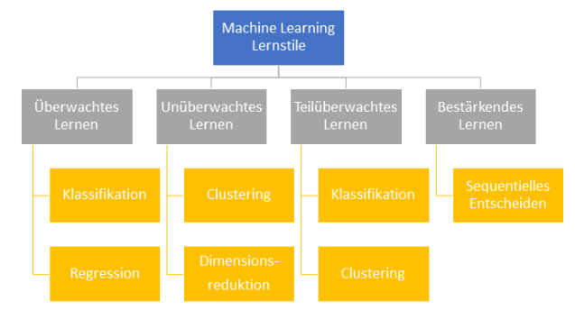

# Arten von Machine Learning
 
Im Bereich des Machine Learnings werden verschiedene Lernstile unterschieden. Dabei werden die verwendeten Lernstile nach dem jeweiligen Zweck ausgewählt. Dieser wird häufig von den verfügbaren Zusatzinformationen des Datensatzes bestimmt. Die untenstehende Abbildung zeigt eine Übersicht der verschiedenen Lernstile.

Abbildung: Übersicht Machine Learning Lernstile

Quelle: eigene Darstellung

## Überwachtes Lernen
 
Beim überwachten Lernen (engl. Supervised Learning) werden dem Lernalgorithmus eine große Menge an Beispieldaten zur Verfügung gestellt, welche bereits sogenannte Label besitzen. Das Label gibt dabei bereits das gewünschte Ergebnis an. Dieser Lernstil kommt häufig bei Klassifikationsaufgaben, wie z.B. Buchstaben-/Ziffernerkennung oder E-Mail-Spamfiltern zum Einsatz. Ein weiteres Einsatzgebiet sind Funktionsapproximations- bzw. Regressionsaufgaben, wie z.B. Schätzungen oder Kosten-, Nachfrage- und Angebotsprognosen. Das zuverlässige Erfüllen von Aufgaben ist bei diesem Lernstil sehr von der Qualität der Beispieldaten abhängig. Die Notwendigkeit von Labels birgt einen erheblichen Mehraufwand in der Datenvorverarbeitung. Zudem besteht hier das Risiko, dass Maschinen etwas Falsches lernen, wenn ein Label zuvor nicht richtig bestimmt wurde [31].
 
## Unüberwachtes Lernen
 
Das unüberwachte Lernen (engl. Unsupervised Learning) verzichtet im Gegensatz zu dem überwachten Lernen auf die Markierung der Beispieldaten mit Labeln. Häufig liegen hier deutlich größere, unstrukturierte Datenmengen vor, welche nur schwierig im Vorfeld sinnvoll nach verschiedenen Kriterien sortiert werden können. In diesem Fall wird versucht, Strukturen und Unterschiede in den Daten festzustellen und Gruppen (engl. Cluster) zu bilden. Das sogenannte Clustering wird beispielsweise zur Datenexploration oder Segmentierung von Kundendaten eingesetzt. Die verwendeten Beispieldaten können eine Redundanz aufweisen, welche für Lernalgorithmen jedoch hinderlich sein kann. Deswegen gibt es „verschiedene Lernalgorithmen, um Beispieldaten in eine kompaktere Form zu überführen. […] Weil jedes Merkmal mathematisch als eine Dimension aufgefasst werden kann, bezeichnet man diese Aufgabenstellung des unüberwachten Lernens als Dimensionsreduktion.“ [31]
 
## Teilüberwachtes Lernen
 
Das teilüberwachte Lernen (engl. Semi-Supervised Learning) ist eine Kombination aus dem überwachten Lernen und dem unüberwachten Lernen. Hierbei ist ein Teil der Beispieldaten mit Labeln markiert und die restlichen Daten nicht. Eine Erklärung hierfür ist der extrem hohe Aufwand Daten mit einem Label zu versehen. Bei großen Datenmengen ist dieser Aufwand nicht praktikabel bzw. nur schwer umzusetzen. Häufig kommt hier eine Kombination auf Clustering und Klassifikation zum Einsatz [31].
 
## Bestärkendes Lernen
 
Das bestärkende Lernen (engl. Reinforcement Learning) kommt bei Maschinen zur Verwendung, die mit ihrer Umgebung interagieren. „Dabei nutzen sie Feedback, das sie auf ihre Aktionen von der Umwelt erhalten, um die Erfolgsaussichten der einzelnen Aktionen in den verschiedenen Situationen besser einschätzen zu lernen.“ Die Lernaufgabe der Maschine wird auch als sequentielles Entscheiden bezeichnet, Aktionen schrittweise nacheinander ausgewählt und durchgeführt werden [31].

---

[31]  https://www.bigdata.fraunhofer.de/content/dam/bigdata/de/documents/Publikationen/BMBF_Fraunhofer_ML-Ergebnisbericht_Gesamt.pdf 
 
---

[< Einführung in Machine Learning](Einführung.md) | [ Algorithmen >](Algorithmen.md)

