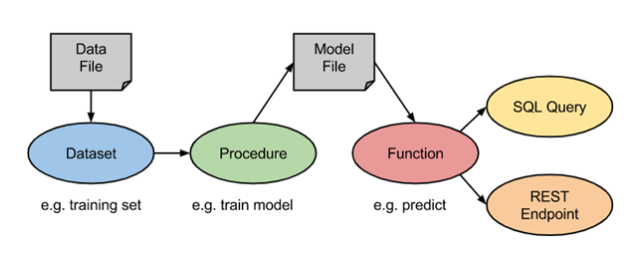
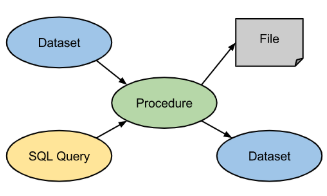
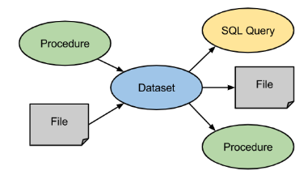
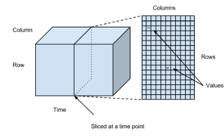

# Datenbanken und Frameworks

## MLDB
 
Die MLDB ist eine open-source Datenbank, welche von Element AI für den Bereich Machine Learning entworfen wurde. Zusammenfassend bietet die MLDB die folgenden Eigenschaften:
-   Frei zugänglich (open-source)
-   SQL Datenbank, welche in C++ geschrieben wurde
-   Web Nativ – primäre API im JSON Format über REST API/ HTTP zugänglich
-   Ende-zu-Ende Lösung – Daten werden eigelesen, das Modell trainiert und entwickelt
-   Unterstützt Big Data – kann Modelle mit Milliarden von Datenpunkten trainieren
-   Kosteneffizient – schnelles Lernen möglich (ohne Clustering)
 
Die Funktionsweise der MLDB wird in der nachfolgenden Abbildung dargestellt. Das Dataset wird mit einem Data File gespeist. Die Procedures laufen über dieses Dataset und erstellen einen Model File, welche in eine Function eingespeist werden. Diese Functions werden dadurch parametrisiert und können mit Hilfe von SQL oder über eine REST API ausgelesen werden [61].

 

Abbildung: Funktionsweise MLDB

Quelle: [61]

Nachfolgend wird die Funktionsweise von Functions, Procedures, Data Sets und Files näher erläutert.

### Functions

 

Abbildung: Functions

Quelle: [61]

Functions (dt. Funktionen) sind wiederverwendbare Programme, die nach ihrer Funktion benannt werden. Sie werden dazu verwendet, SQL Ausdrücke zu kapseln und Machine Learning Modelle anzuwenden, die zuvor von Procedures parametrisiert wurden. Alle entwickelten MLDB Functions können mit Hilfe von REST Endpoints (dt. Endpunkten) abgefragt werden. Dies ermöglicht die Anwendung von Machine Learning Modellen in Echtzeit. Zudem können diese Functions in SQL-Queries (dt. SQL-Abfragen) genutzt werden, um effizient Machine Learning Modelle auf Daten mit Hilfe von Batch-Prozessen anzuwenden [61]. 

### Procedures

 

Abbildung: Procedures

Quelle: [61]

Procedures (dt. Prozeduren) sind ebenfalls wiederverwendbare Programme, die nach ihrer Funktion benannt werden. Sie werden dazu verwendet langwierige Batch-Operationen auszuführen, welche keine Rückgabewerte liefern. Procedures laufen prinzipiell über Data Sets (dt. Datensätze) und können mit Hilfe von SQL Ausdrücken konfiguriert werden. Grundsätzlich werden Procedures zum Transformieren oder Aufräumen von Daten, das Training von Machine Learning Modellen und das Anwenden von Batch-Prozessen auf Maschinenmodelle verwendet [61].

### Data Sets

 

Abbildung: Data Sets 

Quelle: [61]

Data Sets (dt. Datensätze) bestehen aus mehreren Datenpunkten, die sich aus Tupeln (Zeile, Spalte, Zeitstempel und Wert) zusammensetzen. Sie können aus Millionen Zeilen und Spalten bestehen und Datenpunkte mit Zahlen oder Text enthalten. Data Sets können aus Files (dt. Dateien) gelesen und auch geschrieben werden. Zudem können sie als Eingabewerte für Procedures dienen oder auch aus Procedures generiert werden. Data Sets können außerdem mit Hilfe von SQL-Ausdrücken durchsucht werden. Data Sets werden in MLDB als dreidimensionale Matrizen betrachtet. Dabei werden Zeilen, Spalten und Zeitstempel als Dimensionen verwendet. Die folgende Abbildung zeigt diese Strukturierung. Demzufolge gibt es je Zeitstempel ein eigenes Data Set [61].

Abbildung: Schaubild Data Set 

Quelle: [61]

## Hadoop

Das Open-Source Framework Hadoop erlaubt das Verarbeiten von Batch-Prozessen in einem Clustern mit mehreren Knoten, Server und virtuellen Maschinen. Durch dieses Cluster lassen sich große Datenmengen effizient verarbeiten. 

Hadoop besteht aus vier Bausteinen. Die Komponente Hadoop Common stellt verschiedene Umgebungen und Tools, beispielsweise zum Ausführen von JavaScript, bereit und kommuniziert über verschiedene Schnittstellen mit den anderen Komponenten des Systems.

Zur Verarbeitung riesiger Datenmengen wird ein verteiltes Dateisystem, das Distributed File System HDFS, eingesetzt. Die Komponenten strukturiert das Dateisystem und stellt verschiedene Dienste zur Datenverwaltung, beispielsweise bei der Datensicherung, bereit.

Der MapReduce-Algorithmus stellt die wichtigste Einheit des Frameworks dar. Der ursprünglich von Google entworfene Algorithmus ermöglicht das Ausführen von Berechnungen parallel auf mehreren Instanzen. DIe Daten werden dabei in Schlüssel-Werte-Paaren in Blöcke eingeteilt, verschiedene Berechnungen durchgeführt und am Ende vom Hadoop Framework wieder zusammengefasst.
 
Die vierte Komponente YARN dient zur Ressourcen- Verwaltung, verschiedene Jobs können dynamisch einer Maschine oder Ressource zugewiesen werden. [62]  [62] 

## Spark

Spark ist ein Datenanalysesystem, dass es erlaubt, Echtzeitdaten, beispielsweise aus sozialen Netzwerken, in Echtzeit zu verarbeiten. Die Datenverarbeitung erfolgt dabei im Arbeitsspeicher, was einen sehr dynamischen Umgang mit Datenströmen erlaubt.

Iterationen in der Verarbeitung spielen beim maschinellen Lernen eine große Rolle - der Fokus von Spark liegt in einer optimalen Verarbeitung entsprechender Algorithmen, Das Framework bringt von Haus aus eine eigene Machine Learning Bibliothek mit und kann in verschiedenen Sprachen wie Java oder Python angesprochen werden.

Neben der Verarbeitung von Streamingdaten aus sozialen Netzwerken kann das Framework für Finanzanalysen, in der Automatisierung oder im e-Commerce Bereich eingesetzt werden - bei Amazon wird das Tool weitläufig zur Ermittlung von Kaufempfehlungen eingesetzt. Der Fokus der Anwendung liegt, im Gegensatz zum Framework Hadoop, dass vor Allem zur Verarbeitung von Batch-Prozessen verwendet wird, auf der Verarbeitung von Echtzeitdaten. [64]

---

[61]  https://docs.mldb.ai/doc/#builtin/Overview.md.html

[62]  https://dbs.uni-leipzig.de/file/seminar_0910_findling_K%C3%B6nig.pdf

[63]  https://www.bigdata-insider.de/was-ist-hadoop-a-587448/

[64]  https://data-science-blog.com/blog/2016/08/03/was-ist-eigentlich-apache-spark/

---

[< Anwendungsbeispiele](Anwendungsbeispiele.md) | [ Fazit >](Fazit.md)
