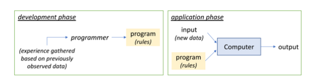
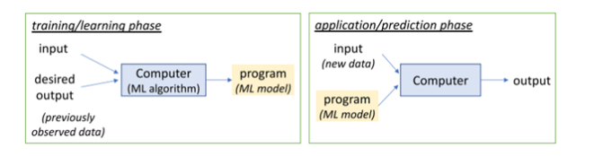
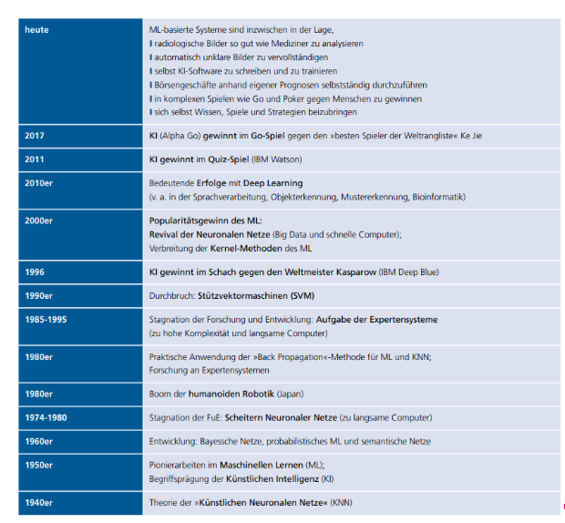

# Einführung in Machine Learning
 
## Definition
 
Machine Learning (ML), dt. Maschinelles Lernen, gilt als Teilgebiet der künstlichen Intelligenz (KI) [21]. Künstliche Intelligenz wiederum ist ein Teilgebiet der Informatik und verfolgt den Zweck, Maschinen in die Lage zu versetzen, Aufgaben „intelligent“ zu lösen. Die Begriffe Machine Learning und Künstliche Intelligenz werden der Einfachheit halber häufig synonym verwendet [22].
 
„Maschinelles Lernen (ML) bezweckt die Generierung von >>Wissen<< aus >>Erfahrung<<“ [22]. Dabei werden mit Hilfe von Lernalgorithmen  komplexe Modelle aus Beispieldaten, wie z.B. Sensordaten, Bildern oder Texten berechnet [22]. „Durch das Erkennen von Mustern in vorliegenden Datenbeständen sind IT-Systeme in der Lage, eigenständig Lösungen für Probleme zu finden“ [21]. Durch die Verallgemeinerung der gewonnenen Erkenntnisse können diese Modelle zur Analyse von unbekannten Daten verwendet und neue Problemlösungen gefunden werden [21]. Die Modelle werden umso genauer und zuverlässiger, je mehr Beispieldaten dem Algorithmus zur Verfügung stehen [22]. Im Umkehrschluss bedeutet das, dass Machine Learning Computern bzw. Maschinen die Möglichkeit gibt, zu lernen und Erfahrungen zu sammeln ohne explizite Programmierung von Regeln. Das Hauptaugenmerk liegt hier auf dem eigenständigen Lernprozess [23].

Die zwei nachfolgenden Abbildungen verdeutlichen den Unterschied zwischen dem traditionellen Ansatz, Aufgaben zu bewältigen und dem Ansatz des maschinellen Lernens. Ein klassisches Beispiel ist der E-Mail-Spamfilter. Beim traditionellen Ansatz erstellt der Entwickler Regeln, basierend auf seiner Erfahrung. Beispielsweise werden E-Mails mit einem bestimmten Betreff, wie z.B. „Lotterie“, als Spam markiert. Diese Regeln werden in einem Programm implementiert und basierend auf dem Input (neue E-Mails) und diesen Regeln wird die Entscheidung getroffen, ob es sich um Spamnachrichten handelt oder nicht. Die Schwierigkeit besteht darin, zuverlässige Regeln zu erstellen und diese auf einem aktuellen Stand zu halten [23].

 
Abbildung: Traditioneller Ansatz

Quelle: [23]

Im Gegensatz dazu werden beim Machine Learning die Regeln automatisiert erstellt und stetig aktualisiert. Dabei wird die Erfahrung des Entwicklers (aus dem vorherigen Beispiel) durch einen Machine Learning Algorithmus ersetzt. Das Ergebnis, welches dieser Algorithmus liefert wird als Machine Learning Model bezeichnet. Dieses Model wird daraufhin auf neue Daten angewendet. In der Regel gibt beim Machine Learning zwei Phasen:
 - Learning Phase (Lernphase)
 - Prediction Phase ( Prognosephase)
 
 
 
Abbildung: Ansatz des maschinellen Lernens

Quelle: [23]

Machine Learning kommt häufig dann zum Einsatz, wenn Prozesse zu komplex sind, um sie analytisch zu beschreiben. Mit Hilfe der daraus resultierenden Modelle ist es möglich, Vorhersagen oder Empfehlungen zu entwickeln. Dabei können ML-Anwendungen sowohl für physische Geräte als auch rein digitale Zwecke verwendet werden [23].
 
Zusammenfassend sind Machine Learning Systeme in der Lage folgende Aufgaben zu bewältigen [21]:
-   „Relevante Daten finden, extrahieren und zusammenfassen
-   Vorhersagen auf Basis der analysierten Daten treffen
-   Wahrscheinlichkeiten für bestimmte Ereignisse berechnen
-   sich an Entwicklungen eigenständig anpassen und
-   Prozesse auf Basis erkannter Muster optimieren“ [21].
 
 
## Historischer Überblick
 
Machine Learning ist, wie zu Beginn erwähnt, ein Teilgebiet der Künstlichen Intelligenz und hat sich basierend auf dessen statistischen Methoden entwickelt. Erste Entwicklungen im Bereich der künstlichen Intelligenz gab es bereits in den 1940er Jahren. Diese Forschung wurde durch das Verständnis neuronaler Prozesse im Gehirn angeregt und bildeten die Basis für erste Konzepte für Künstliche Neuronale Netze (KNN). Erstmals umgesetzt wurden diese etwa 1950. Um das Jahr 1970 geriet die Forschung im Bereich der künstlichen Intelligenz ins Stocken, da zwei Wissenschaftler (Minsky und Papert) herausgefunden hatten, dass „ein einziges Neuron die elementare Entweder-oder-Logik nicht lernen kann und größere Neuronale Netze mit wenigen lokalen Vernetzungen in ihrer Ausdrucksfähigkeit beschränkt sind.“ [2] Diese Stagnation erhielt die Bezeichnung erster „KI-Winter“ [22].
 
In den 1960er Jahren fokussierte sich die Forschung auf Systeme mit sogenannten „symbolischen Wissen“, welche aus logischen Regeln bestehen, die zuvor manuell eingegeben wurden. Diese Regeln basieren dabei sowohl auf manuell ausgewählten Merkmalen als auch auf manuell konstruierten Hierarchien. Dabei wurde es schnell ersichtlich, dass es äußerst schwierig ist, eine konsistente „Wissensdatenbank“ manuell zu entwickeln. Somit folgte zum Ende der 1980er Jahre der zweite „KI-Winter“ [22]. 
 
Der Grundstein für den heutigen Erfolg der Künstlichen Intelligenz wurde um die Jahrtausendwende gelegt. Eine wichtige Basis dafür bildeten die Fortschritte in der Computertechnologie. Zudem trugen “das Aufkommen von »Big Data«, das Lernen von sehr komplexen, sogenannten »tiefen« Künstlichen Neuronalen Netzen” [22] dazu bei, die Künstliche Intelligenz auf den heutigen Forschungsstand zu bringen.

 

Abbildung: Meilensteine im Einsatz von Machine Learning

Quelle: [24]

---
 
[1] https://www.bigdata-insider.de/was-ist-machine-learning-a-592092/
 
[2] https://www.bigdata.fraunhofer.de/content/dam/bigdata/de/documents/Publikationen/BMBF_Fraunhofer_ML-Ergebnisbericht_Gesamt.pdf
 
[3] https://link.springer.com/content/pdf/10.1007/s13222-017-0247-8.pdf

[4] https://www.bigdata.fraunhofer.de/content/dam/bigdata/de/documents/Publikationen/Fraunhofer_Studie_ML_201809.pdf

---
 
[< Einleitung](Einleitung.md) | [ Arten von Machine Learning >](Arten_von_Machine_Learning.md)

