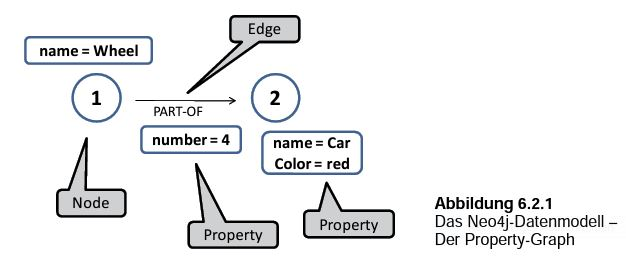

# 2. Allgemeine Vorstellung
## 2.1 RDBMS
Ein Relational Database Management System (RDBMS) bezeichnet grundsätzlich ein Database Management System (DBMS), welches auf dem relationalen Modell von E. F. Codd (vgl. Codd 1970: 377 ff.) basiert. Innerhalb dieses Systems können Daten anhand einer vordefinierten Struktur in Datenbankobjekten gespeichert werden, die innerhalb des RDBMS durch Tabellen dargestellt werden. RDBMS dient als Basis für die Structured Query Language (SQL) und findet unter anderem Anwendung in den Datenbanksystemen Oracle, MySQL sowie Postgres.

### 2.1.1 Schema 
Eine Tabelle bildet die einfachste Form von Datenspeicherung innerhalb dieses Systems und beschreibt jeweils eine Gruppierung von schemagleichen Daten, organisiert durch mehrere Reihen und Spalten. Die nachfolgende Tabelle veranschaulicht ein Datenbankobjekt anhand einer (vereinfachten) Kundendatenbank eines Online-Shops:

| customerID   | firstname | lastname | email 
| --- | --- | ---  | ---
| 1 | Joseph | Müller | jmueller50@t-online.de 
| 2 | Max | Gerdes | gerdes1956@web.de 
| 3 | Martina | Schröder | mschroed@gmail.com
| 4 | Hans | Meyer | hameyer@arcor.de

*Tabelle: customer_data*

Ein einzelner Datensatz wird innerhalb dieser Struktur als Tupel, Record oder Reihe bezeichnet. Die zuvor dargestelle Kundendatenbank besitzt insgesamt vier solcher Tupel. Die Spalten der Tabelle stehen  hierbei für die einzelnen Merkmale (Attribute) und sind jeweils maßgeblich für die eigentliche Datenspeicherung, hier werden pro Spalte gleich strukturierte Informationen über die eizelnen Tupel (in unserem Beispiel ID, Vorname, Nachname sowie E-Mail Adresse) gespeichert. Die ID dient hierbei als sogenannter Schlüssel, der zur eindeutigen Identifikation des Tupels benötigt wird und nicht mehrfach vergeben werden darf. 

Mehrere Tabellen können miteinander verknüpft werden, sodass innerhalb des Systems Relationen entstehen. Um dies zu verdeutlichen, sei zusätzlich zur Kundendatenbank eine Produktdatenbank gegeben:

| productID   | name | inStock | price 
| --- | --- | ---  | ---
| 1 | iPhone 6 | 23 | 399 
| 2 | Nokia 3310 | 50 | 129 
| 3 | Samsung S8 | 31 | 499

*Tabelle: product_data*

Bestellt ein Kunde nun in diesem Online-Shop ein Produkt, können diese Bestellungen als Relation zwischen den Kunden und den Produkten dargestellt werden:

| orderID   | customerID | productID | orderDate | paymentStatus
| --- | --- | ---  | --- | ---
| 1 | 4 | 3 | 2019-05-25 | complete
| 2 | 3 | 2 | 2019-05-27 | processing

*Tabelle: order_data*

Durch die eindeutigen Schlüssel zur Indentifikation der entsprechenden Datensätze können die einzelnen Bestellungen einem Kunden (hat bestellt) und einem Produkt (wurde gekauft) zugeordnet werden.

### 2.1.2 Constraints
Die sogenannten Constraints sind vordefinierte Regeln, die jeweils auf einzelne Merkmale (Attribute) oder auch auf gesamte Tabellen bei Erzeugung definiert und durch das RDBMS kontrolliert werden. Zu speichernde Daten, die nicht auf die vordefinierten Constraints passen, werden abgewiesen. Folgende Constraints werden häufig in SQL eingesetzt:

* **NOT NULL** - Eine Spalte kann keine NULL Werte enthalten
* **UNIQUE** - Alle Werte einer Spalte sind unterschiedlich
* **PRIMARY KEY** - Kombination aus **NOT NULL** und **UNIQUE**, dient als Identifikation einzelner Tupel
* **FOREIGN KEY** - Identifiziert ein Tupel in einer anderen Tabelle
* **DEFAULT** - Setzt einen Standardwert für eine Spalte, wenn kein Wert mitgegeben wurde
* **CHECK** - Überprüft, ob alle Werte einer Spalte einer Bedingung entsprechen
* **INDEX** - Baut einen Index auf, um Abfragen schneller bearbeiten zu können

### 2.1.3 Integrität 
Innerhalb jedes RDBMS lassen sich durch die zuvor genannten Contraints folgende Kategorien definieren, die die Integrität der Daten gewährleisten:
* **Entity Integrity** - Es existieren keine Duplikate in einer Tabelle
* **Domain Integrity** - Spalten werden nach Datentyp, Format oder Länge der Werte eingeschränkt
* **Referential Integrity** - Tupel, die durch andere Tupel über **FOREIGN KEY** referenziert werden, können nicht gelöscht werden

### 2.1.4 Sprache, Operationen und Syntax
SQL wurde 1987 durch die International Organization for Standardization (ISO)als offizielle, domänenspezifische Sprache für RDBMS ernannt und basierte ursprünglich auf relationaler Algebra und Kalkülausdrücken. SQL war die erste kommerzielle Sprache, die das relationale Modell von E. F. Codd [01] aufgriff. Nachfolgend sind die relevantesten Statements dargestellt, die mit SQL realisiert werden können:

* **SELECT** - Liest Daten
* **UPDATE** - Aktualisiert Daten
* **DELETE** - Löscht Daten
* **INSERT INTO** - Fügt Daten ein
* **CREATE (DATABASE/TABLE/INDEX)** - Erstellt Datenbank/Tabelle/Suchindex
* **ALTER (DATABASE/TABLE/INDEX)** - Verändert Datenbank/Tabelle/Suchindex
* **DROP TABLE** - Löscht Tabelle

Neben Statements gibt es zudem Anweisungen und logische Operatoren, um Ergebnisse einer Datenbankabfrage einzugrenzen:

* **WHERE** - Gibt Ergebnisse zurück, die auf Bedingung passen
* **AND/OR/NOT** - Kombination mit **WHERE** um Ergebnisse weiter einzugrenzen

Beispielabfrage, um am Beispiel des Online-Shops Bestellungen zu selektieren, deren Bezahlung überfällig ist:
~~~~sql
SELECT orderID
FROM order_data
WHERE paymentStatus = 'pending' AND orderDate <= '2019-06-01';
~~~~

Selektierte Rückgaben können nachfolgend durch die Statements **GROUP BY** nach Attributen zusammengefasst, und durch **ORDER BY** nach Attributen in beliebiger Reihenfolge sortiert werden.

Fernen können durch **JOIN** Anweisungen Reihen von zwei oder mehrere Tabelle anhand ihrer Relation kombiniert werden:

~~~~sql
SELECT order_data.orderID, customer_data.email, order_data.orderDate
FROM order_data
INNER JOIN customer_data ON order_data.customerID = customer_data.customerID;
~~~~

Die resultierende Kombination sieht am Beispiel des Online-Shops wie folgt aus:

| orderID   | email | orderDate 
| --- | --- | ---  
| 1 | hameyer@arcor.de | 2019-05-25 
| 2 | mschroed@gmail.com | 2019-05-27 

## 2.2 Neo4j
Während im vorigen Abschnitt die Idee, Modelle und Technologie von relationalen Datenbanken vorgestellt wurden, folgt als eine Alternative dazu die Vorstellung von Graphendatendanken anhand der Technologie Neo4j. Auch wenn es weitere Graphendatenbanktechnologien gibt, beschränkt sich diese Arbeit bei der Beschreibung von Graphendatenbanken einzig auf das in Java geschriebene Neo4j. 

### 2.2.1 Grundsätzliches 

Anders als die zuvor beschriebenenen relationalen Datenbanken, funktionieren Graphendatenbanken, wie der Name schon vermuten lässt, über die Modellierung und Verwaltung von Daten in Graph-/ bzw. Baumstrukturen (vgl. Edlich et al. 2010: 8). 

Hierbei werden die Daten in Knoten bzw. Knotenpunkten (**nodes**) mit ihren Eigenschaften (**properties**) gespeichert. Diese Eigenschaften können aus einem Wert / einem Namen oder aber auch aus einem Paar von Namen / Werten bestehen. (vgl. Neo4j, Inc. 2019: 2). Jeder Knoten kann mit einem Kennzeichen (**label**) versehen werden. Die Anzahl dieser Labels ist beliebig. Mit diesen Labels können verschiedene Knotenpunkte zusammengefasst werden (vgl. Neo4j, Inc. 2019: 3). Verbindungen erfolgen über sogenannte Kanten (**edges**), die die Beziehungen (**relationships**) zwischen zwei oder mehreren Knoten darstellen. (vgl. Edlich et al. 2010: 185). 

*Modellschema Graphendatenbanken nach, Gerken\(2018: 184\)*

Bei der Generierung von Abfragen werden die einzelnen Knoten und Kanten entsprechend der Abfrage durchlaufen (**traversiert**). Dabei erlaubt Neo4j prinzipiell eine indexfreie Abfrage im Gegensatz zu Abfragen bei relationalen SQL-Datenbanken. (vgl. Edlich et al. 2010: 8). Allerdings können **Indizes** hinzugefügt werden, um Abfragen zu beschleunigen, wenn beispielsweise längere Graphen und Knoten nach bestimmten Eigenschaften durchsucht werden sollen (vgl. Edlich et al. 2010: 185). Weil bei Neo4j externe Indexsysteme verwendet werden (vgl. Edlich et al. 2010: 185), wird im Hintergrund der Datenbank eine redundante Kopie der abgespeicherten Daten hinterlegt, die bei Änderungen ebenfalls synchron verändert werden. Basierend auf diesem technischen Hintergrund, hat eine zu umfangreiche Indexierung der Daten negative Auswirkungen auf die Performance der Datenbank (vgl. Quackit 2019).

Der Theorie von Graphendatenbanken liegt ein Graphenmodell zugrunde, das bereits  von Leonhard Euler (1707-1783) aufgegriffen wurde. Er nahm sich dem sogenannten Königsberger Brückenproblem an. Dabei ging es um die Lösungsfindung zu dem Problem, wie man alle sieben Brücken der Stadt überqueren konnte, ohne eine der Brücken mehr als einmal zu passieren, was bekanntlich nicht lösbar war (Hunger 2014: 9).

In den 80er / 90er Jahren, ursprünglich für die Verwaltung und Modellierung von Netzen vorgesehen (vgl. Edlich et al. 2010: 8), hat diese Form von Datenbanken eine zunehmende Bedeutung durch den Einsatz von mobilen Endgeräten und den damit erhöhten Bedarf an Datenbankanfragen im Zuge diverser Services via Internet erfahren (vgl. Edlich et al. 2010: 170). Edlich et al. nennen einige wichtige Dienste, die im Zusammenhang mit graphenbasierten Anfragen stehen, wie etwa geoinformationstechnische Dienste, die u. a. kürzeste Wege berechnen und darstellen, Page-Ranking bei Suchmaschinen, 'Wer-kennt-wen'-Darstellungen in sozialen Netzwerken usw. ( vgl. Edlich et al. 2010: 170). 

### 2.2.2 Abgrenzung zu RDBMS

Auch wenn es im mathematischen Aufbau von Graphendatenbanken kaum Unterschiede zu RDBMS gibt (vgl. Edlich et al. 2010: 180), heben sich Graphendatenbanken in einigen Eigenschaften erheblich von anderen Modellen ab. Während es bei der Konzeption von RDBMS wichtig ist, sich bereits im Vorfeld die Struktur der Datenbank zu überlegen, kann eine Graphendatenbank relativ einfach im Nachhinein erweitert werden. Das hat auch den grundlegenden Vorteil, dass die zu verarbeitenden Daten nicht im Vorfeld denormalisiert bzw. zusammengefasst werden müssen (vgl. Hunger 2014: 8). Stark vernetzte Daten fallen bei RDBMS durch dementsprechend viele JOIN-Tabellen auf. Diese Komponente gibt es bei Graphendatenbanken nicht. (vgl. Hunger 2014: 9).
Der womöglich entscheidenste Vorteil bei der Verwendung von Graphendatenbanken könnte die bessere Performance im Vergleich zu RDBMS  sein, wenn man bei der Verwendung von Datenmengen unterhalb der 10 Milliarden Knoten, Eigenschaften, Kanten etc. bleibt, da bis zu einer solchen Datenmenge die Daten problemlos aus dem Cache eines Servers abgerufen werden können (Edlich et al. 2010: 194).

Wie auch bei relationalen Datenbanken steht bei Neo4j ebenfalls das Ziel im Vordergrund, Datenbanken nach dem so genannten ACID-Prinizip zu erstellen. ACID ist eine Abkürzung, bei der jeder Buchstabe für eine Eigenschaft steht, über die eine Datenbank optimaler Weise verfügen sollte. Eine Aufschlüsselung soll die folgende Liste bieten:

   * A (Atomicity) - Multiple Datenbankoperationen, zusammengepackt in eine Transaktion, lassen sich ausführen; sollte eine der Operationen fehlschlagen, wird automatisch die ursprüngliche Transaktion angezeit. Das bedeutet auch, dass entweder alle oder keine der Operationen ausgeführt werden.
   * C (Consistency) - Jeder Nutzer soll stets die aktuellsten Daten der Neo4j-Datenbank zur Verfügung gestellt kriegen. 
   * I (Isolation) - Jede Transaktion läuft von anderen unabhängig voneinander ab.
   * D (Durability) - Auch nach einem Serverabsturz oder einem Neustart der Datenbank sollen alle eingegebenen Daten noch verfügbar sein.

### 2.2.3 Sprache / Syntax

Für Neo4j wurde eine eigene Sprache entwickelt, die von der Syntax und dem Gebrauch SQL ähnelt. Bei Cypher wird ASCII-Art verwendet, was soviel bedeutet, dass die erstellten Befehle einer sinngemäßen bildlichen Darstellung folgen: Der Befehl 

~~~~cypher
(anna)-[:KENNT]->(emma)
~~~~

stellt beispielsweise die Beziehung dar, dass Anna Emma kennt, was auch schon optisch im Befehl einem Graphen entspricht.

Um die Verwendung von Cypher besser zu verdeutlichen, sollen ein paar grundlegende Befehle vorgestellt werden. Wie o. g. sind neben sozialen Netzwerken auch Fahrwegsberechnungen für den Einsatz von Graphendatenbanken gut geeignet. Deshalb wird beispielhaft ein fiktives Buslinien-Netz über eine Neo4j-Datenbank abgebildet.
Die entsprechende Graphik zu dem Buslinienplan ist unten aufgeführt:

*Buslinien Netzplan*

Das Busliniensystem enthält drei Linien mit jeweils drei Stationen. Alle Linien sind über die Station Hauptbahnhof verbunden. Die Kanten enthalten neben der Information, mit welcher Station jeweils eine andere verbunden ist, auch die Info zur Dauer über die Fahrtzeit und zu welcher Linie die Kante gehört. 

Erstellen der Linien als Knoten mit dem Befehl CREATE. Neben den Namen wird jeder Linie eine Farbe als Property zugewiesen:
~~~~cypher
CREATE (l1:Linie {name:'Linie 1', farbe:'grün'})
CREATE (l2:Linie {name:'Linie 2', farbe:'rot'})
CREATE (l3:Linie {name:'Linie 3', farbe:'blau'})
~~~~

Erstellen der Bahnhöfe als Knoten unter Verwendung der betriebsinternen Kürzel und dem Langnamen als Property:
~~~~cypher
CREATE (rh:Station {name:'Rathaus'})
CREATE (kp:Station {name:'Kaiserplatz'})
CREATE (op:Station {name:'Oper'})
CREATE (hb:Station {name:'Hauptbahnhof'})
CREATE (hf:Station {name:'Hafen'})
CREATE (sm:Station {name:'Stadtmuseum'})
~~~~

Erstellung der Verbindungen von den Stationen untereinander:
~~~~cypher
CREATE (rh)-[:VERBINDET {dauer:4, farbe:'grün'}]->(hb)
CREATE (hb)-[:VERBINDET {dauer:4, farbe:'grün'}]->(rh)
CREATE (hb)-[:VERBINDET {dauer:5, farbe:'grün'}]->(op)
CREATE (op)-[:VERBINDET {dauer:5, farbe:'grün'}]->(hb)

Alternativ:
CREATE (rh)-[:VERBINDET{dauer:4, farbe:'grün'}]->(hb)-[:VERBINDET{dauer:5, farbe:'grün'}]->(op)
~~~~

~~~~cypher
CREATE (rh)-[:VERBINDET {dauer:4, farbe:'rot'}]->(hb)
CREATE (hb)-[:VERBINDET {dauer:4, farbe:'rot'}]->(rh)
CREATE (hf)-[:VERBINDET {dauer:3, farbe:'rot'}]->(hb)
CREATE (hb)-[:VERBINDET {dauer:3, farbe:'rot'}]->(hf)

CREATE (kp)-[:VERBINDET {dauer:3, farbe:'blau'}]->(hb)
CREATE (hb)-[:VERBINDET {dauer:3, farbe:'blau'}]->(kp)
CREATE (sm)-[:VERBINDET {dauer:2, farbe:'blau'}]->(hb)
CREATE (hb)-[:VERBINDET {dauer:2, farbe:'blau'}]->(sm)
~~~~

Erstellung der Verbindungen, Zuordnung von Stationen zu Buslinien:
~~~~cypher
CREATE (rh)-[:TEIL]->(l1)
CREATE (hb)-[:TEIL]->(l1)
CREATE (op)-[:TEIL]->(l1)

CREATE (rh)-[:TEIL]->(l2)
CREATE (hb)-[:TEIL]->(l2)
CREATE (hf)-[:TEIL]->(l2)

CREATE (kp)-[:TEIL]->(l3)
CREATE (hb)-[:TEIL]->(l3)
CREATE (sm)-[:TEIL]->(l3)
~~~~

Station "Kaiserplatz" anzeigen:
~~~~cypher
MATCH (n)
WHERE n.name = 'Kaiserplatz' 
RETURN n.name

MATCH (n)
WHERE n.name = 'Kaiserplatz' 
RETURN n.name
~~~~

Nachträglich das Property für behindertengerechte Stationen eintragen:
~~~~cypher
MATCH (n { name: 'Hafen' })
SET n.behindertengerecht = true
RETURN n.name, n.behindertengerecht;
MATCH (n { name: 'Hauptbahnhof' })
SET n.behindertengerecht = true
RETURN n.name, n.behindertengerecht;
Fragen, ob der Hauptbahnhof behindertengerecht ist:
MATCH (n { name: 'Hauptbahnhof' })
RETURN n.behindertengerecht;
Führe alle Bahnhofsnamen auf
MATCH (station:Station)
RETURN station.name;
~~~~

Alle Bahnhöfe der Linie 3 heraussuchen:
~~~~cypher
MATCH (n) 
WHERE n.behindertengerecht = true
RETURN n.name, n.behindertengerecht;
~~~~

Indexerstellung:
~~~~cypher
CREATE INDEX ON :Station(name);
~~~~
....

Ähnlich wie bei anderen, in DBMS verwendeten Sprachen, gibt es auch bei Cypher typische, wie in vielen Programmsprachen verwendete Operatoren, Datentypen, etc. Viele Befehle sind sogenannte sprechende Befehle wie in der Softwareprogrammierung üblich. Eine Liste einiger wichtiger Befehle: 

    * MATCH - Befehl zur Abbildung von Mustergraphiken aus der Datenbank
    * RETURN - beschreibt, was bei der Abfrage miteingeschlossen sein soll
    * WITH - erlaubt eine Aneinanderkettung von verschiedenen Kriterien
    * WHERE - ergänzt Einschränkungen bei der Abfrage
    * ORDER BY - lässt das Ergebnis sortieren
    * SKIP - schneidet das Ergebnis eines Graphen bis zu einem gewissen Knoten zurecht
    * CREATE - erstellt Knoten usw.
    * DELETE - löscht Knoten und Beziehungen
    * SET - setzt properties nachträglich zu Beziehungen, Knoten usw.
    * REMOVE - löscht Labels und Properties 
    * MERGE - stellt sicher, dass Muster in einem Grpahen existieren
    * UNION -kombiniert das Ergebnis von multiplen Anfragen

Auswahl von Befehlen aus dem Neo4j-Manual, https://neo4j.com/docs/cypher-manual/current/clauses/

---
| [<< Einleitung](01_einleitung.md) | Allgemeine Vorstellung | [Projektvorstellung >>](03_project.md) |
|------------------------------------|------------|-------------------------------------|

