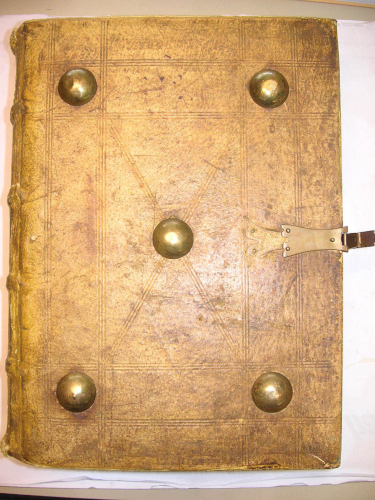
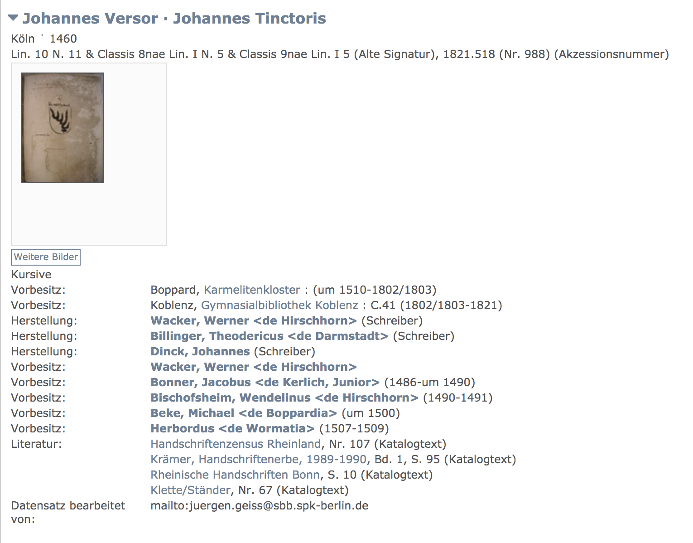

# 3. Projektvorstellung / Bibliothek mittelalterliche Handschriften
## 3.1 Einführung

Die Staatsbibliothek zu Berlin ermöglicht den ortsunabhängigen und kostenfreien Zugang zu den Ergebnissen der Handschriftenkatalogisierung im deutschen Sprachraum. Alle Metadaten der abendländischen mittelalterlichen Handschriften
sollen in diesem Projekt als Datengrundlage verwendet werden. Die Metadaten beschreiben den Handschriftenbestand und liegen in Form von XML Dateien vor. Diese Daten sollen in ein sehr vereinfachtes Datenmodell überführt und 
in den entsprechenden Datenbanksystemen persistiert werden. Anschließend sollen verschiedene Aspekte im Rahmen der Anwendungsentwicklung für beide Datenbanktechnologien verglichen werden. Wir möchten, anhand eines konkreten Anwendungsfalls 
zeigen, worin die Unterschiede und Gemeinsamkeiten beim Entwickeln einer konkreten Anwendungen sind. 

## 3.2 Technologie Stack

Um die theoretischen Fragestellungen praktisch evaluieren zu können wurde ein Java Enterprise Projekt mit Hilfe des [Spring Frameworks](https://spring.io/) aufgesetzt. 
Um in kurzer Zeit eine lauffähige Serverumgebung zu bekommen wurde [Spring Boot](https://docs.spring.io/spring-boot/docs/current/reference/html/) mit einem integriertem Tomcat Servlet Container als Laufzeitumgebung eingesetzt. Als Build Werkzeug 
kommt [Gradle](https://gradle.org/) zum Einsatz. Der gesamte Quellcode wird mit Hilfe des Versionierungssystem [Git](https://git-scm.com/) auf der Github Platform verwaltet. Das Projekt ist öffentlich [hier](https://github.com/eichstaedtk/handschriften-graphviewer/tree/master/src/main/java/de/eichstaedt/handschriftengraphviewer) zugänglich.  

Um die relevanten Datenbanksystem zur Verfügung zu stellen haben wir uns entschieden [Docker](https://www.docker.com/) als Container Technologie zu verwenden. So konnten wir sehr leicht eine relationale Postgres Datenbank
und eine Neo4J Graphendatenbank anbinden. Um die Daten in diesen Systemen zu persistieren, wurden die Objekt Graph Mapper (OGM) Bibliothek [Spring Data Neo4J](https://spring.io/guides/gs/accessing-data-neo4j/) und Objekt Relational Mapper (ORM) Bibliothek [Spring Data JPA](https://spring.io/projects/spring-data) verwendet. 

## 3.3 Domainmodell 

Das fachliche Modell stellt Handschriftenbeschreibungen von mittelalterlichen Handschriften dar. Diese stellen gesammelte Metadaten, welche durch Bibliothekare identifiziert worden sind, dar. Nachfolgende Abbildung zeigt eine Handschrift aus dem 15. Jahrhundert.

Das Datenmodell dieses Projektes besteht aus folgenden Komponenten: 

  *  **Beschreibungsdokument**: Enthält alle Metadaten zu einer abendländischen Handschriftenbeschreibung. Es stellt im Context von Domain Driven Design das Root Aggregate dar. 
  *  **Dokumentenelement**: Ist ein inhaltlicher Bestandteil einer Beschreibung. Das kann ein Textabschnitt zur Beschreibung eines Einbandes oder eine Sammlung von Texten sein. 
  *  **Beteiligte**: Ist ein abstraktes Element um gemeinsame Normdatenattribute für Personen und Koerperschaften zu verwalten. 
  *  **Ort**: Informationen zu einem Ort. 
  *  **Person**: Informationen zu einer Person, was in diesem Kontext ein Autor oder ein Besitzer einer Handschrift sein kann. 
  *  **Koerperschaft**: Informationen zu einer Institution. 
  *  **Provenienz**: Zeitlich begrenztes Besitzverhältnis. 
  *  **Digitalisat**: Ergebnis eines Digitalisierungsprozesses. In der Regel eine Bilddatei für eine Seite bzw. eines Handschriftenbestandteiles.
  
Das Beschreibungsdokument führt mehrere Objekte zusammen und verwaltet dieses. Ein Beschreibungsdokument besteht aus einer Hierarchie von Dokumentenelementen und den wichtigsten Metadaten. Zu jeder Handschrift werden Daten 
zu folgenden wichtigen Informationen erfasst: 

  * Titel: [Johannes Versor, Johannes Tinctoris](http://www.manuscripta-mediaevalia.de/#|5)
  * Signatur: S 67
  * Entstehungsdatum: 1460 
  * Bestandhaltende Einrichtung: Bonn, Universitäts- und Landesbibliothek Bonn
  * Dokumentenbestandteile
  * Provenienz
  * Buchbinder 

Nachfolgende Grafiken zeigen die fachliche Struktur einer Handschriftenbeschreibung. 

Beispiel: Dokumentenelement Text

 

Anhand dieses Beispiels wurde kurz die fachliche Struktur einer Handschriftenbeschreibung dargestellt. Zu erkennen ist, dass ein Beschreibungsdokument viele Beziehungen zu Orten, Personen, Instiutionen mit zeitlicher Varianz haben kann. 
  
## 3.4 Unterschiede in der Implementierung 

### 3.4.1 Objekt Mapping für RDBMS und Graphdatenbank
Alle Bestandteile des Datenmodells wurden mit den entsprechenden Annotation der Objektmapper Frameworks ausgezeichnet, sodass der Mapper diese persistieren kann. Nachfolgende Graphik soll die Beschreibungsentität kurz erläutern: 
~~~~java
@Entity
@Table(name = "beschreibungen")
@NodeEntity
public class Beschreibungsdokument {

  protected Beschreibungsdokument() {
  }

  public Beschreibungsdokument(String id, String titel, String signatur) {
    this.id = id;
    this.titel = titel;
    this.signatur = signatur;
    this.bestandteile = new HashSet<>();
    this.orte = new HashSet<>();
  }

  @javax.persistence.Id
  @Id
  private String id;

  @Column(length = 4096)
  private String titel;

  private String signatur;

  @ManyToMany(fetch = FetchType.EAGER)
  private Set<Ort> orte;

  @ManyToOne(fetch = FetchType.EAGER)
  @Relationship(type = "BUCHBINDER")
  private Beteiligte buchbinder;

  @OneToMany(fetch = FetchType.EAGER, cascade = {CascadeType.ALL})
  @Relationship(type = "ENTHAELT")
  private Set<DokumentElement> bestandteile;
~~~~

**OGM Annotation für GRAPH Datenbank** 

Ein Neo4J Knoten wird durch die Annotation **@NodeEntity** gekennzeichnet. Zusätzlich benötigt ein Knoten eine eindeutige Identifikationsnummer. Eine Beziehung zu anderen Knoten wird 
mit Hilfe der Annotation **@Relationship** gekennzeichnet. Mit Hilfe dieser Annotationen kann ein Objekt Graph Mapper, wie er im Spring Data Neo4J verwendet wird, dieses Java Objekt in einer Graphendatenbank persistieren. 

#### 3.4.1.1 Objekt Mapping, Besonderheit RelationshipEntity

Eine Besonderheit im Bereich der Graphendatenbank stellt hierbei das Objekt Provienz dar. Dieses Objekt ist ein Relationsobjekt **@RelationshipEntity()** , welches zwei Entitäten miteinander verbindet. Eine solche Objektannotation gibt es im Kontext des RDBMS nicht. 
~~~~java
@Entity
@RelationshipEntity()
public class Provenienz {

protected Provenienz() {
}

public Provenienz(String id,ProvenienzTyp typ,
    Beteiligte beteiligte, String vonJahr, String bisJahr, Beschreibungsdokument beschreibungsdokument) {
  this.id = id;
  this.typ = typ;
  this.beteiligte = beteiligte;
  this.vonJahr = vonJahr;
  this.bisJahr = bisJahr;
  this.beschreibungsdokument = beschreibungsdokument;
}

@javax.persistence.Id
@Id
private String id;

@Enumerated
private ProvenienzTyp typ;

@ManyToOne(fetch = FetchType.EAGER)
@EndNode
private Beteiligte beteiligte;

private String vonJahr;

private String bisJahr;

@OneToOne(fetch = FetchType.EAGER)
@StartNode
private Beschreibungsdokument beschreibungsdokument;
~~~~    
Die Provienz verbindet hierbei die Entitäten Beschreibungsdokument und Beteiligte in einer gerichteten Form. Die Richtung wird durch die Annotationen **@StartNode** und **@EndNode** gekennzeichnet. 

#### 3.4.1.2 Objekt Mapping, Besonderheit Vererbung 

In unserem Beispiel spielt für folgende Objekt die Vererbung im Sinne der objektorientierten Programmierung eine Rolle. Die Objekte Ort, Koerperschaft und Person sind alle vom Typ Beteiligte. 

~~~~java
public class Ort extends Beteiligte {..}
public class Koerperschaft extends Beteiligte {..}
public class Person extends Beteiligte {..}
~~~~  

Für ein relationales Datenbanksystem muss eine Strategie festgelegt werden, in wieviele Tabellen die Daten vom Typ Beteiligte abgelegt werden.

~~~~java
@Entity
@Table(name = "beteiligte")
@Inheritance(strategy = InheritanceType.TABLE_PER_CLASS)
public abstract class Beteiligte {
~~~~

In unserem Beispiel wird für jede Entität vom konkreten Typ eine Tabelle angelegt. So enthält die spätere Datenbank eine Tabelle Person, Ort und Körperschaft. Weitere Möglichkeiten die Daten 
im RDBMS abzulegen sind: 

  * SINGLE_TABLE, Eine Tabelle für alle Typen von Beteiligte 
  * JOINED, Eine Tabelle für gemeinsame Attribute und jeweils eine Tabelle für Typ spezifische Attribute. Diese werden mit einem Join verbunden. 
  
Für die Graphendatenbank werden hier keine Steuerungsangaben benötigt. Jeder Knoten ist lediglich von dem konkreten Typ und der abstrakte Typ Beteiligte findet keine Verwendung. 

**ORM Annotationen für RDBMS** 

Ein Java Objekt, welches in eine relationale Datenbank persistiert werden soll, muss mit der Annotation **@Entity** gekennzeichnet werden. Genau wie bei Neo4J muss dieses Objekt ein Attribute mit der **@Id** Annotation als Primary Key kennzeichnen. 
Für Beziehungen zu anderen Objekten stehen folgende Annotationen zur Verfügung: **@OneToOne**, **@OneToMany**, **@ManyToOne**, **@ManyToMany**. Für diese Annotationen müssen noch Werte für das Verhalten beim Laden angegeben werden. Zusätzlich können Daten zusammenhänged 
gespeichert, gelöscht oder geladen werden, was die Arbeit mit Objekten des ORM in der Praxis oft komplex werden lässt. Bei der Konfiguration des Objekt Mappers benötigt das relationale Datenbankmanagementsystem mehr Steuerung als die Graphendatenbank.

### 3.4.2 CREAD, READ, UPDATE and DELETE (CRUD) für RDBMS und Graphdatenbank

Mit Spring Data bekommt der Entwickler eine der einfachsten Möglichkeiten für die Umsetzung der CRUD Operation an die Hand, die es unserer Meinung nach gibt. Für jede Entität die durch Spring Data verwaltet werden soll, muss lediglich 
ein Spring Data CRUDRepository erweitert werden. 

**Beispiel Neo4J**
~~~~java
public interface BeschreibungsdokumentGraphRepository extends Neo4jRepository<Beschreibungsdokument,String> {

}
~~~~

**Beispiel Postgres**
~~~~java
public interface BeschreibungsdokumenteRDBMSRepository extends CrudRepository<Beschreibungsdokument,String> {

}
~~~~
Die Implementierung dieser Interfaces wird durch Spring Data selbst vorgenommen. Mit Hilfe von Generics muss im Interface lediglich der Typ der Entität und der Typ des Primary Key angebeben werden. In beiden Fällen ist dies jeweils
die Klasse Beschreibungsdokument und die Klasse String. Die Verwendung des Repositories ist in beiden Fällen sehr einfach: 
~~~~java
@Autowired
private BeschreibungsdokumentGraphRepository beschreibungsdokumentGraphRepository;

@Autowired
private BeschreibungsdokumenteRDBMSRepository beschreibungsdokumenteRDBMSRepository;

beschreibungsdokumentGraphRepository.deleteAll();

beschreibungsdokumenteRDBMSRepository.deleteAll();

beschreibungsdokumentGraphRepository.saveAll(l);

beschreibungsdokumenteRDBMSRepository.saveAll(l);
~~~~
      
Im ersten Schritt muss die Implementierng via Dependency Injection einer Variable zugewiesen werden. Anschließend können die Entitäten mit save, delete, oder findBy Methoden in die entsprechende Datenbank 
persistiert, gelöscht oder aktualisiert werden. Für die Verwendung der CRUD Operationen macht es hierbei keinen Unterschied, ob diese auf einer Graphendatenbank oder einem relationales DBMS durchgeführt werden.

      
### 3.4.3 Queries für RDBMS und Graphdatenbank

Wie bereits zuvor erläutert, werden in einem relationalen Datenbankmanagementsystem SQL als Datenbanksprache verwendet. SQL Befehle lassen sich in vier Kategorien einteilen: 

  *  Data Query Language: Befehle zur Abfrage und Aufbereitung
  *  Data Manipulation Language: Befehle zum Einfügen, Aktualisieren und Löschen von Daten
  *  Data Definition Language: Befehle zur Schema Definition
  *  Data Control Language: Befehle zur Rechteverwaltung und Transaktionskontrolle. 
  
In diesem Kapitel sollen primär die Befehle zur Abfrage mit denen der Graphendatenbanksprache Cypher verglichen werden. 

Grundsätzlich müssen mit dem Einsatz von Spring Data die einfachen Befehle zur Abfragen und Manipulation nicht mehr selbst geschrieben werden. Wie im vorhergehenden Kapitel beschrieben steht dafür das CRUDRepository zur Verfügung. Allerdings bietet Spring Data 
für beide Datenbanksysteme die Möglichkeit, eigene Queries zu formulieren. 

Nachfolgendes Codebeispiel zeigt die Implementierung einer Query by Name und einer nativen Query einmal für ein RDBMS und einmal für ein Graphendatenbanksystem. 
~~~~java
public interface BeschreibungsdokumenteRDBMSRepository extends CrudRepository<Beschreibungsdokument,String> {

  List<Beschreibungsdokument> findByTitelAndSignatur(String titel, String signatur);

  @Query(value = "SELECT beschreibung FROM Beschreibungsdokument WHERE beschreibung.titel like %?1 AND beschreibung.signatur like %?2", nativeQuery = true)
  List<Beschreibungsdokument> findBeschreibungenWithTitelAndSignatur(String titel, String signatur);

}

public interface BeschreibungsdokumentGraphRepository extends Neo4jRepository<Beschreibungsdokument,String> {

  List<Beschreibungsdokument> findByTitelAndSignatur(String titel, String signatur);

  @Query("MATCH (b:Beschreibungsdokument{titel:{titel} & signatur:{signatur}})-[:r]->(n) return b")
  List<Beschreibungsdokument> findWithTitelAndSignatur(String titel, String signatur);
}
~~~~

Grundsätzlich lassen sich mit Hilfe des Frameworks Spring Data native Queries für beide Datenbanksysteme sehr leicht implementieren. Die Unterstützung der Standardoperation ist ebenfalls sehr gut. Allerdings bietet die Graphendatenbank 
durch die sogenannten Return Statements noch die Möglichkeit, individuelle Ergebnisse zurück zugeben. Die Möglichkeit besteht für die relationale Datenbank nicht. Folgendes Beispiel zeigt dies anhand der Provenienz: 
~~~~java
@Query("MATCH (k:Koerperschaft)-[r:PROVENIENZ]-(b:Beschreibungsdokument) RETURN k AS beteiligte,r AS provenienz,b AS beschreibungsdokument")
  List<ProvenienzResult> findAllProvenienz();
  

@QueryResult
public class ProvenienzResult {

  Beteiligte beteiligte;

  Provenienz provenienz;

  Beschreibungsdokument beschreibungsdokument;

  @Override
  public boolean equals(Object o) {
    if (this == o) {
      return true;
    }
    if (o == null || getClass() != o.getClass()) {
      return false;
    }
    ProvenienzResult that = (ProvenienzResult) o;
    return Objects.equals(beteiligte, that.beteiligte) &&
        Objects.equals(provenienz, that.provenienz) &&
        Objects.equals(beschreibungsdokument, that.beschreibungsdokument);
  }

  @Override
  public int hashCode() {
    return Objects.hash(beteiligte, provenienz, beschreibungsdokument);
  }

  public Beteiligte getBeteiligte() {
    return beteiligte;
  }

  public void setBeteiligte(Beteiligte beteiligte) {
    this.beteiligte = beteiligte;
  }

  public Provenienz getProvenienz() {
    return provenienz;
  }

  public void setProvenienz(Provenienz provenienz) {
    this.provenienz = provenienz;
  }

  public Beschreibungsdokument getBeschreibungsdokument() {
    return beschreibungsdokument;
  }

  public void setBeschreibungsdokument(
      Beschreibungsdokument beschreibungsdokument) {
    this.beschreibungsdokument = beschreibungsdokument;
  }
}
~~~~

Diese Abfrage gibt als Ergebnis ein Objekt zurück, welches die Knoten Beteiligte und Beschreibungsdokument, sowie die Beziehung Provienz enthält. Diese Flexibilität ermöglicht es für den Einsatz 
einer Graphendatenbank sehr leicht beliebige Ergebnisobjekte zu erschaffen. So können sehr leicht neue Informationen aus den Daten gewonnen werden, ohne die Datenbankstruktur anpassen zu müssen.

### 3.4.3 Schema Management für RDBMS und Graphdatenbank

Beide Ojektmapper können das Schema automatisch verwalten. Dies bedeutet, dass sowohl die Tabellen, als auch die Knoten und Beziehungen automatisch angelegt werden. Allerdings benötigt der RDBMS OR Mapper 
eine Einstellung zur Steuerung, ob das Schema der Datenbank automatisch oder manuell angelegt werden soll. 

    spring.jpa.hibernate.ddl-auto=update

Die OR-Mapper Implementierung Hibernate benötigt hier die Einstellung für die Schema Verwaltung. Folgende Werte sind dabei zulässig: 

  * Update: Nur Änderungen werden durchgeführt
  * Validate:Das Schema wird lediglich validiert aber nicht verwaltet.  
  * Create: Das Schema wird mit jeder Initialisierung erstellt. 
  * Create-Drop: Das Schema wird mit jeder Initialisierung erstellt und dem Herunterfahren gelöscht.
  
Der OR Graphmapper benötigt diese Einstellungen nicht. Ein Schema der Graphendatenbank besteht lediglich aus der Definition von Indizes und Constraints. Die Strukturen der Knoten und Beziehungen werden automatisch angelegt. 

Automatische Anpassungen am Schema sind weder für RDBMS, noch für Graphendatenbanken im produktiven Einsatz empfohlen. Daher sollten die Schema Änderungen mit Hilfe eines Tools oder manuell durchgeführt werden. Populäre Werkzeuge sind das Google Tool [Flyway](https://flywaydb.org/getstarted/) oder 
[Liquibase](https://www.liquibase.org/). Nur das Tool Liquibase bietet Unterstützung für die Änderungen in einer [Graphendatenbank](https://www.liquigraph.org/).   

RDBMS Strukturen sind starrer und aufwendiger zu betreuen als das Schema einer Graphendatenbank. Dies gilt auch für den Einsatz eines Objektmappers, wobei dieser den Aufwand im Rahmen einer Anwendungsentwicklung gleichermaßen für beide Systeme schon deutlich reduziert. 
---
| [<< Allgemeine Vorstellung](02_allgemein.md) | Projektvorstellung | [Untersuchungen >>](04_untersuchungen.md) |
|------------------------------------|------------|-------------------------------------|