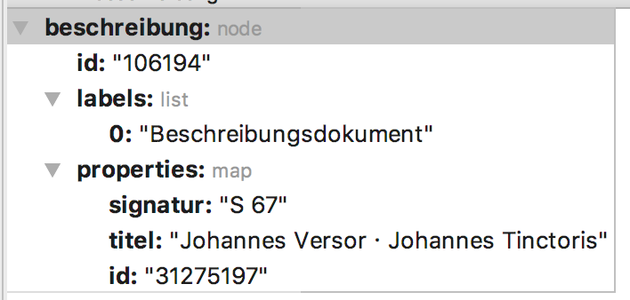
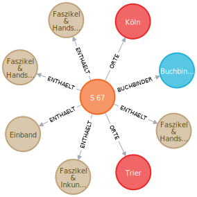
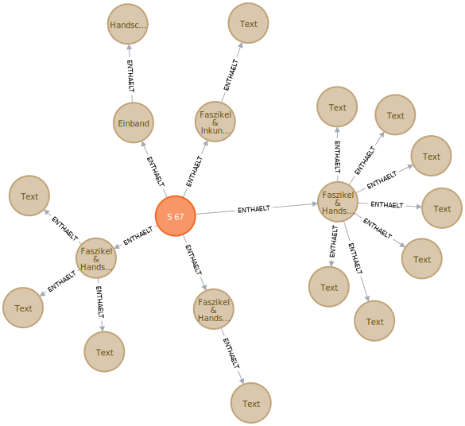
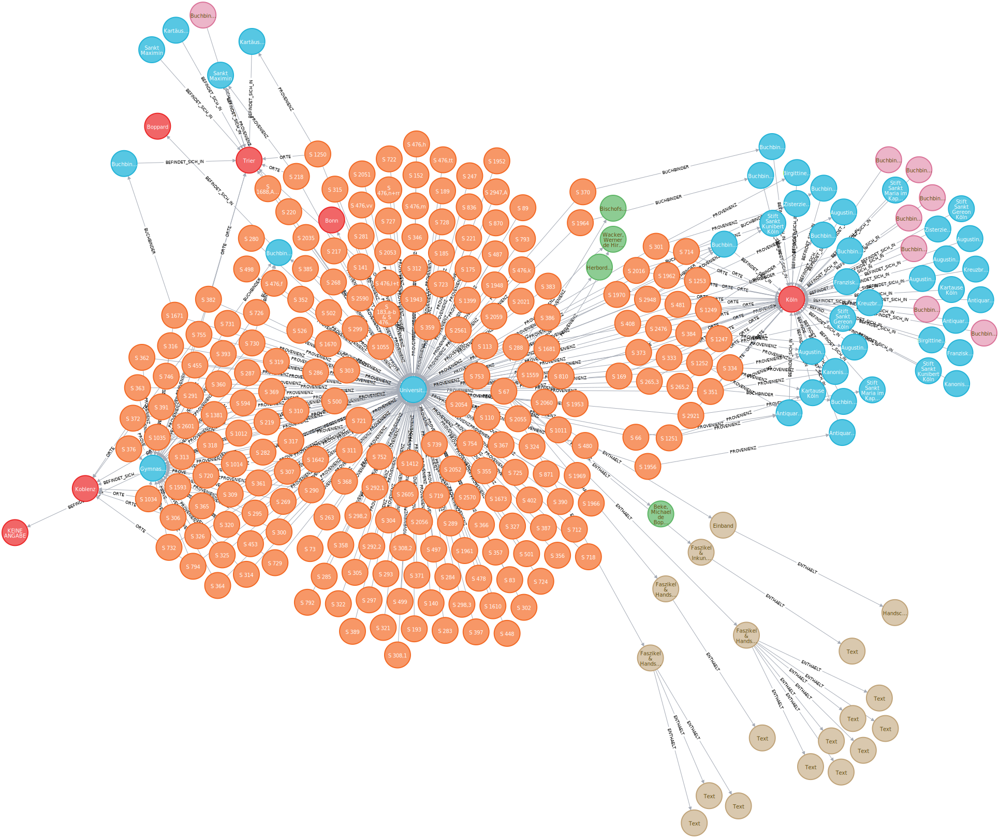
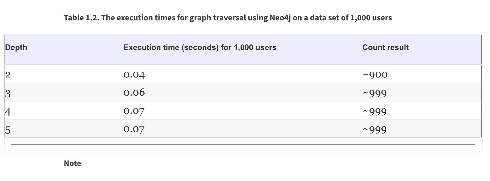
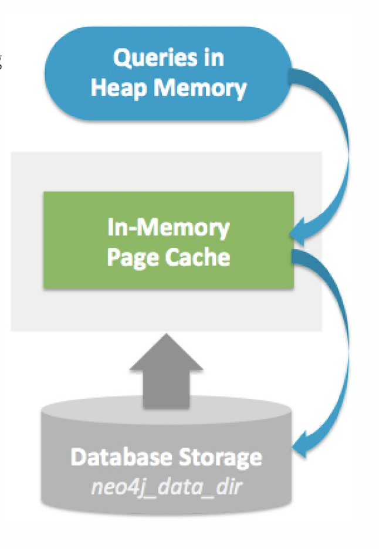

# 4. Untersuchungen #
## 4.1 Abfragen an konkreten Daten, SQL versus Cypher #

In diesem Kapitel möchten wir anhand eines konkreten Beispiels die Abfragesprachen beider RDBM-Systeme miteinander vergleichen. Dazu werden wir mit einem einfachen Beispiel beginnen und dieses immer weiter ausbauen. 

   1. Anzeigen eines Beschreibungsdokumentes. 

~~~~sql
SQL: 
SELECT * FROM  WHERE id = '31275197'
~~~~

 <table>
 <tr><th>id</th><th>signatur</th><th>titel</th><th> buchbinder_name</th></tr>
 <tr><td>31275197</td><td>S 67</td><td>Johannes Versor Johannes Tinctoris</td><td>Buchbinder Boppard Karmeliten</td>
 </table>
     
~~~~cypher
CYPHER: MATCH (b:Beschreibungsdokument {id:'31275197'}) RETURN b as beschreibung;
~~~~

    
    
Gut zu erkennen ist, dass im Ergebnis der SQL Abfrage der Primärschlüssel der Tabelle der beteiligten Buchbinder mitenthalten ist. Um ein identisches Ergebnis zu erhalten, müssten mit Hilfe der Selektion die 
entsprechenden Spalten im SQL definiert werden. Das Ergebnis der Cypher Abfrage enthält hingegen noch zusätzliche Metadaten, welche das Datenbanksystem automatisch angelegt hat. Diese sind: 

  * label: Kennzeichnung eines Knotentyps 
  * id: Interne Datenbankid
  * properties: Enthält alle Werte des Knotens.
  
   2. Anzeigen eines Beschreibungsdokumentes und des dazugehörigen Buchbinder.
 ~~~~sql
SQL: 
SELECT * FROM beschreibungen INNER JOIN koerperschaft 
ON buchbinder_name = koerperschaft.name
WHERE beschreibungen.id = '31275197'  
~~~~

<table border="1" style="border-collapse:collapse">
<tr><th>id</th><th>signatur</th><th>titel</th><th>buchbinder_name</th><th>name</th><th>bemerkung</th><th>gndid</th><th>id</th><th>ort_name</th></tr>
<tr><td>31275197</td><td>S 67</td><td>Johannes Versor · Johannes Tinctoris</td><td>Buchbinder Boppard Karmeliten</td><td>Buchbinder Boppard Karmeliten</td><td>NULL</td><td>NULL</td><td>31275175</td><td>Boppard</td></tr></table>

~~~~cypher
    CYPHER: MATCH (b:Beschreibungsdokument {id:'31275197'})-[r:BUCHBINDER]-(k) RETURN b as beschreibung,k;
~~~~

An diesem Beispiel ist bereits zu erkennen, dass die SQL Query etwas aufwendiger und umfangreicher ist, als die Cypher Query. 

   3. Anzeigen eines Beschreibungsdokumentes und den dazugehörigen Daten vom Buchbinder, Ort und Dokumentenelementen.
   
~~~~sql
SQL:  
SELECT beschreibungen.id,signatur,titel,koerperschaft.name,orte_name,e.name FROM beschreibungen
LEFT JOIN koerperschaft ON buchbinder_name = koerperschaft.name
LEFT JOIN beschreibungen_orte ON beschreibungen.id = beschreibungen_orte.beschreibungsdokument_id
LEFT JOIN beschreibungen_bestandteile bb ON beschreibungen.id = bb.beschreibungsdokument_id
LEFT JOIN elemente e ON bb.bestandteile_id = e.id
WHERE beschreibungen.id = '31275197'
~~~~

<table border="1" style="border-collapse:collapse">
<tr><th>id</th><th>signatur</th><th>titel</th><th>name</th><th>orte_name</th><th>name</th></tr>
<tr><td>31275197</td><td>S 67</td><td>Johannes Versor · Johannes Tinctoris</td><td>Buchbinder Boppard Karmeliten</td><td>Trier</td><td>Faszikel &amp; Inkunabel</td></tr>
<tr><td>31275197</td><td>S 67</td><td>Johannes Versor · Johannes Tinctoris</td><td>Buchbinder Boppard Karmeliten</td><td>Trier</td><td>Faszikel &amp; Handschrift</td></tr>
<tr><td>31275197</td><td>S 67</td><td>Johannes Versor · Johannes Tinctoris</td><td>Buchbinder Boppard Karmeliten</td><td>Trier</td><td>Faszikel &amp; Handschrift</td></tr>
<tr><td>31275197</td><td>S 67</td><td>Johannes Versor · Johannes Tinctoris</td><td>Buchbinder Boppard Karmeliten</td><td>Trier</td><td>Faszikel &amp; Handschrift</td></tr>
<tr><td>31275197</td><td>S 67</td><td>Johannes Versor · Johannes Tinctoris</td><td>Buchbinder Boppard Karmeliten</td><td>Trier</td><td>Einband</td></tr>
<tr><td>31275197</td><td>S 67</td><td>Johannes Versor · Johannes Tinctoris</td><td>Buchbinder Boppard Karmeliten</td><td>Köln</td><td>Faszikel &amp; Inkunabel</td></tr>
<tr><td>31275197</td><td>S 67</td><td>Johannes Versor · Johannes Tinctoris</td><td>Buchbinder Boppard Karmeliten</td><td>Köln</td><td>Faszikel &amp; Handschrift</td></tr>
<tr><td>31275197</td><td>S 67</td><td>Johannes Versor · Johannes Tinctoris</td><td>Buchbinder Boppard Karmeliten</td><td>Köln</td><td>Faszikel &amp; Handschrift</td></tr>
<tr><td>31275197</td><td>S 67</td><td>Johannes Versor · Johannes Tinctoris</td><td>Buchbinder Boppard Karmeliten</td><td>Köln</td><td>Faszikel &amp; Handschrift</td></tr>
<tr><td>31275197</td><td>S 67</td><td>Johannes Versor · Johannes Tinctoris</td><td>Buchbinder Boppard Karmeliten</td><td>Köln</td><td>Einband</td></tr></table>

~~~~cypher
    Cypher: MATCH (b:Beschreibungsdokument {id:'31275197'})-[r:BUCHBINDER|:ENTHAELT|:ORTE]-(k) RETURN b,r,k;
~~~~

4. Anzeigen eines Beschreibungsdokumentes und allen dazugehörigen Daten.

~~~~sql
SQL:   
SELECT DISTINCT beschreibungen.id,signatur,titel,koerperschaft.name as buchbinder,orte_name,e.name as element, p.von_jahr, p.bis_jahr, p.beteiligte_name FROM beschreibungen
LEFT JOIN koerperschaft ON buchbinder_name = koerperschaft.name
LEFT JOIN beschreibungen_orte ON beschreibungen.id = beschreibungen_orte.beschreibungsdokument_id
LEFT JOIN beschreibungen_bestandteile bb ON beschreibungen.id = bb.beschreibungsdokument_id
LEFT JOIN elemente e ON bb.bestandteile_id = e.id
LEFT JOIN provenienz p ON beschreibungen.id = p.beschreibungsdokument_id
WHERE beschreibungen.id = '31275197'
~~~~
<table border="1" style="border-collapse:collapse">
<tr><th>id</th><th>signatur</th><th>titel</th><th>buchbinder</th><th>orte_name</th><th>element</th><th>von_jahr</th><th>bis_jahr</th><th>beteiligte_name</th></tr>
<tr><td>31275197</td><td>S 67</td><td>Johannes Versor · Johannes Tinctoris</td><td>Buchbinder Boppard Karmeliten</td><td>Köln</td><td>Einband</td><td></td><td></td><td>Beke, Michael de Boppardia</td></tr>
<tr><td>31275197</td><td>S 67</td><td>Johannes Versor · Johannes Tinctoris</td><td>Buchbinder Boppard Karmeliten</td><td>Köln</td><td>Einband</td><td></td><td></td><td>Billinger, Theodericus de Darmstadt</td></tr>
<tr><td>31275197</td><td>S 67</td><td>Johannes Versor · Johannes Tinctoris</td><td>Buchbinder Boppard Karmeliten</td><td>Köln</td><td>Einband</td><td></td><td></td><td>Bischofsheim, Wendelinus de Hirschhorn</td></tr>
<tr><td>31275197</td><td>S 67</td><td>Johannes Versor · Johannes Tinctoris</td><td>Buchbinder Boppard Karmeliten</td><td>Köln</td><td>Einband</td><td></td><td></td><td>Bonner, Jacobus de Kerlich, Junior</td></tr>
<tr><td>31275197</td><td>S 67</td><td>Johannes Versor · Johannes Tinctoris</td><td>Buchbinder Boppard Karmeliten</td><td>Köln</td><td>Einband</td><td></td><td></td><td>Dinck, Johannes</td></tr>
<tr><td>31275197</td><td>S 67</td><td>Johannes Versor · Johannes Tinctoris</td><td>Buchbinder Boppard Karmeliten</td><td>Köln</td><td>Einband</td><td></td><td></td><td>Herbordus de Wormatia</td></tr>
<tr><td>31275197</td><td>S 67</td><td>Johannes Versor · Johannes Tinctoris</td><td>Buchbinder Boppard Karmeliten</td><td>Köln</td><td>Einband</td><td></td><td></td><td>Wacker, Werner de Hirschhorn</td></tr>
<tr><td>31275197</td><td>S 67</td><td>Johannes Versor · Johannes Tinctoris</td><td>Buchbinder Boppard Karmeliten</td><td>Köln</td><td>Einband</td><td>1802/1803-1821</td><td></td><td>Gymnasialbibliothek Koblenz</td></tr>
<tr><td>31275197</td><td>S 67</td><td>Johannes Versor · Johannes Tinctoris</td><td>Buchbinder Boppard Karmeliten</td><td>Köln</td><td>Einband</td><td>seit 1821</td><td>2019</td><td>Universitäts- und Landesbibliothek Bonn</td></tr>
<tr><td>31275197</td><td>S 67</td><td>Johannes Versor · Johannes Tinctoris</td><td>Buchbinder Boppard Karmeliten</td><td>Köln</td><td>Einband</td><td>um 1510-1802/1803</td><td></td><td>Karmelitenkloster</td></tr>
<tr><td>31275197</td><td>S 67</td><td>Johannes Versor · Johannes Tinctoris</td><td>Buchbinder Boppard Karmeliten</td><td>Köln</td><td>Faszikel &amp; Handschrift</td><td></td><td></td><td>Beke, Michael de Boppardia</td></tr>
<tr><td>31275197</td><td>S 67</td><td>Johannes Versor · Johannes Tinctoris</td><td>Buchbinder Boppard Karmeliten</td><td>Köln</td><td>Faszikel &amp; Handschrift</td><td></td><td></td><td>Billinger, Theodericus de Darmstadt</td></tr>
<tr><td>31275197</td><td>S 67</td><td>Johannes Versor · Johannes Tinctoris</td><td>Buchbinder Boppard Karmeliten</td><td>Köln</td><td>Faszikel &amp; Handschrift</td><td></td><td></td><td>Bischofsheim, Wendelinus de Hirschhorn</td></tr>
<tr><td>31275197</td><td>S 67</td><td>Johannes Versor · Johannes Tinctoris</td><td>Buchbinder Boppard Karmeliten</td><td>Köln</td><td>Faszikel &amp; Handschrift</td><td></td><td></td><td>Bonner, Jacobus de Kerlich, Junior</td></tr>
<tr><td>31275197</td><td>S 67</td><td>Johannes Versor · Johannes Tinctoris</td><td>Buchbinder Boppard Karmeliten</td><td>Köln</td><td>Faszikel &amp; Handschrift</td><td></td><td></td><td>Dinck, Johannes</td></tr>
<tr><td>31275197</td><td>S 67</td><td>Johannes Versor · Johannes Tinctoris</td><td>Buchbinder Boppard Karmeliten</td><td>Köln</td><td>Faszikel &amp; Handschrift</td><td></td><td></td><td>Herbordus de Wormatia</td></tr>
<tr><td>31275197</td><td>S 67</td><td>Johannes Versor · Johannes Tinctoris</td><td>Buchbinder Boppard Karmeliten</td><td>Köln</td><td>Faszikel &amp; Handschrift</td><td></td><td></td><td>Wacker, Werner de Hirschhorn</td></tr>
<tr><td>31275197</td><td>S 67</td><td>Johannes Versor · Johannes Tinctoris</td><td>Buchbinder Boppard Karmeliten</td><td>Köln</td><td>Faszikel &amp; Handschrift</td><td>1802/1803-1821</td><td></td><td>Gymnasialbibliothek Koblenz</td></tr>
<tr><td>31275197</td><td>S 67</td><td>Johannes Versor · Johannes Tinctoris</td><td>Buchbinder Boppard Karmeliten</td><td>Köln</td><td>Faszikel &amp; Handschrift</td><td>seit 1821</td><td>2019</td><td>Universitäts- und Landesbibliothek Bonn</td></tr>
<tr><td>31275197</td><td>S 67</td><td>Johannes Versor · Johannes Tinctoris</td><td>Buchbinder Boppard Karmeliten</td><td>Köln</td><td>Faszikel &amp; Handschrift</td><td>um 1510-1802/1803</td><td></td><td>Karmelitenkloster</td></tr>
<tr><td>31275197</td><td>S 67</td><td>Johannes Versor · Johannes Tinctoris</td><td>Buchbinder Boppard Karmeliten</td><td>Köln</td><td>Faszikel &amp; Inkunabel</td><td></td><td></td><td>Beke, Michael de Boppardia</td></tr>
<tr><td>31275197</td><td>S 67</td><td>Johannes Versor · Johannes Tinctoris</td><td>Buchbinder Boppard Karmeliten</td><td>Köln</td><td>Faszikel &amp; Inkunabel</td><td></td><td></td><td>Billinger, Theodericus de Darmstadt</td></tr>
<tr><td>31275197</td><td>S 67</td><td>Johannes Versor · Johannes Tinctoris</td><td>Buchbinder Boppard Karmeliten</td><td>Köln</td><td>Faszikel &amp; Inkunabel</td><td></td><td></td><td>Bischofsheim, Wendelinus de Hirschhorn</td></tr>
<tr><td>31275197</td><td>S 67</td><td>Johannes Versor · Johannes Tinctoris</td><td>Buchbinder Boppard Karmeliten</td><td>Köln</td><td>Faszikel &amp; Inkunabel</td><td></td><td></td><td>Bonner, Jacobus de Kerlich, Junior</td></tr>
<tr><td>31275197</td><td>S 67</td><td>Johannes Versor · Johannes Tinctoris</td><td>Buchbinder Boppard Karmeliten</td><td>Köln</td><td>Faszikel &amp; Inkunabel</td><td></td><td></td><td>Dinck, Johannes</td></tr>
<tr><td>31275197</td><td>S 67</td><td>Johannes Versor · Johannes Tinctoris</td><td>Buchbinder Boppard Karmeliten</td><td>Köln</td><td>Faszikel &amp; Inkunabel</td><td></td><td></td><td>Herbordus de Wormatia</td></tr>
<tr><td>31275197</td><td>S 67</td><td>Johannes Versor · Johannes Tinctoris</td><td>Buchbinder Boppard Karmeliten</td><td>Köln</td><td>Faszikel &amp; Inkunabel</td><td></td><td></td><td>Wacker, Werner de Hirschhorn</td></tr>
<tr><td>31275197</td><td>S 67</td><td>Johannes Versor · Johannes Tinctoris</td><td>Buchbinder Boppard Karmeliten</td><td>Köln</td><td>Faszikel &amp; Inkunabel</td><td>1802/1803-1821</td><td></td><td>Gymnasialbibliothek Koblenz</td></tr>
<tr><td>31275197</td><td>S 67</td><td>Johannes Versor · Johannes Tinctoris</td><td>Buchbinder Boppard Karmeliten</td><td>Köln</td><td>Faszikel &amp; Inkunabel</td><td>seit 1821</td><td>2019</td><td>Universitäts- und Landesbibliothek Bonn</td></tr>
<tr><td>31275197</td><td>S 67</td><td>Johannes Versor · Johannes Tinctoris</td><td>Buchbinder Boppard Karmeliten</td><td>Köln</td><td>Faszikel &amp; Inkunabel</td><td>um 1510-1802/1803</td><td></td><td>Karmelitenkloster</td></tr>
<tr><td>31275197</td><td>S 67</td><td>Johannes Versor · Johannes Tinctoris</td><td>Buchbinder Boppard Karmeliten</td><td>Trier</td><td>Einband</td><td></td><td></td><td>Beke, Michael de Boppardia</td></tr>
<tr><td>31275197</td><td>S 67</td><td>Johannes Versor · Johannes Tinctoris</td><td>Buchbinder Boppard Karmeliten</td><td>Trier</td><td>Einband</td><td></td><td></td><td>Billinger, Theodericus de Darmstadt</td></tr>
<tr><td>31275197</td><td>S 67</td><td>Johannes Versor · Johannes Tinctoris</td><td>Buchbinder Boppard Karmeliten</td><td>Trier</td><td>Einband</td><td></td><td></td><td>Bischofsheim, Wendelinus de Hirschhorn</td></tr>
<tr><td>31275197</td><td>S 67</td><td>Johannes Versor · Johannes Tinctoris</td><td>Buchbinder Boppard Karmeliten</td><td>Trier</td><td>Einband</td><td></td><td></td><td>Bonner, Jacobus de Kerlich, Junior</td></tr>
<tr><td>31275197</td><td>S 67</td><td>Johannes Versor · Johannes Tinctoris</td><td>Buchbinder Boppard Karmeliten</td><td>Trier</td><td>Einband</td><td></td><td></td><td>Dinck, Johannes</td></tr>
<tr><td>31275197</td><td>S 67</td><td>Johannes Versor · Johannes Tinctoris</td><td>Buchbinder Boppard Karmeliten</td><td>Trier</td><td>Einband</td><td></td><td></td><td>Herbordus de Wormatia</td></tr>
<tr><td>31275197</td><td>S 67</td><td>Johannes Versor · Johannes Tinctoris</td><td>Buchbinder Boppard Karmeliten</td><td>Trier</td><td>Einband</td><td></td><td></td><td>Wacker, Werner de Hirschhorn</td></tr>
<tr><td>31275197</td><td>S 67</td><td>Johannes Versor · Johannes Tinctoris</td><td>Buchbinder Boppard Karmeliten</td><td>Trier</td><td>Einband</td><td>1802/1803-1821</td><td></td><td>Gymnasialbibliothek Koblenz</td></tr>
<tr><td>31275197</td><td>S 67</td><td>Johannes Versor · Johannes Tinctoris</td><td>Buchbinder Boppard Karmeliten</td><td>Trier</td><td>Einband</td><td>seit 1821</td><td>2019</td><td>Universitäts- und Landesbibliothek Bonn</td></tr>
<tr><td>31275197</td><td>S 67</td><td>Johannes Versor · Johannes Tinctoris</td><td>Buchbinder Boppard Karmeliten</td><td>Trier</td><td>Einband</td><td>um 1510-1802/1803</td><td></td><td>Karmelitenkloster</td></tr>
<tr><td>31275197</td><td>S 67</td><td>Johannes Versor · Johannes Tinctoris</td><td>Buchbinder Boppard Karmeliten</td><td>Trier</td><td>Faszikel &amp; Handschrift</td><td></td><td></td><td>Beke, Michael de Boppardia</td></tr>
<tr><td>31275197</td><td>S 67</td><td>Johannes Versor · Johannes Tinctoris</td><td>Buchbinder Boppard Karmeliten</td><td>Trier</td><td>Faszikel &amp; Handschrift</td><td></td><td></td><td>Billinger, Theodericus de Darmstadt</td></tr>
<tr><td>31275197</td><td>S 67</td><td>Johannes Versor · Johannes Tinctoris</td><td>Buchbinder Boppard Karmeliten</td><td>Trier</td><td>Faszikel &amp; Handschrift</td><td></td><td></td><td>Bischofsheim, Wendelinus de Hirschhorn</td></tr>
<tr><td>31275197</td><td>S 67</td><td>Johannes Versor · Johannes Tinctoris</td><td>Buchbinder Boppard Karmeliten</td><td>Trier</td><td>Faszikel &amp; Handschrift</td><td></td><td></td><td>Bonner, Jacobus de Kerlich, Junior</td></tr>
<tr><td>31275197</td><td>S 67</td><td>Johannes Versor · Johannes Tinctoris</td><td>Buchbinder Boppard Karmeliten</td><td>Trier</td><td>Faszikel &amp; Handschrift</td><td></td><td></td><td>Dinck, Johannes</td></tr>
<tr><td>31275197</td><td>S 67</td><td>Johannes Versor · Johannes Tinctoris</td><td>Buchbinder Boppard Karmeliten</td><td>Trier</td><td>Faszikel &amp; Handschrift</td><td></td><td></td><td>Herbordus de Wormatia</td></tr>
<tr><td>31275197</td><td>S 67</td><td>Johannes Versor · Johannes Tinctoris</td><td>Buchbinder Boppard Karmeliten</td><td>Trier</td><td>Faszikel &amp; Handschrift</td><td></td><td></td><td>Wacker, Werner de Hirschhorn</td></tr>
<tr><td>31275197</td><td>S 67</td><td>Johannes Versor · Johannes Tinctoris</td><td>Buchbinder Boppard Karmeliten</td><td>Trier</td><td>Faszikel &amp; Handschrift</td><td>1802/1803-1821</td><td></td><td>Gymnasialbibliothek Koblenz</td></tr>
<tr><td>31275197</td><td>S 67</td><td>Johannes Versor · Johannes Tinctoris</td><td>Buchbinder Boppard Karmeliten</td><td>Trier</td><td>Faszikel &amp; Handschrift</td><td>seit 1821</td><td>2019</td><td>Universitäts- und Landesbibliothek Bonn</td></tr>
<tr><td>31275197</td><td>S 67</td><td>Johannes Versor · Johannes Tinctoris</td><td>Buchbinder Boppard Karmeliten</td><td>Trier</td><td>Faszikel &amp; Handschrift</td><td>um 1510-1802/1803</td><td></td><td>Karmelitenkloster</td></tr>
<tr><td>31275197</td><td>S 67</td><td>Johannes Versor · Johannes Tinctoris</td><td>Buchbinder Boppard Karmeliten</td><td>Trier</td><td>Faszikel &amp; Inkunabel</td><td></td><td></td><td>Beke, Michael de Boppardia</td></tr>
<tr><td>31275197</td><td>S 67</td><td>Johannes Versor · Johannes Tinctoris</td><td>Buchbinder Boppard Karmeliten</td><td>Trier</td><td>Faszikel &amp; Inkunabel</td><td></td><td></td><td>Billinger, Theodericus de Darmstadt</td></tr>
<tr><td>31275197</td><td>S 67</td><td>Johannes Versor · Johannes Tinctoris</td><td>Buchbinder Boppard Karmeliten</td><td>Trier</td><td>Faszikel &amp; Inkunabel</td><td></td><td></td><td>Bischofsheim, Wendelinus de Hirschhorn</td></tr>
<tr><td>31275197</td><td>S 67</td><td>Johannes Versor · Johannes Tinctoris</td><td>Buchbinder Boppard Karmeliten</td><td>Trier</td><td>Faszikel &amp; Inkunabel</td><td></td><td></td><td>Bonner, Jacobus de Kerlich, Junior</td></tr>
<tr><td>31275197</td><td>S 67</td><td>Johannes Versor · Johannes Tinctoris</td><td>Buchbinder Boppard Karmeliten</td><td>Trier</td><td>Faszikel &amp; Inkunabel</td><td></td><td></td><td>Dinck, Johannes</td></tr>
<tr><td>31275197</td><td>S 67</td><td>Johannes Versor · Johannes Tinctoris</td><td>Buchbinder Boppard Karmeliten</td><td>Trier</td><td>Faszikel &amp; Inkunabel</td><td></td><td></td><td>Herbordus de Wormatia</td></tr>
<tr><td>31275197</td><td>S 67</td><td>Johannes Versor · Johannes Tinctoris</td><td>Buchbinder Boppard Karmeliten</td><td>Trier</td><td>Faszikel &amp; Inkunabel</td><td></td><td></td><td>Wacker, Werner de Hirschhorn</td></tr>
<tr><td>31275197</td><td>S 67</td><td>Johannes Versor · Johannes Tinctoris</td><td>Buchbinder Boppard Karmeliten</td><td>Trier</td><td>Faszikel &amp; Inkunabel</td><td>1802/1803-1821</td><td></td><td>Gymnasialbibliothek Koblenz</td></tr>
<tr><td>31275197</td><td>S 67</td><td>Johannes Versor · Johannes Tinctoris</td><td>Buchbinder Boppard Karmeliten</td><td>Trier</td><td>Faszikel &amp; Inkunabel</td><td>seit 1821</td><td>2019</td><td>Universitäts- und Landesbibliothek Bonn</td></tr>
<tr><td>31275197</td><td>S 67</td><td>Johannes Versor · Johannes Tinctoris</td><td>Buchbinder Boppard Karmeliten</td><td>Trier</td><td>Faszikel &amp; Inkunabel</td><td>um 1510-1802/1803</td><td></td><td>Karmelitenkloster</td></tr></table>

~~~~cypher 
CYPHER:  MATCH (b:Beschreibungsdokument {id:'31275197'})-[r]-(k) RETURN b,r,k;
~~~~    

Je mehr Beziehungen abgefragt werden müssen, desto einfacher wird die Anfrageformulierung mit Hilfe von Cypher.

5. Anzeigen eines Beschreibungsdokumentes und allen Dokumentenelemente aller Hierarchien.
~~~~sql
SQL:    
WITH RECURSIVE q as (
    SELECT bb.bestandteile_id,e.name FROM beschreibungen
    LEFT JOIN beschreibungen_bestandteile bb ON beschreibungen.id = bb.beschreibungsdokument_id
    LEFT JOIN elemente_bestandteile ON elemente_bestandteile.bestandteile_id = bb.bestandteile_id
    LEFT JOIN elemente e ON e.id = bb.bestandteile_id
    WHERE beschreibungen.id = '31275197'

    UNION ALL

    SELECT el.bestandteile_id, e.name FROM elemente_bestandteile el
    left JOIN elemente e ON e.id = el.bestandteile_id
    LEFT JOIN beschreibungen_bestandteile ON e.id = beschreibungen_bestandteile.bestandteile_id
    LEFT JOIN beschreibungen ON beschreibungen_bestandteile.beschreibungsdokument_id = beschreibungen.id
    JOIN q ON q.bestandteile_id = el.dokument_element_id
    ) SELECT * FROM q
~~~~

<table border="1" style="border-collapse:collapse">
<tr><th>bestandteile_id</th><th>name</th></tr>
<tr><td>31276465</td><td>Faszikel &amp; Inkunabel</td></tr>
<tr><td>31276479</td><td>Faszikel &amp; Handschrift</td></tr>
<tr><td>31276456</td><td>Faszikel &amp; Handschrift</td></tr>
<tr><td>31276467</td><td>Faszikel &amp; Handschrift</td></tr>
<tr><td>31276455</td><td>Einband</td></tr>
<tr><td>31276461</td><td>Text</td></tr>
<tr><td>31276476</td><td>Text</td></tr>
<tr><td>31276478</td><td>Text</td></tr>
<tr><td>31276477</td><td>Text</td></tr>
<tr><td>31276457</td><td>Text</td></tr>
<tr><td>31276474</td><td>Text</td></tr>
<tr><td>31276472</td><td>Text</td></tr>
<tr><td>31276471</td><td>Text</td></tr>
<tr><td>31276470</td><td>Text</td></tr>
<tr><td>31276469</td><td>Text</td></tr>
<tr><td>31276468</td><td>Text</td></tr>
<tr><td>31276466</td><td>Text</td></tr>
<tr><td>31276480</td><td>Handschrift</td></tr></table>

~~~~cypher
CYPHER: MATCH (b:Beschreibungsdokument {id:'31275197'})-[r:ENTHAELT *1..2]-(k) RETURN b,r,k;
~~~~

Durch den einfachen Ausdruck einer rekursiven Abfragen mit Hilfe der Cypher Query im Vergleich zur SQL Anfragen wird sehr deutlich, dass SQL für rekursiv strukturierte Daten nicht sehr komfortabel ist.
Darüber hinaus muss der Entwickler solcher Queries bei SQL sehr genau die Datenstrukturen kennen, was für eine Graphenabfrage mit Hilfe von Cypher nicht zwingend notwendig ist. Um zum Beispiel alle Daten, welche in einem einstufigen rekursiven Bezug 
zum Beschreibungsdokument zu bekommen, muss lediglich folgende Abfrage mit Cypher formuliert werden: 

~~~~cypher
Cypher: MATCH (b:Beschreibungsdokument {id:'31275197'})-[r *1..2]-(k) RETURN b,r,k;
~~~~
  

Das Ergebnis zeigt, dass beliebige Beziehungen und Knoten mit aufgeführt werden. Eine solche Abfrage via SQL zu formulieren würde einen enorm großen Aufwand bedeuten. 

Zusammenfassend zeigen diese Beispiele, dass bei steigender Anfragekomplexität die Cypher-Anfrage leichter zu formulieren ist als die SQL-Abfrage. Zusätzlich ist bei SQL eine genaue Kenntnis der Datenbankstruktur notwendig, um die Anfrage formulieren zu können. 
Für die Formulierung einer Cypher-Anfrage hingegen, benötigt man nicht zwingend genaue Kenntnisse der Knoten und Beziehungsstrukturen. Dies bietet unter anderem eine gute Möglichkeit, um neue Erkenntnisse aus den Daten gewinnen zu können. 

## 4.1 Performance ##

Im Rahmen dieser Arbeit möchten wir eine durch die Autoren des Buches "Neo4J in Action" Aleksa Vukotic und Nicki Watt bereits durchgeführte Untersuchungen zu rekursiven Abfragen in einer MySQL und einer Neo4J Datenbank hinsichtlich der Abfragegeschwindigkeit evaluieren. Die Untersuchung wird im Buch Neo4J in Action im Kapitel 1.4 "SQL JOINS VERSUS GRAPH TRAVERSAL ON A LARGE SCALE" als ein Datenexperiment vorgestellt, welches SQL Join Queries mit einer Graph Traversal Queries vergleicht. Das Testdatenset ist
in diesem Beispiel sehr einfach aufgebaut. Es gibt eine Tabelle mit den Daten der Personen und eine Tabelle in welcher die Freundschaftsbeziehung zur jeweiligen Person festgehalten ist. 

In der hier aufgeführten Tabelle sind jeweils freundschaftliche Beziehungen der Tiefe 2 festgehalten. Um nun alle Beziehungen einer Person herauszubekommen,muss folgendes SQL Statement formuliert werden: 

~~~~sql
SELECT Count(DISTINCT uf3.*) 
FROM   t_user_friend uf1 
       INNER JOIN t_user_friend uf2 
               ON uf1.user_1 = uf2.user_2 
       INNER JOIN t_user_friend uf3 
               ON uf2.user_1 = uf3.user_2 
WHERE  uf1.user_1 = ? 
~~~~

Für jedes weiteres freundschaftliches Beziehungslevel erhält die Tabelle eine weitere Spalte und die Abfrage muss um ein weiteres Join erweitert werden. Bei einem 
Testdatenset von 1000 Personen mit ca. 50 Beziehungen enthält die Beziehungstabelle ca. 50.000 Einträge. In einem Experiment mit 1000 Benutzerdaten und jeweils 10 SQL Abfragen auf die 
entsprechenden Freundeanzahl wird aufgezeigt, dass die Performance mit steigender Anzahl an Join-Verbindungen stark abfällt, obwohl die Anzahl des Ergebnisses gleich bleibt. 

 

Ursache dafür ist nach Ansicht der Autoren, dass für jede Join Abfrage das kartesische Produkt der relevanten Tabelle durchgeführt wird, bevor anschließend die relevanten Daten gefiltert werden. 
In dem oben dargestellt Fall bedeutet dies, dass ein 5-maliger Join mit derselben Tabelle mit 50.0000 Einträgen zu einer Tabelle mit 102.4 x 10 ^21 Zeilen führt.  

Ein Vergleich mit denselben Daten und Abfragen auf Basis einer Neo4J Graphendatenbank zeigt diese folgendes Ergebnis: 

Ursache für die nahezu gleichbleibende gute Performance ist die Tatsache, dass innerhalb der Graphendatenbank zur Ermittlung des Ergebnisses Knoten abgelaufen werden. Nicht relevante Knoten werden wieder verworfen. So bleibt bei gleicher Ergebnismenge die Abfragegeschwindigkeit 
nahezu gleich, obwohl mehr Knoten überprüft werden müssen.

Um nun für unser praktisches Beispiel vergleichbare Untersuchungen machen zu können mussten wir Testdaten erzeugen. Dafür haben wir eine bestimmte Anzahl an Beschreibungsdokumente erzeugt, welche wir mit jeweils 10 Dokumentelementen mit jeweils 5 Kindelementen erzeugt haben. Jedes Dokumentenelement ist dabei wiederum ein Kindelement des vorherigen Elementes. Eine Testbeschreibung ist in nachfolgender Grafik dargestellt: 

Diese Datenstruktur ist mit den Testdatenstrukturen aus dem Buch Neo4J vergleichbar. Um hier die Beziehungen der Dokumentenelemente abzufragen, müssen für SQL ebenfalls Joins auf dieselbe Tabelle angewendet werden. In nachfolgendem Beispiel sind die jeweiligen Abfragen aufgeführt. 

~~~~cypher
Cypher:
MATCH (b:Beschreibungsdokument)-[r:ENTHAELT *1..7]-(k) RETURN count(k)
~~~~   
~~~~sql
SQL:

    WITH RECURSIVE  q as (
    
        SELECT bb.bestandteile_id,e.name FROM beschreibungen
        LEFT JOIN beschreibungen_bestandteile bb on beschreibungen.id = bb.beschreibungsdokument_id
        LEFT JOIN elemente_bestandteile on elemente_bestandteile.bestandteile_id = bb.bestandteile_id
        LEFT JOIN elemente e on e.id = bb.bestandteile_id
    
        UNION ALL
    
        SELECT el.bestandteile_id, e.name from elemente_bestandteile el
        left join elemente e on e.id = el.bestandteile_id
        LEFT JOIN beschreibungen_bestandteile on e.id = beschreibungen_bestandteile.bestandteile_id
        LEFT JOIN beschreibungen ON beschreibungen_bestandteile.beschreibungsdokument_id = beschreibungen.id
        join q on q.bestandteile_id = el.dokument_element_id
    
        ) SELECT count(*) from q 
~~~~

Alle Abfragen wurden auf einem iMac Intel Core i7 mit 32 GByte RAM durchgeführt. Beide Abfragen wurden nativ ohne Objektmapper durchgeführt. Beide DBMS Systeme laufen in der Standardkonfiguration in einem Docker Container.

Nachfolgende Tabelle stellt die Ergebnisse unseres Abfragetests dar. 

<table>
<thead>
<tr><th>Anzahl Beschreibungen </th><th>Anzahl Dokumentenelemente</th><th>Anzahl Treffer</th><th>RDBMS Zeit</th><th>GraphDB Zeit</th></tr>
</thead>
<tbody>
<tr><td>1000</td><td>60000</td><td>60000</td><td>ca. 160 ms</td><td>ca. 64 ms</td></tr>
<tr><td>5000</td><td>300000</td><td>300000</td><td>ca. 950 ms</td><td>ca. 450 ms</td></tr>
<tr><td>10000</td><td>600000</td><td>600000</td><td>ca. 1500 ms</td><td>ca. 950 ms</td></tr>
<tr><td>20000</td><td>1200000</td><td>1200000</td><td>ca. 3000 ms</td><td>ca. 1300 ms</td></tr>
</tbody>
</table>

Die Tabelle zeigt, dass wir die Ergebnisse aus dem Buch "Neo4J in Action" nicht reproduzieren können. Dies kann verschiedenste Ursachen haben. Der größte Unterschied zu dem Test von Aleksa Vukotic und Nicki Watt sind sicherlich die unterschiedlichen Abfragen.
Für die Graphendatenbank haben wir Cypher verwendet und das SQL Statement ist eine rekursive Abfrage. Die rekursive Abfrage enthält zwar Joins, allerdings könnte das Wiederholen der zweiten Abfrage nicht zu einem kartesischen Produkt aller Daten führen. Ein weiterer Unterschied ist, dass 
wir als RDBMS Postgres und nicht MySQL verwendet haben. Ein Reproduzieren des Ergebnisses war hier allerdings nicht unser primäres Ziel. Vielmehr wollten wir untersuchen, wie die beiden Systeme tief verschachtelte Datenstrukturen mit vielen Beziehungen zueinander behandeln. 

Bei unserem Test ist uns allerdings aufgefallen, dass die Schreibgeschwindigkeit zwischen dem RDBMS Postgres und Neo4J stark unterschiedlich war. Für ein Testdatenset von 50 Beschreibungsdokumenten benötigte die
Graphendatenbank ca. 500 Millisekunden und das RDBMS Postgres 20 Sekunden. Die Ursache für die 4-fach langsamere Schreibgeschwindigkeit der Postgres-Datenbank konnten wir im zeitlichen Rahmen dieses Projektes nicht evaluieren. 

## 4.1 Performance Optimierungsmaßnahmen ##

Für beide Datenbanksysteme gibt es Möglichkeiten die Performance des Systems zu beeinflussen. Folgende Möglichkeiten können dabei genutzt werden: 

  * Erstellen von Indizes. 
  * Einstellungen für das DBMS für Speicherbedarf, Verbindungsmanagement und Handling setzen. 
  * Einstellungen des ORM / OGM setzen. 

Beim Performanceoptimieren eines Datenbankmanagementsystem muss man sehr dediziert und analytisch vorgehen. Im ersten Schritt ist zu überprüfen, welche Aktionen genau zu viel Zeit benötigen. Im Falle von Abfragen sollte die Ausführung auf dem DBMS analysiert werden. 
In der Regel stellen die Entwickler der entsprechenden Systeme dazu Werkzeuge zur Verfügung. Um zum Beispiel die Abfragegeschwindigkeit im Allgemeinen zu erhöhen, können bestimmte Werte einer Tabelle oder eines Graphens indiziert werden. 

### 4.1.1 Indizes erstellen ###

Um einen Index auf einer relationalen Datenbank anzulegen, geht man, bezogen auf unser Projekt, wie folgt vor: 

  1.) Erstellen eines Index auf einer Tabelle mit Hilfe einer Annotation. 
  
      @Table(name = "beschreibungen", indexes = { @javax.persistence.Index(name = "BESCHREIBUNGGS_INDEX", columnList = "id") })
      
  2.) Alle Werte müssen anschließend neu in diese Tabelle geschrieben werden. 
  
Um einen Index für unsere Graphendatenbank anzulegen, ist folgendes notwendig: 

  1.) Annotation der Werte des Knotens bzw. der Relation

       @org.neo4j.ogm.annotation.Index;
       private String id;
  
  2.) Konfiguration des OGM anpassen: 
  
      spring.data.neo4j.auto-index=assert
      
  3.) Alle Werte neu in die Datenbank schreiben. 
  

Für beide Systeme muss festgelegt werden, welche Elemente mit einem zusätzlich Index ausgestattet werden. Dies verbessert die Lesegeschwindigkeit, verringert allerdings die Schreibgeschwindigkeit. Wie im vorherigen Abschnitt bereits erwähnt, war die Schreibgeschwindigkeit 
der Postgres-Datenbank signifikant schlechter als die der Neo4J Datenbank. 

### 4.1.2 DBMS Konfiguration anpassen ###

Beide Systeme lassen sich über Konfigurationsdateien im Dateisystem anpassen. Für die Graphendatenbank heißt die Datei **neo4j.conf** und die Postgresdatenbank **postgresql.conf**. 

**Optimierungen Neo4J Graphendatenbank**

Da die Neo4J Datenbank auf Java basiert, können über die folgenden beiden Werte der Java Virtual Machine mehr Arbeitsspeicher zur Verfügung gestellt werden. 

      dbms.memory.heap.initial_size=2g
      dbms.memory.heap.max_size=2g
      
So steht der Grahpendatenbank 2 GByte schneller Arbeitsspeicher zur Verfügung, um die Anfrage- und Schreiboperationen durchzuführen. Allerdings muss bei der Einstellung der Werte 
darauf geachtet werden, wieviel Arbeitsspeicher das physikalische System zur Verfügung stellt. Wird der Wert zu groß gewählt, kommt es zum Absturz der Datenbank, da mehr Speicher versucht wird zu allokieren als dem System zur Verfügung steht. 

Ein weiterer wichtiger Wert ist: 

    dbms.memory.pagecache.size=1g

Dieser Wert bestimmt die Datenmenge, welche Neo4J nicht von der Platte laden muss, sondern aus dem Arbeitsspeicher laden kann. Die nachfolgende Abbildung verdeutlicht den Sachverhalt. 

  

**Optimierung Postgres Datenbank**

Anpassung der Speicherwerte für die Postgresdatenbank. 

    shared_buffers = 4096MB

Dieser Wert bestimmt den Cache, welcher im Arbeitsspeicher des Systems für die Postgres Datenbank verwendet wird. Der Standardwertvon 128KByte ist sehr gering. Der Wert ist vergleichbar mit dem Wert der Grahpendatenbank
dbms.memory.pagecache.size. 

Nachfolgende Werte stellen dem System mehr Arbeitsspeicher für Sortierung von Ergebnisse und Wartungsaufgaben wie Index anlegen, Tabellen ändern, Schlüsselbeziehungen anlegen. 

    work_mem = 4000MB 
    maintenance_work_mem = 6400MB

### 4.1.3 Objektmapper Konfiguration anpassen ###

Für die OMG Bibliothek gibt es hierbei kaum Werte die eingestellt werden können. Für den OR Mapper haben wir folgende Werte gesetzt: 

    spring.jpa.properties.hibernate.jdbc.batch_size=50
    spring.jpa.properties.hibernate.order_inserts=true
    spring.jpa.properties.hibernate.order_updates=true
    
Mit Hilfe dieser Einstellungen können Massendaten schneller in das RDBMS geladen werden, da diese im Batch Modus verarbeitet werden. 
---
| [<< Projektvorstellung](03_project.md) | Untersuchungen | [Fazit >>](05_fazit.md) |
|------------------------------------|------------|-------------------------------------|